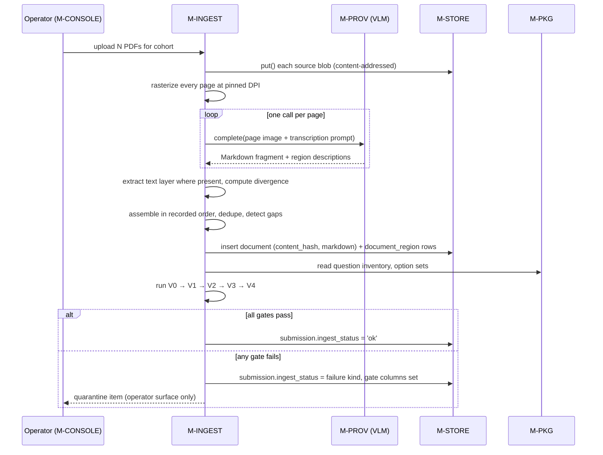
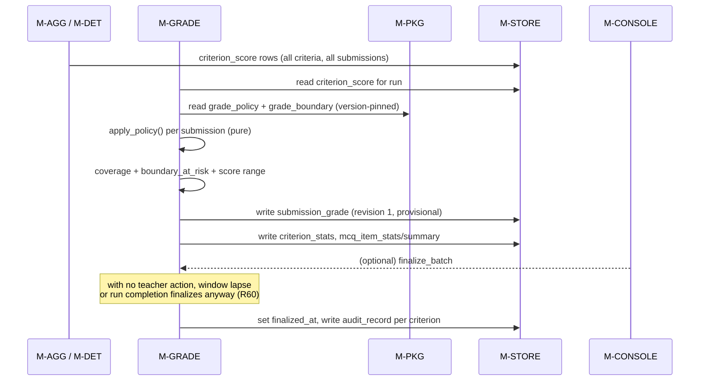
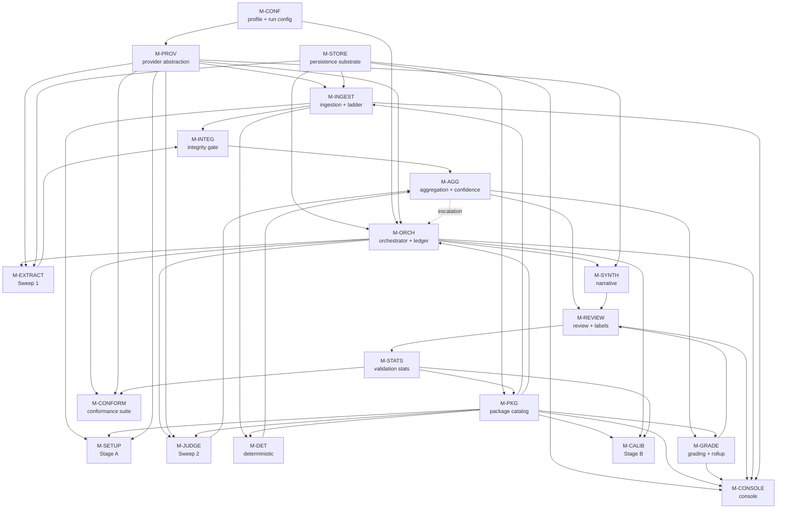
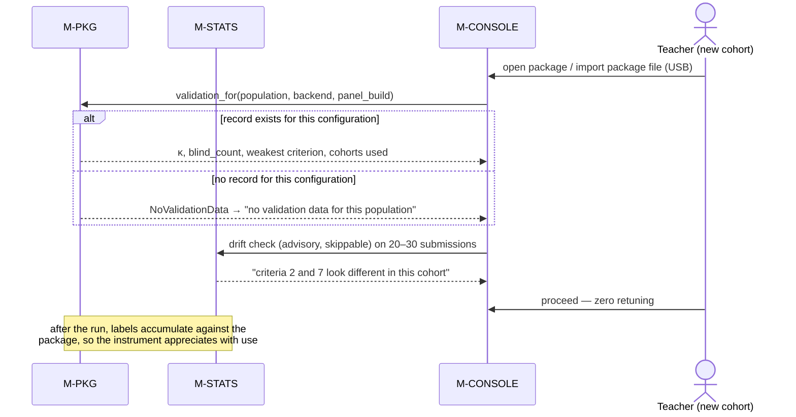

# Detailed Design: Agentic Evaluation Harness for Education

**Source HLD:** `docs/agentic-evaluation-harness-for-education.md` (report v3.3.2)
**Version:** 1.1  **Date:** 2026-08-19  **Status:** Draft
**Author:** generated by `/detailed-design-generator` from the HLD named above

## Revision history

| Version | Date | Change | Author |
|---|---|---|---|
| 1.0 | 2026-08-19 | First detailed design derived from HLD v3.3.1 | `/detailed-design-generator` |
| 1.1 | 2026-08-19 | HLD corrected to v3.3.2 for the five schema inconsistencies this design found; ADR-1, ADR-3, ADR-4, ADR-8 and ADR-9 restated as resolved rather than outstanding | `/detailed-design-generator` |

---

## 1. Scope & purpose

This document decomposes the system described in the HLD into implementable modules and specifies
each one to the level an engineer (or an implementation agent) can build and test against:
responsibilities and boundaries, numbered independently-testable functional requirements,
interfaces as signatures and schemas, data structures, data flow, dependencies, non-functional
requirements, error handling, observability, and configuration.

**In scope.** Every runtime component of the harness: the provider abstraction, the persistence
substrate and its four tiers, the assessment package catalog, ingestion and transcription, Stage A
setup, the run orchestrator and work ledger, extraction, the evidence-integrity gate, panel
scoring, the deterministic evaluator, aggregation and confidence, synthesis, grading and rollup,
the review queue and label store, validation statistics, rubric calibration, the backend
conformance suite, and the MVP console.

**Out of scope, deliberately.**

- **The test plan and the story backlog.** They are owned by `/create-test-plan` and
  `/plan-to-issues` and are generated from the IDs in this document. This document states what must
  be true; it does not enumerate test cases.
- **Infrastructure and provisioning.** Hardware procurement, container images, CI pipeline
  definitions, OS configuration. The design states what each profile requires of its environment,
  not how that environment is built.
- **The research argument.** HLD sections 1 to 6 justify why the architecture looks like this. That
  reasoning is referenced by section number, not restated. Read the HLD for *why*, this for *what*.
- **Student-facing surfaces.** Grades and feedback are exported; the harness serves the teacher and
  the operator only (HLD §11.2).

### 1.1 How to read the requirement IDs

Every requirement carries a stable ID of the form `FR-<ModuleID>-NN` or `NFR-<ModuleID>-NN`. These
IDs are the contract with the next two pipeline stages, so they are **append-only**: gaps are left
where a requirement is withdrawn, and nothing is renumbered.

Two extra columns appear on every requirement table and both are load-bearing:

- **Traces to** — the HLD requirement IDs (`R1` … `R72`) and section numbers this requirement
  discharges. The HLD is structured as a response to R1–R72; §4.5 carries the reverse index that
  proves every one of them landed somewhere. Downstream issues inherit this into their
  `Traces to:` line.
- **Phase** — the HLD §13 implementation phase. This matters because HLD §6 is *not* one deferred
  block: the §6.2 schema lock is Phase 1, the §6.3/6.5/6.6 guardrails are Phase 3, and only §6.4
  elicitation is Phase 4. Collapsing them would schedule a Phase 1 constraint behind a Phase 4
  feature.

### 1.2 Conventions

- **Assumption:** prefixes any value or decision not present in the HLD. Anything genuinely
  undecided is marked `TBD` and appears in §4.6.
- Requirements are written so the failing test is statable. Negative requirements — and this design
  has many, because the HLD prevents structurally rather than instructing behaviourally (HLD §0.8)
  — are written as assertions about an artifact ("the assembled request contains no field named
  `points`"), never as intentions ("judges shall not see numbers").
- SQL refers to the DDL in HLD §9.5–§9.7. Where this design changes or adds to that DDL, the change
  is called out explicitly and carries an ADR in §4.4.

---

## 2. Module inventory

| Module ID | Name | Responsibility | Type | Depends on |
|---|---|---|---|---|
| `M-CONF` | Deployment Profile & Run Configuration | Resolves the deployment profile and freezes one immutable run configuration — backend, panel, quantization, concurrency, budgets — for the life of a run, and makes that identity readable by every consumer. | library | — |
| `M-PROV` | Inference Provider Abstraction | One `InferenceProvider` interface with three interchangeable implementations (local server, OpenRouter, recorded fixture). The only path by which any model call leaves the harness. | library | `M-CONF` |
| `M-STORE` | Persistence Substrate | Owns the four storage tiers, schema and migrations, single-writer commit discipline, the content-addressed blob store, retention and purge. | data store | — |
| `M-PKG` | Assessment Package Catalog | Owns Tier P: package versions, criteria, bands, dependency graph, grade policy and boundaries, exemplars, validation records. Enforces the §6.2 schema lock and single-file export/import. | service | `M-STORE` |
| `M-INGEST` | Ingestion, Transcription & Validation Ladder | Sole gateway from PDF to canonical content-hashed Markdown plus region metadata. Runs gates V0–V4 and routes every failure to operator quarantine, never to a score. | service | `M-PROV`, `M-STORE`, `M-PKG` |
| `M-SETUP` | Assessment Setup (Stage A) | Turns ingested assessment, reference and rubric artifacts into a locked package version: question inventory proposal, rubric read-back into criteria and bands, decomposability determination, dependency graph, prefix-budget check. | service | `M-INGEST`, `M-PKG`, `M-PROV` |
| `M-ORCH` | Run Orchestrator & Work Ledger | Enumerates, leases, schedules, retries, quarantines and resumes every unit of work. Owns the two-sweep execution plan, concurrency and backpressure, escalation enqueue, circuit breakers, and the cost ceiling. | service | `M-STORE`, `M-CONF`, `M-PROV`, `M-PKG` |
| `M-EXTRACT` | Evidence Extraction (Sweep 1) | Localizes rubric-relevant evidence spans per (submission, judged criterion) into the working store, in topological dependency order. | worker | `M-ORCH`, `M-PROV`, `M-STORE` |
| `M-INTEG` | Evidence Integrity & Impact Routing | The independent detection path between extraction and scoring: span verification, required-evidence check, transcription and description overlap, second-family extraction comparison. | worker | `M-EXTRACT`, `M-INGEST`, `M-STORE` |
| `M-JUDGE` | Panel Scoring (Sweep 2) | Assembles isolated scoring contexts, dispatches one criterion × one judge × one submission, validates the response contract, persists verdicts. | worker | `M-ORCH`, `M-PROV`, `M-STORE`, `M-PKG` |
| `M-DET` | Deterministic Evaluator | Scores `deterministic` criteria by answer-key lookup against the extracted selection. Never invokes a judge and never enters either sweep. | library | `M-INGEST`, `M-PKG`, `M-STORE` |
| `M-AGG` | Aggregation, Confidence & Escalation Policy | Median-band aggregation on the ordinal scale, the single band→points mapping, ordinal α, confidence with integrity inversion, routing and escalation decisions. | library | `M-JUDGE`, `M-INTEG`, `M-DET`, `M-STORE` |
| `M-SYNTH` | Narrative Synthesis | Two-level read-only narrative composition, structurally unable to write or imply a score. | worker | `M-ORCH`, `M-PROV`, `M-STORE` |
| `M-GRADE` | Grading, Finalization & Class Rollup (Stage E) | Applies the declared grade policy to every submission automatically, computes coverage and boundary risk, finalizes, amends, and produces the class-level rollup. | service | `M-AGG`, `M-PKG`, `M-STORE` |
| `M-REVIEW` | Review Queue, Sampling & Label Store (Stage D) | The minute-budgeted, expected-value-ranked review queue with group actions, the blind and whole-grade samples, and the label records they emit. | service | `M-AGG`, `M-GRADE`, `M-STORE`, `M-PKG` |
| `M-STATS` | Validation Statistics & MVVP | Chance-corrected agreement from blind judged labels only, compression and surface-proxy checks, routing-policy validation, the package drift check. Updates the package validation record. | service | `M-REVIEW`, `M-STORE`, `M-PKG` |
| `M-CALIB` | Rubric Calibration (Stage B) | Disagreement triage, teacher-authored elicitation, and the guardrail gates — dual-scoring non-inferiority and adversarial back-translation — that must exist before any rubric revision ships. | service | `M-PKG`, `M-ORCH`, `M-PROV`, `M-STATS` |
| `M-CONFORM` | Backend Conformance Suite | Runs one frozen fixture set through the full pipeline on each backend and reports where they diverge. Writes backend-scoped validation records. | harness | `M-ORCH`, `M-PROV`, `M-STATS` |
| `M-CONSOLE` | Teacher & Operator Console | Server-rendered, loopback-bound read view over the stores plus a small enumerable idempotent control surface. Two separate surfaces for the two roles. | UI | `M-STORE`, `M-PKG`, `M-GRADE`, `M-REVIEW`, `M-ORCH` |

**Boundary notes, because each was a live decision.**

- **The validation ladder lives inside `M-INGEST`, not beside it.** V0–V4 write columns on the same
  `submission` row in the same transaction as ingestion's own output, and every failure lands on one
  surface. Splitting them would put two modules inside one transaction.
- **`M-INTEG` is deliberately *not* inside `M-EXTRACT`.** R19 requires an *independent* detection
  path; integrity checks owned by the module whose output they check are independent in name only.
  HLD §9.17 already lists "C1b. Integrity gate" as its own stage.
- **`M-CONF` is a module rather than a config file** because R1's fixed-at-run-start rule, R30's
  backend scoping of every validation record, and HLD §12's "an institution that does not know which
  profile it is on" all need one owner that can be asserted against.
- **The HLD §8.5 hardware acceptance test is not a module.** It is a release gate computed over
  `run_metrics`, and it lives in §4.3 with the other system-level requirements. `M-CONFORM` is a
  module because it has fixtures, a comparison algorithm, and rows it writes.

---

## 3. Per-module detailed design

### 3.1 Module: Deployment Profile & Run Configuration (`M-CONF`)

**Responsibility.** Resolve the deployment profile and hardware profile from configuration, build
one immutable `RunConfig` before a run begins, and expose that identity — backend, resolved model
builds, quantization, concurrency, budgets — to every consumer that must record or display it. It
owns the *fixing* of the backend; it does not own the calling of it (`M-PROV`) or the running of the
work (`M-ORCH`).

**Does not own.** Model invocation, retry behaviour, cost accounting during a run, or persistence.
It produces a value object and the assertions that guard it.

**Functional requirements**

| ID | Requirement | Traces to | Phase |
|---|---|---|---|
| FR-CONF-01 | The module shall resolve `backend_profile` to exactly one of `edge-local`, `cloud-hosted`, `dev-ci` from configuration, and shall raise `ConfigurationError` when the value is absent or unrecognized, rather than defaulting. | R27, R29, §0.7 | 1 |
| FR-CONF-02 | The module shall construct a `RunConfig` before the `run` row is written, and shall expose it as a frozen (immutable) value: any attempted attribute assignment raises `TypeError`. | R1, §0.7 | 1 |
| FR-CONF-03 | The module shall reject a `RunConfig` in which any `model_ref` (judge, transcriber, or off-panel checker) is not a resolved build identity — for `edge-local`, a weights file path plus quantization plus weights hash; for `cloud-hosted`/`dev-ci`, a provider-pinned model slug. A friendly name such as `"Llama 3.3 70B"` fails validation. | R30, §0.7, §6.7 | 1 |
| FR-CONF-04 | The module shall expose exactly one provider binding per run and shall offer no API by which the backend of an existing run can be changed; a run resumed after interruption resolves to the `backend_profile` and `provider_config` persisted on its `run` row, and a mismatch against current configuration raises `BackendMismatchError` rather than proceeding. | R1, §0.7, §8.7 | 1 |
| FR-CONF-05 | The module shall compute `panel_build_ref` as a stable hash over the ordered set of resolved judge builds (provider, served build, quantization), and shall expose it for use in every `package_validation` primary key. | R30, §9.5 | 1 |
| FR-CONF-06 | When `backend_profile = edge-local`, the module shall require a `hardware_profile` of `unified-large`, `unified-small`, or `discrete-gpu`, and shall derive from it a residency policy (models permitted resident concurrently), a concurrency ceiling, and a quantization target; absence of `hardware_profile` raises `ConfigurationError`. | R2, §8.1 | 1 |
| FR-CONF-07 | When `backend_profile` is `cloud-hosted` or `dev-ci`, the module shall require a cost ceiling and currency, and shall refuse to produce a `RunConfig` without them. | R5, R29, §8.7 | 1 |
| FR-CONF-08 | The module shall refuse to produce a `RunConfig` binding a remote provider when the target cohort's `consent_class` is neither `synthetic` nor `consented`, unless an explicit `allow_remote_real_work` override is supplied, in which case the override and its supplier are written to the audit record. | R31, §8.7 | 1 |
| FR-CONF-09 | The module shall expose `profile_summary()` returning backend profile, panel builds, transcriber build, quantization, and (cloud only) retention setting, in a form the console renders on any view showing a grade and the audit record stores verbatim. | R66, §12 | 1 |
| FR-CONF-10 | The module shall carry a per-profile `prefix_token_ceiling` (Assumption: 2,000 for `unified-large`, 1,500 otherwise) and expose it to `M-SETUP` for the Stage A prefix-budget check. | §8.4 | 1 |
| FR-CONF-11 | The module shall read provider credentials from the environment or an OS secret store only, and `RunConfig.to_persisted_dict()` shall contain no credential value; a test asserting that the serialized `provider_config` matches no credential pattern is the acceptance form of this requirement. | §8.7, OWASP A02 | 1 |
| FR-CONF-12 | The module shall record the configured zero-retention routing setting for `cloud-hosted` runs and refuse to produce a `RunConfig` when it is unset for that profile. | R4, R31, §9.14 | 1 |

**Interfaces**

```python
@dataclass(frozen=True)
class ModelRef:
    role: Literal["judge", "transcriber", "extractor", "off_panel"]
    provider: str                 # "ollama" | "vllm-mlx" | "openrouter" | "fixture"
    build_id: str                 # resolved: GGUF path + weights hash, or pinned slug@provider
    quantization: str | None
    def is_resolved(self) -> bool: ...

@dataclass(frozen=True)
class RunConfig:
    backend_profile: Literal["edge-local", "cloud-hosted", "dev-ci"]
    hardware_profile: Literal["unified-large", "unified-small", "discrete-gpu"] | None
    panel: tuple[ModelRef, ...]           # len in {1, 3, 5}
    transcriber: ModelRef
    off_panel_checker: ModelRef | None
    prompt_template_v: str
    concurrency_ceiling: int
    prefix_token_ceiling: int
    cost_ceiling: Decimal | None
    cost_currency: str | None
    retention_setting: str | None
    panel_build_ref: str
    def profile_summary(self) -> ProfileSummary: ...
    def to_persisted_dict(self) -> dict: ...   # credential-free

def resolve_run_config(cfg: Mapping, cohort: CohortRef) -> RunConfig: ...
def rehydrate_run_config(run_row: RunRow) -> RunConfig: ...   # FR-CONF-04
```

**Upstream consumers.** `M-ORCH` (constructs a run), `M-CONSOLE` (S6 preflight, S7 monitor, S13
footer), `M-PROV` (binding), `M-STATS` and `M-PKG` (backend scoping).
**Downstream dependencies.** None. This module is a leaf by design so it can be asserted in
isolation.

**Data structures.** `RunConfig` is serialized into `run.backend_profile`, `run.panel_config`, and
`run.provider_config` (HLD §9.6). No new tables.

**Non-functional requirements**

| ID | Category (ISO 25010) | Requirement |
|---|---|---|
| NFR-CONF-01 | Maintainability / testability | `resolve_run_config` shall be a pure function of its arguments and the environment snapshot passed to it, so profile resolution is unit-testable without a filesystem or network. |
| NFR-CONF-02 | Security (confidentiality) | No credential value shall appear in any persisted row, log line, or exception message emitted by this module. |
| NFR-CONF-03 | Portability | The module shall introduce no platform-specific dependency; `edge-local`-only concepts (residency, quantization) are data, not code paths. |
| NFR-CONF-04 | Reliability | `rehydrate_run_config` shall reconstruct a byte-identical `RunConfig` from a persisted `run` row, so that resume cannot silently change the grader. |

**Security.** No authN/authZ of its own (the MVP is single-user, loopback — R68). Handles
credentials and must not persist or log them. STRIDE: *Information disclosure* is the live category;
*Tampering* is addressed by freezing and by rehydrating from the persisted row rather than from
current config.

**Error handling.** All failures are raised before a run starts, which is the point:
`ConfigurationError`, `UnresolvedModelRefError`, `BackendMismatchError`, `ConsentGateError`. None is
retryable.

**Observability.** One structured log line per run start containing `profile_summary()`. No metrics
of its own.

**Configuration.** `HARNESS_PROFILE`, `HARNESS_HARDWARE_PROFILE`, `OPENROUTER_API_KEY`,
`HARNESS_COST_CEILING`, `HARNESS_COST_CURRENCY`, `HARNESS_CONCURRENCY`,
`HARNESS_ALLOW_REMOTE_REAL_WORK` (default false).

**Open questions / assumptions.**
- Assumption: prefix ceilings of 1,500/2,000 tokens; the HLD gives "on the order of 1,500 to 2,000"
  without per-profile assignment.
- Assumption: `cohort.consent_class` is a new column (`synthetic | consented | real`), added because
  R31 requires a pre-dispatch check and HLD §9.6 declares no field to check. See ADR-5.

---

### 3.2 Module: Inference Provider Abstraction (`M-PROV`)

**Responsibility.** Provide one `InferenceProvider` interface and three interchangeable
implementations — local OpenAI-compatible server, OpenRouter, and a recorded-fixture provider — and
be the only place in the codebase that knows which is in use. Owns transport retry, rate-limit
behaviour, build-identity resolution, and per-call cost and usage accounting.

**Does not own.** Prompt construction (that is `M-JUDGE`, `M-EXTRACT`, `M-SYNTH`, `M-INGEST`),
scoring semantics, or the decision to retry a *judgment* (which is forbidden — see FR-PROV-07).

**Functional requirements**

| ID | Requirement | Traces to | Phase |
|---|---|---|---|
| FR-PROV-01 | The module shall expose `complete(prompt, model_ref, params) -> Completion` returning generated text, token usage, latency, and provider metadata, for all three implementations. | R27, §0.7 | 1 |
| FR-PROV-02 | The module shall expose `capabilities(model_ref) -> Capabilities` declaring `supports_seed`, `supports_prefix_cache`, `max_concurrency`, `deterministic_at_temperature_zero`, and `cost_per_token`, populated per implementation rather than discovered at call time. | R27, §0.7, §8.7 | 1 |
| FR-PROV-03 | No module other than `M-PROV` shall import or reference a provider SDK, HTTP client targeting a model endpoint, or backend-specific symbol; an automated import-graph assertion over the source tree is the acceptance form of this requirement. | R27, §0.7 | 1 |
| FR-PROV-04 | The module shall record, per call, the *resolved* provider and served-build metadata reported in the response — not the identifier requested — and shall aggregate them into `run_metrics.resolved_builds`. | R30, §8.7 | 1 |
| FR-PROV-05 | The module shall raise `BuildChangedError` when a response reports a served build differing from the build recorded at run start, and shall not retry the call. | R30, §8.7, §9.11 | 1 |
| FR-PROV-06 | The module shall retry a call only on transport failure, timeout, HTTP 429, HTTP 5xx, or a response that fails structural parsing; it shall expose no parameter, flag, or code path that retries a call whose response parsed successfully. | §8.7, §12 | 1 |
| FR-PROV-07 | On HTTP 429 the module shall honour `Retry-After` when present and otherwise back off exponentially with jitter, and shall reduce in-flight concurrency toward the configured floor rather than dispatching the full batch. | §8.7, §9.13 | 1 |
| FR-PROV-08 | On repeated 5xx or timeout beyond the retry budget the module shall raise `ProviderUnavailableError`; it shall provide no mechanism to substitute a different provider or model for the failing one. | R1, §0.7, §9.11 | 1 |
| FR-PROV-09 | The module shall expose `estimate_cost(call_plan) -> CostEstimate` computed from planned call count and per-call token budgets, and shall maintain a running `actual_cost` that `M-ORCH` compares against the ceiling. | R5, §8.7 | 1 |
| FR-PROV-10 | The recorded-fixture implementation shall return a stored response keyed by a hash of the fully-assembled request, and shall raise `FixtureMissingError` for an unknown request rather than performing any network call. | R28, §8.7 | 1 |
| FR-PROV-11 | The OpenRouter implementation shall pin the upstream provider where the API permits it, and shall raise `ConfigurationError` when price-based routing across providers is requested for a scoring or extraction call. | R30, §8.7 | 1 |
| FR-PROV-12 | The module shall count and expose `transport_retries`, `rate_limited_calls`, `rate_limit_wait_s`, `tokens_in`, `tokens_out`, and `cache_hit_rate` for persistence into `run_metrics`. | §8.5, §9.7 | 1 |
| FR-PROV-13 | The module shall accept only pre-assembled prompt payloads and shall not add, reorder, or template any field, so that prompt construction is identical across backends. | §0.7, §8.7 | 1 |
| FR-PROV-14 | For `cloud-hosted`, the module shall verify at run start that the configured zero-retention routing is in force for every model in the panel, and shall raise `RetentionPolicyError` when it cannot be confirmed for any one of them. | R4, R31, §9.14 | 1 |

**Interfaces**

```python
class InferenceProvider(Protocol):
    def complete(self, prompt: PromptPayload, model_ref: ModelRef,
                 params: SamplingParams) -> Completion: ...
    def capabilities(self, model_ref: ModelRef) -> Capabilities: ...
    def estimate_cost(self, plan: CallPlan) -> CostEstimate: ...
    def verify_retention(self, model_refs: Sequence[ModelRef]) -> RetentionReport: ...

@dataclass(frozen=True)
class Completion:
    text: str
    tokens_in: int
    tokens_out: int
    latency_ms: int
    resolved_build: str          # what actually answered (FR-PROV-04)
    cached_prefix_tokens: int
    cost: Decimal | None
```

Implementations: `LocalServerProvider` (OpenAI-compatible endpoint served by Ollama or vLLM-MLX),
`OpenRouterProvider`, `RecordedFixtureProvider`. Selected by `M-CONF`; constructed once per run.

**Upstream consumers.** `M-INGEST`, `M-EXTRACT`, `M-JUDGE`, `M-SYNTH`, `M-SETUP`, `M-CALIB`.
**Downstream dependencies.** `M-CONF` (binding), external: local model server, OpenRouter HTTP API,
fixture files on disk.

**Data flow.**

1. `M-ORCH` leases a work unit and asks the owning worker for a `PromptPayload`.
2. Worker hands the payload and its `ModelRef` to the bound provider.
3. Provider dispatches, retrying only per FR-PROV-06, accounting usage and cost.
4. Provider returns a `Completion`; the worker parses and validates it.
5. Usage and resolved-build metadata accumulate in memory and are flushed to `run_metrics` by
   `M-ORCH` on the ordinary commit cadence.

Everything here is synchronous per call; concurrency is the orchestrator's, not the provider's.

**Non-functional requirements**

| ID | Category | Requirement |
|---|---|---|
| NFR-PROV-01 | Compatibility / interoperability | The three implementations shall be substitutable without any caller change; the conformance fixture set shall pass against each with only `RunConfig` differing (Liskov, at module level). |
| NFR-PROV-02 | Performance efficiency | The local implementation shall sustain the configured concurrency without additional per-call allocation of the invariant prefix, so measured `cache_hit_rate` reflects prompt ordering rather than client behaviour. |
| NFR-PROV-03 | Reliability / fault tolerance | A single call failure shall never abort a run; it raises to the caller, which fails the unit (HLD §9.11 "fail the unit, never the run"). |
| NFR-PROV-04 | Security (confidentiality) | Request bodies shall carry `student_ref` only and shall contain no student name; an assertion over assembled payloads is the acceptance form. |
| NFR-PROV-05 | Maintainability | Adding a fourth backend shall require no change outside this module and `M-CONF`. |

**Performance requirements.** Assumption, from HLD §8.4: at 32 concurrent requests the local
implementation should reach roughly 1,150 tok/s aggregate on the reference `unified-small` hardware;
this is a hypothesis measured by the §8.5 acceptance test (NFR-SYS-05), not a guarantee. The cloud
implementation is bounded by provider rate limits, not by hardware.

**Security requirements.** AuthN to providers by API key from the environment (FR-CONF-11). Payloads
contain student work: for `edge-local` they never leave the machine; for `cloud-hosted` they are the
PII surface, protected by retention configuration (FR-PROV-14) and pseudonymization (NFR-PROV-04),
not by redaction, because the judge needs the actual text. STRIDE: *Information disclosure* is the
dominant risk (mitigated by retention verification, pseudonymization, and the R31 dispatch gate in
`M-CONF`); *Spoofing* of a served build is addressed by FR-PROV-04/05; *Denial of service* against
ourselves is addressed by FR-PROV-07's backpressure.

**Error handling & resilience.** Exception taxonomy: `TransportError` (retryable),
`RateLimitedError` (retryable with wait), `ProviderUnavailableError` (pauses the run),
`BuildChangedError` (pauses the run), `MalformedResponseError` (retryable up to 3 attempts, then the
unit quarantines), `FixtureMissingError` (fails the test tier immediately). Retries carry jitter and
a per-unit cap of 3 attempts (HLD §9.11).

**Observability.** Per call: model_ref, resolved build, latency, tokens, retry count, at DEBUG.
Per run: the counters in FR-PROV-12. **Alert conditions:** `rate_limited_calls` rising as a share of
dispatch (concurrency set too high); `cache_hit_rate` dropping below the run's historical band —
HLD §9.7 is explicit that this is a build failure, not a curiosity, because the symptom of losing
prefix ordering is a fivefold slowdown with no error; any `BuildChangedError`.

**Configuration.** `OPENROUTER_BASE_URL`, `OPENROUTER_API_KEY`, `LOCAL_INFERENCE_BASE_URL`,
`HARNESS_FIXTURE_DIR`, `HARNESS_RETRY_MAX` (default 3), `HARNESS_BACKOFF_BASE_MS` (default 250).

**Open questions / assumptions.**
- Assumption: LiteLLM is used inside the two live implementations as the OpenAI-compatible shim
  (HLD §8.6 recommends it). See ADR-2.
- `TBD`: whether OpenRouter's provider-pinning API can guarantee a served build across a run, or
  only a provider. FR-PROV-05 detects the failure either way; whether it can be *prevented* is open.

---

### 3.3 Module: Persistence Substrate (`M-STORE`)

**Responsibility.** Own the physical stores: four SQLite databases by lifetime tier, the
content-addressed blob directory, schema migrations, the single-writer commit discipline, and
retention and purge. It is the substrate every other module writes through and the enforcement point
for HLD §9.1's one-way rule.

**Does not own.** Any schema *meaning*. Table semantics belong to the module that owns the tier
(`M-PKG` for Tier P, `M-ORCH` for the ledger, and so on). `M-STORE` owns files, transactions,
migrations, and the absence of a retrieval API.

**Functional requirements**

| ID | Requirement | Traces to | Phase |
|---|---|---|---|
| FR-STORE-01 | The module shall provide four tier handles — P (per package file), C and R (per cohort file), D (one shared file) — each a SQLite database opened in WAL mode. | §9.3, §9.12 | 1 |
| FR-STORE-02 | The module shall maintain a `schema_version` table per tier, apply forward-only numbered migrations at startup, and refuse to open a database whose `schema_version` exceeds the one the binary implements, raising `SchemaTooNewError`. | §9.15, §9.11 | 1 |
| FR-STORE-03 | The module shall serialize all writes through a single writer thread fed by an in-process queue; concurrent readers shall not block the writer. | §9.13 | 1 |
| FR-STORE-04 | The module shall commit in batches of at most 100 results or 5 seconds, whichever comes first (Assumption: those values), and shall commit a work unit's result and its ledger status transition in a single transaction. | §9.13 | 1 |
| FR-STORE-05 | The module shall apply backpressure — blocking or slowing `enqueue_write` — when the pending write queue exceeds a configured depth (Assumption: 1,000 rows). | §9.13 | 1 |
| FR-STORE-06 | The module shall store blobs (source PDFs, page rasters, image crops) in a content-addressed directory keyed by SHA-256, storing only the hash and relative path in the database, and shall deduplicate identical content on write. | §9.12 | 1 |
| FR-STORE-07 | The module shall expose `purge_cohort(cohort_id)` which deletes Tier C and Tier R content and runs `VACUUM`, and which raises `PurgePreconditionError` unless audit records, labels, and per-criterion statistics for that cohort have already been promoted to Tier D. | §9.14 | 1 |
| FR-STORE-08 | The module shall expose no method that performs similarity, embedding, or free-text search over any tier reachable from the scoring path; the store interface offers keyed lookup and declared queries only. | R15, §9.1, §9.8 | 1 |
| FR-STORE-09 | The module shall create all database files and the blob directory with owner-only permissions, in a configured data directory, and shall raise `InsecureLocationError` if that directory resolves inside a world-writable temporary path. | §8.4, §9.14 | 1 |
| FR-STORE-10 | On a write failure caused by exhausted disk space the module shall halt the process after committing outstanding ledger status transitions, rather than continuing with partial writes. | §9.11 | 1 |
| FR-STORE-11 | The module shall issue lease expiry timestamps from a monotonic counter persisted alongside wall-clock time, so that a clock moving backwards on resume cannot make an expired lease appear live. | §9.11 | 1 |
| FR-STORE-12 | Tier D rows shall carry `student_ref` and shall reject any insert containing a column mapped as a student-name field; the identity mapping exists only in Tier C. | §9.14 | 1 |
| FR-STORE-13 | The module shall support opening a Tier P database read-only, so an imported package can be inspected before it is trusted. | §9.4 | 3.5 |
| FR-STORE-14 | The module shall enable SQLite `foreign_keys` enforcement on every connection, so the CHECK and FOREIGN KEY constraints the HLD relies on as guarantees are actually enforced. | §6.2, §9.5 | 1 |

**Interfaces**

```python
class TierHandle(Protocol):
    def query(self, stmt: Statement, **params) -> Sequence[Row]: ...
    def enqueue_write(self, unit: WriteUnit) -> None: ...      # single-writer queue
    def transaction(self) -> ContextManager[Tx]: ...           # for multi-row atomicity

class Store(Protocol):
    def package(self, package_id: str) -> TierHandle: ...      # Tier P
    def cohort(self, cohort_id: str) -> TierHandle: ...        # Tiers C + R
    def durable(self) -> TierHandle: ...                       # Tier D
    def blobs(self) -> BlobStore: ...
    def purge_cohort(self, cohort_id: str) -> PurgeReport: ...

class BlobStore(Protocol):
    def put(self, data: bytes) -> str: ...        # returns content hash
    def get(self, content_hash: str) -> bytes: ...
    def path(self, content_hash: str) -> Path: ...
```

**Upstream consumers.** Every module except `M-CONF`.
**Downstream dependencies.** Filesystem only. No server process — this is HLD §9.12's central
recommendation and the reason SQLite wins over Postgres at a school node.

**Data model.** The tier layout, verbatim from HLD §9.3, with file mapping made explicit:

| Tier | File | Contains | Lifetime | PII |
|---|---|---|---|---|
| P | `packages/<package_id>.pkg.sqlite` | package, versions, criteria, bands, dependencies, exemplars, grade policy, validation records | permanent | none by construction |
| C | `cohorts/<cohort_id>.sqlite` (shared file with R) | cohort, document, document_region, submission, roster | per administration | heavy |
| R | same file as C | work_unit, evidence, verdict, criterion_score, submission_grade, narrative, review_queue | per run | yes |
| D | `durable.sqlite` | audit_record, label, criterion_stats, mcq_item_stats, mcq_item_summary, run_metrics | permanent | pseudonymized |

C and R share one file deliberately: they are created and purged together, and a single file keeps
the purge a `VACUUM` on one database rather than a two-file consistency problem.

**Non-functional requirements**

| ID | Category | Requirement |
|---|---|---|
| NFR-STORE-01 | Performance efficiency | The module shall sustain at least 200 write units/second on the reference `unified-small` hardware, which is an order of magnitude above the ~23,000 units a run produces over hours. |
| NFR-STORE-02 | Reliability / recoverability | After an uncontrolled process kill, reopening a tier shall recover to the last committed batch with no corruption and shall lose at most 5 seconds of results (FR-STORE-04). |
| NFR-STORE-03 | Portability / installability | The module shall require no server process, no separate installation step, and no configuration beyond a data directory path. |
| NFR-STORE-04 | Maintainability | Every migration shall be reversible only by restoring a copy; migrations are forward-only and numbered, and the test suite shall migrate a fixture database of every prior schema version to current. |
| NFR-STORE-05 | Security (confidentiality) | Where the platform provides filesystem encryption at rest at no operational cost, the data directory shall be created inside it. |
| NFR-STORE-06 | Capacity | A 350-student run shall occupy under 500 MB including blobs (Assumption: HLD §9.12 estimates tens of megabytes for rows; page rasters and crops dominate). |

**Security requirements.** Data classification: Tier C and R hold verbatim student work — the
largest PII surface in the system. Controls are filesystem permissions (FR-STORE-09), purge
(FR-STORE-07), pseudonymization at the tier boundary (FR-STORE-12), and platform encryption at rest
(NFR-STORE-05). No network listener. STRIDE: *Information disclosure* (permissions, purge,
never `/tmp`); *Tampering* (append-only discipline on `audit_record` enforced by the owning module,
plus FK enforcement here); *Repudiation* (audit records are never updated or deleted).

**Error handling.** `SchemaTooNewError` (refuse to open — HLD §9.11), `DiskFullError` (halt),
`InsecureLocationError` (refuse to start), `PurgePreconditionError` (refuse to purge). SQLite
`SQLITE_BUSY` is retried internally with a short backoff, which under WAL and a single writer should
not occur.

**Observability.** Write-queue depth, batch commit latency, database file sizes, free disk space, and
`VACUUM` duration. **Alerts:** free disk below the projected remaining-run requirement; queue depth
sustained above the backpressure threshold.

**Configuration.** `HARNESS_DATA_DIR`, `HARNESS_COMMIT_BATCH` (100), `HARNESS_COMMIT_INTERVAL_MS`
(5000), `HARNESS_WRITE_QUEUE_DEPTH` (1000).

**Open questions / assumptions.**
- Assumption: batch sizes, queue depth, and the 500 MB capacity figure are chosen here; the HLD gives
  the mechanism ("every ~100 results or every few seconds") without fixing values.
- Postgres remains a later deployment choice for a genuinely multi-tenant hosted instance (HLD
  §9.12). The interface above is what keeps that a choice; see ADR-6.

---

### 3.4 Module: Assessment Package Catalog (`M-PKG`)

**Responsibility.** Own Tier P and everything in it: package identity and version lineage, questions
and MCQ options, criteria and their bands, the criterion dependency graph, exemplars, elicitation
history, the grade policy and boundary table, and the population- and backend-scoped validation
record. Enforce the HLD §6.2 schema lock, and implement single-file export and import.

**Does not own.** Deciding *what* the criteria should be (`M-SETUP`), revising them (`M-CALIB`), or
computing validation statistics (`M-STATS`). It owns what may be written and what may never change.

**Functional requirements**

| ID | Requirement | Traces to | Phase |
|---|---|---|---|
| FR-PKG-01 | The module shall reject any update to a `package_version` row, or to any row referencing it, once `published = 1`, raising `PublishedVersionImmutableError`. | R16, §9.4, §6.7 | 1 |
| FR-PKG-02 | The module shall create a revision as a new `package_version` with `parent_version_id` set to the prior version, never by mutation. | R16, §9.4 | 1 |
| FR-PKG-03 | The module shall reject, at the data-access layer, every edit the HLD §6.2 lock forbids: changing a criterion's `max_points`, adding or removing a criterion, changing `question_type`, changing `scoring_model`, changing `construct_tag`, changing any `criterion_band` row (label, ordinal, descriptor, or points), and adding, removing or altering a `criterion_dependency` row. Each attempt raises `SchemaLockViolation` naming the field. | R43, R49, R52, §6.2, §5.10 | 1 |
| FR-PKG-04 | The module shall permit the HLD §6.2 clarification edits — adding sub-criteria under an existing criterion, adding operational definitions, adding edge-case handling, adding evidence-type annotations — only by creating a new `package_version`. | §6.2 | 1 |
| FR-PKG-05 | The module shall reject a write to `criterion_dependency` that would make the dependency graph cyclic, raising `CyclicDependencyError`, and shall expose `topological_order(criteria)` for `M-ORCH`'s extraction sweep. | §7.2 Rule 2, §8.4 | 1 |
| FR-PKG-06 | The module shall reject a `criterion` whose `band_count` is odd or outside 2..6, and a `criterion_band` set whose ordinals are not contiguous from 0 or whose `points` are not non-decreasing in ordinal. | R40, R48, §5.10 | 1 |
| FR-PKG-07 | The module shall reject an `exemplar` whose `band` does not name a band declared for its criterion. | §5.10, §9.5 | 1 |
| FR-PKG-08 | The module shall store validation records keyed by `(package_version_id, criterion_id, population_scope_id, backend_profile, panel_build_ref, scoring_model)`, and shall expose no query returning a package-level or criterion-level "validated" boolean or single headline figure across populations. | R23, R30, R51, §9.5 | 1 |
| FR-PKG-09 | `validation_for(package_version, population_scope, backend_profile, panel_build_ref)` shall return an explicit `NoValidationData` result — distinguishable in type from a zero or a low figure — when no matching row exists. | R23, §9.4, §11.5 | 1 |
| FR-PKG-10 | The module shall export a package version as a single self-contained file containing the Tier P database and any referenced blobs, importable on another installation with no network. | R16, R17, §9.4 | 3.5 |
| FR-PKG-11 | The module shall refuse export while `package.contains_real_student_text = 1`, and shall expose `export_provenance_report()` listing every exemplar with `provenance = 'real_verbatim'` so the console can run the approval gate; export succeeds only once every such exemplar is paraphrased-and-approved or dropped. | R71, §9.4, §11.5 | 3.5 |
| FR-PKG-12 | The module shall write the exemplar provenance actually exported into the package validation record, so a package validated with real anchors and exported with synthetic ones is distinguishable from one validated as exported. | R71, §9.4 | 3.5 |
| FR-PKG-13 | On import the module shall refuse a package whose `schema_version` exceeds the binary's, with a message naming the required upgrade, rather than partially importing it. | §9.11, §9.15 | 3.5 |
| FR-PKG-14 | The module shall store the grade policy as a structured object drawn from the closed rule vocabulary — weighted sum, gate, best-k-of-n, drop-lowest-n, scale, rounding, boundary table — and shall reject any policy containing a free-text formula or executable expression. | R57, §7.9 | 1 |
| FR-PKG-15 | The module shall generate `grade_policy.plain_language` from the stored policy object rather than accepting it as independent input, so the approved wording and the executed policy cannot diverge. | R57, §11.5 | 1 |
| FR-PKG-16 | The module shall store grade boundaries in `grade_boundary` as the single canonical representation, and shall expose `boundary_for(scaled_score)` and `distance_to_nearest_boundary(scaled_score)` for the review ranking. | R59, §7.9, §10 | 1 |
| FR-PKG-17 | The module shall store a multiple-choice answer key in `criterion.answer_key` as the single canonical representation, and shall expose it to `M-DET` and to `M-INGEST`; `mcq_option` carries no correctness column. | R52, ADR-1 | 1 |
| FR-PKG-18 | The module shall version an answer-key correction as a new `package_version`, retaining the prior key, so `audit_record.answer_key_ref` resolves to exactly the key that produced a given grade. | R52, §11.5, §11.8 | 1 |
| FR-PKG-19 | The module shall store `grade_policy.review_window_hours` (nullable; null means finalize on run completion) and expose it to `M-GRADE`. | R70, §11.8, ADR-3 | 1 |
| FR-PKG-20 | The module shall append to `elicitation_history` and never update or delete a row in it. | §6.4, §9.5 | 4 |
| FR-PKG-21 | The module shall provide a package manifest containing per-population validation entries, the weakest criterion per population, exemplar provenance, and schema version, and shall not provide any manifest field aggregating validation across populations. | R23, §9.9 | 3.5 |

**Interfaces**

```python
class PackageCatalog(Protocol):
    def create_version(self, parent: PackageVersionId | None,
                       draft: PackageDraft) -> PackageVersionId: ...
    def publish(self, v: PackageVersionId, approved_by: str) -> None: ...
    def criteria(self, v: PackageVersionId, question_id: str | None = None
                 ) -> Sequence[Criterion]: ...
    def bands(self, criterion_id: str) -> Sequence[Band]: ...       # ordered by ordinal
    def points_for_band(self, criterion_id: str, band: str) -> float: ...
    def topological_order(self, v: PackageVersionId) -> Sequence[str]: ...
    def grade_policy(self, v: PackageVersionId) -> GradePolicy: ...
    def answer_key(self, criterion_id: str) -> Sequence[str]: ...
    def validation_for(self, v: PackageVersionId, scope: PopulationScopeId,
                       backend_profile: str, panel_build_ref: str
                       ) -> ValidationRecord | NoValidationData: ...
    def export(self, v: PackageVersionId, dest: Path) -> ExportReport: ...
    def import_file(self, src: Path) -> PackageVersionId: ...
    def export_provenance_report(self, v: PackageVersionId) -> ProvenanceReport: ...
```

**Upstream consumers.** `M-SETUP` (writes the initial version), `M-ORCH`, `M-JUDGE`, `M-DET`,
`M-AGG`, `M-GRADE`, `M-REVIEW`, `M-STATS`, `M-CALIB`, `M-CONSOLE`.
**Downstream dependencies.** `M-STORE` (Tier P handle, blob store).

**Data structures.** The DDL of HLD §9.5. Three of its declarations originated as corrections raised
by this design and adopted into the HLD at v3.3.2; they are noted here because the ADRs explain why
each is shaped the way it is:

- `grade_policy.review_window_hours INTEGER`, nullable (ADR-3).
- `exemplar.provenance` CHECK of `('synthetic','paraphrased','real_verbatim')`, matching §9.4's
  table and R71's export rule (ADR-4).
- No `mcq_option.is_correct`; the key lives on `criterion.answer_key` (ADR-1).

**Data flow.** Package creation is a Stage A transaction: `M-SETUP` assembles a `PackageDraft`,
`M-PKG` validates every structural constraint above, writes it as an unpublished version, and
publishes it on teacher confirmation of the question inventory (the first blocking gate). Everything
afterwards is read-mostly: runs read criteria, bands and policy; `M-STATS` appends validation rows
after each administration. Export serializes the Tier P file plus blobs into one archive.

**Non-functional requirements**

| ID | Category | Requirement |
|---|---|---|
| NFR-PKG-01 | Functional correctness | Every constraint in FR-PKG-03 and FR-PKG-06 shall be enforced by a database constraint or a data-layer guard, not by a caller convention, so violation is a failed write rather than a code review finding. |
| NFR-PKG-02 | Portability | An exported package shall import successfully on any installation at or above its schema version, with no network and no shared filesystem (USB transfer). |
| NFR-PKG-03 | Maintainability | The schema lock's forbidden-field list shall exist in exactly one place in the source and be enumerable at runtime, so a test can assert the list matches HLD §6.2. |
| NFR-PKG-04 | Security (integrity) | An exported package shall carry a signature over its content hash, and import shall report an unsigned or mismatched package rather than refusing it outright (a school with no PKI must still be able to accept a package it trusts by other means). |
| NFR-PKG-05 | Performance efficiency | `criteria()`, `bands()`, and `points_for_band()` shall be served from an in-process cache loaded once per run, since they are read on every one of ~23,000 units. |

**Security requirements.** Tier P must never accumulate PII (HLD §9.14). Enforcement points are
`contains_real_student_text`, the exemplar provenance constraint, and the export gate
(FR-PKG-11/12). STRIDE: *Tampering* with a package in transit (NFR-PKG-04 signature);
*Information disclosure* by exporting real student exemplars (FR-PKG-11); *Repudiation* of which
instrument produced a grade (version immutability, FR-PKG-01/02/18).

**Error handling.** `PublishedVersionImmutableError`, `SchemaLockViolation`, `CyclicDependencyError`,
`BandSetError`, `ExportBlockedError`, `SchemaTooNewError`. All are caller errors raised
synchronously; none is retryable and none degrades a run.

**Observability.** Log every version creation and publication with approver and timestamp; log every
`SchemaLockViolation` at WARN with the field named, since a rising rate means a caller is trying to
do something the design forbids. Export and import are logged with package version, provenance, and
destination.

**Configuration.** `HARNESS_PACKAGE_DIR`, `HARNESS_PACKAGE_SIGNING_KEY` (optional).

**Open questions / assumptions.**
- Assumption: packages are signed with a detached signature where a key exists, and import warns
  rather than refuses when it does not (NFR-PKG-04). The HLD's manifest has a `signature` field but
  no policy for the unsigned case.
- `TBD`: whether `population_scope` values are enumerated centrally or authored per institution. As
  drawn, they are free text per installation, which risks two schools writing the same population two
  ways and neither inheriting the other's validation record.

---

### 3.5 Module: Ingestion, Transcription & Validation Ladder (`M-INGEST`)

**Responsibility.** Be the sole gateway from PDF to text. Rasterize every page of every artifact
kind, transcribe it with the pinned vision-language model, assemble multi-file documents
deterministically, emit one immutable content-hashed Markdown artifact plus a region-metadata
sidecar per logical document, and run gates V0–V4 so that no structurally invalid submission reaches
scoring. Every gate outcome is a routing decision; none is ever a score.

**Does not own.** Rubric interpretation (`M-SETUP`), evidence localization (`M-EXTRACT`), or any
judgment about whether transcribed content is *correct* — descriptions are descriptive only
(FR-INGEST-11), which is the boundary that keeps a common-mode verdict out of the panel's input.

**Functional requirements**

*Canonical artifact and transcription*

| ID | Requirement | Traces to | Phase |
|---|---|---|---|
| FR-INGEST-01 | No module other than `M-INGEST` shall open a PDF, decode a page image, or accept a source-file path as input; downstream stages receive a `document_id` and read `document.markdown`. An import-graph assertion plus an interface assertion that no downstream entry point takes a path or image argument is the acceptance form. | R38, §7.7 | 1 |
| FR-INGEST-02 | The module shall rasterize every page of every input PDF at the profile's pinned DPI and transcribe each page with exactly one VLM call, for all four artifact kinds (`assessment`, `reference`, `rubric`, `submission`), with no per-page or per-kind alternative extraction path. | R38, §7.7 | 1 |
| FR-INGEST-03 | Where a page carries an embedded text layer the module shall extract it in addition to transcribing the page, record `document.pages_with_text_layer` and `document.text_layer_divergence`, and shall halt ingestion of a `reference` artifact whose divergence exceeds the configured threshold, treating it as a corrupted answer key rather than a warning. | §7.7 | 1 |
| FR-INGEST-04 | The module shall emit exactly one Markdown artifact per logical document, insert it as a `document` row with `content_hash` unique over the canonical Markdown, and set `transcriber_ref` to the resolved build identity of the VLM; a `document` row with a null `transcriber_ref` shall be unrepresentable. | R32, R37, §7.7 | 1 |
| FR-INGEST-05 | The module shall never update `document.markdown`; a correction — rescanned page, resolved transcription cluster, fixed question boundary — creates a new `document` row with `parent_doc_id` set and a new `content_hash`. | R32, §7.7 | 1 |
| FR-INGEST-06 | The module shall determine assembly order from, in strict order of preference, an operator-stated order, a printed page number or fiducial marker, or filename ordering, and shall record which source was used in `document.source_blobs`; directory iteration order shall never be used. | R33, §7.7 | 1 |
| FR-INGEST-07 | Every emitted region shall carry page provenance — source file hash, page index within that file, and position in the assembled sequence — sufficient to display the originating page for any cited span. | R33, §7.7 | 1 |
| FR-INGEST-08 | The module shall detect duplicate pages by page-image or transcript similarity above a configured threshold and surface them for confirmation rather than concatenating them. | R33, §7.7 | 1 |
| FR-INGEST-09 | The module shall detect gaps in printed page-number or question sequence and raise them as V1 findings naming the specific missing positions. | R33, §7.7 | 1 |
| FR-INGEST-10 | For every non-text region the module shall emit a structured description into the Markdown, and for each element kind that description shall contain the named fields: **free-body diagram** — per arrow, its label, origin point, and direction expressed as an angle or as a relation to a named surface or axis; **geometry construction** — named points, and each marked congruence, parallel or perpendicular relation; **graph or plot** — axis labels, units, and each intercept and turning point; **table** — emitted as a Markdown table rather than as prose; **label or annotation** — the object it attaches to and the attachment means (leader line, adjacency, arrow, bracket); **spatial relation** — stated explicitly rather than implied by layout. The acceptance form is a fixture page per element kind whose description is asserted to contain each named field. | R45, §7.7 | 1 |
| FR-INGEST-11 | A description shall contain no evaluative vocabulary. The module shall reject and re-request any description matching the configured evaluative-term list (`correct`, `valid`, `appropriate`, `properly`, `as expected`, `should be`, and configured synonyms), and the acceptance fixture set shall include a page whose correct description is easily confusable with a verdict. | R46, §7.7 | 1 |
| FR-INGEST-12 | Struck-through content shall be retained in the Markdown with `document_region.retraction = 'struck_through'`, and a correction written above or beside an earlier line shall be retained with `retraction = 'superseded_by:<region_id>'`, both versions present. | R47, §7.7 | 1 |
| FR-INGEST-13 | Every region shall carry `region_kind` of `transcribed_text`, `described_graphic`, or `selection_mark`, and a `described_graphic` region shall carry a non-null `crop_ref` resolving to a retained image crop. | R46, §7.7 | 1 |
| FR-INGEST-14 | For criteria the risk register marks high-risk, the module shall produce a second description of the same crop using a different model family and record disagreement on any load-bearing fact as an integrity signal for `M-INTEG`. | R46, §7.7 | 2 |
| FR-INGEST-15 | The module shall record per-region `ocr_conf`; a document-level confidence value alone shall not satisfy this requirement, because impact routing (`M-INTEG`) intersects confidence with spans. | R24, §7.5 | 1 |
| FR-INGEST-16 | The module shall set `document_region.content_state` to exactly one of `present`, `blank`, or `absent`, and shall represent an absent answer region and an empty answer region as distinct rows; a `described_graphic` region is `present`. | R36, §7.7 | 1 |
| FR-INGEST-17 | For a `selection_mark` region the module shall set `selection_state` to `resolved`, `ambiguous`, or `multiple_marks`, shall populate `selection` only when `resolved`, and shall never map an ambiguous, multiple, or unreadable mark to an option or to an incorrect answer. | R55, §7.8 | 1 |
| FR-INGEST-18 | When ingesting submissions the module shall read `question_type`, the option set, and the expected answer regions from the package rather than classifying question format per submission. | R52, §7.8 | 1 |
| FR-INGEST-19 | A submission region containing prose where the package declares `mcq`, or a selection where it declares `open`, shall be recorded as a V2 failure routed to the operator, never silently reinterpreted. | §7.8 | 1 |
| FR-INGEST-20 | The module shall cluster visually similar unresolved tokens across the whole cohort and present each cluster once for operator resolution, applying the resolution to every occurrence. | §7.5 | 2 |

*Validation ladder*

| ID | Requirement | Traces to | Phase |
|---|---|---|---|
| FR-INGEST-21 | **V0 file integrity.** The module shall verify each PDF opens, is not encrypted, has page count > 0, has no blank or near-blank pages beyond a configured tolerance, and meets the profile's resolution floor; failure quarantines the submission as `unreadable` and it never proceeds. | R34, §7.7 | 1 |
| FR-INGEST-22 | **V1 page completeness.** The module shall reconcile assembled page count against expectation, printed page-number continuity, duplicate detection, and continuation sheets; failure quarantines naming the specific missing or duplicated pages. | R33, R34, §7.7 | 1 |
| FR-INGEST-23 | **V2 structural completeness.** The module shall verify that every question the assessment declares has a corresponding answer region in the submission, and that an `mcq` region contains a resolvable selection; failure routes to the operator naming the question IDs, and an absent region shall never be recorded as a blank answer. | R34, R36, R55, §7.7 | 1 |
| FR-INGEST-24 | **V3 identity.** The module shall extract a student name or ID and match it against the cohort roster; an ambiguous or unmatched result routes to triage with candidate options and is never guessed. | §7.7 | 1 |
| FR-INGEST-25 | **V4 assessment match.** The module shall compute a three-valued outcome (`match`, `uncertain`, `mismatch`) from explicit identifiers, structural fingerprint (question count, numbering, per-question region shape, MCQ option counts), aggregate semantic correspondence across questions, and roster context; `uncertain` and `mismatch` both halt scoring for that submission. | R35, §7.7 | 1 |
| FR-INGEST-26 | The module shall never reassign a submission to a different assessment; where a mismatch is detected it may propose ranked candidates for a human to confirm, and the proposal shall be recorded as a proposal rather than applied. | R35, §7.7 | 1 |
| FR-INGEST-27 | The module shall record every V4 signal that fired in `submission.v4_signals`, so the human deciding sees why. | R35, §7.7 | 1 |
| FR-INGEST-28 | When the V4 `mismatch`-plus-`uncertain` rate across a cohort exceeds a configured threshold (Assumption: 20% of submissions ingested so far, minimum 20 submissions), the module shall halt ingestion, withhold run start, and surface one cohort-level finding rather than generating one triage item per submission. | §7.7, §9.11 | 1 |
| FR-INGEST-29 | The module shall record each gate's outcome in its own column (`v0_integrity`, `v1_pages`, `v2_structure`, `v3_identity`, `v4_match`) rather than collapsing them into one boolean, and shall set `ingest_status` to one of `ok`, `low_confidence_ocr`, `unreadable`, `incomplete`, `unmatched_assessment`. | R13, R34, §7.7 | 1 |
| FR-INGEST-30 | Every quarantined item shall be routed to the operator surface, and no quarantined item shall ever appear in the teacher review queue. | R54, R64, §11.3 | 1 |
| FR-INGEST-31 | Where assembly order cannot be determined — no page numbers, no markers, ambiguous filenames — the module shall quarantine and ask the operator for the order rather than guessing. | R33, §9.11 | 1 |
| FR-INGEST-32 | A V0 or V1 failure on a *setup* artifact (assessment, reference solution, rubric) shall surface to the uploading teacher on the upload screen, not to the operator quarantine queue, because a setup artifact has no operator. | §11.5 (S2) | 1 |

**Interfaces**

```python
class Ingestor(Protocol):
    def ingest_document(self, blobs: Sequence[BlobRef], kind: DocumentKind,
                        order_hint: OrderHint | None,
                        package_version: PackageVersionId | None) -> DocumentId: ...
    def ingest_submission(self, blobs: Sequence[BlobRef], cohort_id: str,
                          package_version: PackageVersionId) -> IngestReport: ...
    def revise_document(self, document_id: DocumentId,
                        replacement_pages: Sequence[PageReplacement]) -> DocumentId: ...
    def clusters(self, cohort_id: str) -> Sequence[TokenCluster]: ...
    def resolve_cluster(self, cluster_id: str, resolution: str) -> Sequence[DocumentId]: ...

@dataclass
class IngestReport:
    submission_id: str
    document_id: DocumentId
    gates: dict[str, str]          # {"v0": "pass", ..., "v4": "uncertain"}
    ingest_status: str
    detail: dict                   # missing pages, duplicates, unmatched questions
    v4_signals: dict
```

`revise_document` returns a *new* `DocumentId` (FR-INGEST-05); it never returns the one passed in.

**Upstream consumers.** `M-SETUP` (setup artifacts), `M-ORCH` (submission readiness), `M-EXTRACT`
and `M-INTEG` (canonical text and region metadata), `M-DET` (selections), `M-CONSOLE` (S2, S6, S8).
**Downstream dependencies.** `M-PROV` (VLM calls), `M-STORE` (documents, regions, blobs),
`M-PKG` (question inventory, option sets, expected structure for V2/V4).

**Data structures.** `document` and `document_region` per HLD §9.6, plus `submission`'s gate columns.
One data-model note: `document_region.region_id` is unique per document; spans are byte offsets into
`document.markdown` and are the coordinate system every later stage uses, which is why the artifact
is immutable.

**State model.** A submission moves through:

```
uploaded → transcribed → validated
                            ├─ ok                     → available to Stage C
                            ├─ low_confidence_ocr     → available, flagged for impact routing
                            ├─ unreadable | incomplete | unmatched_assessment → quarantined
                            └─ quarantined → (operator action) → re-ingested as a new document
```

Legal transitions: quarantined submissions re-enter as new document versions and rejoin the same run
through the ledger. No transition leads from a gate failure directly to a score.

**Data flow (Mermaid)**



Ingestion is fully parallel across pages and across submissions — it has no ordering constraint,
unlike the extraction sweep — which makes it the easiest stage to saturate available concurrency.

**Dependencies**

| Depends on | Direction | Nature | Why |
|---|---|---|---|
| `M-PROV` | downstream | sync call | Every page is a VLM call |
| `M-STORE` | downstream | write | Documents, regions, blobs, gate outcomes |
| `M-PKG` | downstream | read | Question inventory and option sets drive V2 and targeted extraction |
| `M-CONSOLE` | upstream | UI | Uploads in, quarantine out |
| `M-ORCH` | upstream | read | Only `ingest_status = 'ok'` submissions enter Stage C |

**Non-functional requirements**

| ID | Category | Requirement |
|---|---|---|
| NFR-INGEST-01 | Performance efficiency | Ingestion of 350 submissions at ~4 pages each (~1,400 VLM calls) shall complete within the same order of magnitude as the scoring pass on the reference hardware, and its wall clock shall be measured rather than estimated (§8.5). |
| NFR-INGEST-02 | Reliability / fault tolerance | A page that fails transcription three times shall quarantine that submission, not the run; ingestion of the remaining cohort continues. |
| NFR-INGEST-03 | Functional correctness | Transcription quality shall be validated on the actual medium — real scanned handwriting spanning legible to marginal — and never on clean typed text alone. |
| NFR-INGEST-04 | Security (confidentiality) | Page rasters and crops are student PII; they are written to the content-addressed blob store under the same permissions as submissions and are purged with Tier C. |
| NFR-INGEST-05 | Maintainability | The transcription prompt template shall be version-pinned and its version recorded on the document, since a prompt change alters every subsequent transcript. |
| NFR-INGEST-06 | Resource use | On `discrete-gpu` and `unified-small` profiles the VLM shall occupy its own residency slot: the entire cohort's ingestion completes and the model unloads before the first judge loads. |
| NFR-INGEST-07 | Equity (functional appropriateness) | Per-region confidence and per-submission OCR outcomes shall be recorded in a form that supports the §6.9 surface-proxy analysis, because OCR error tracks handwriting and language fluency rather than understanding. |

**Performance requirements.** ~1,400 page calls per 350-student cohort. Input per page is on the
order of 1,000+ image tokens at the pinned DPI; output is a few hundred tokens for prose and
materially more for a page whose answer is a labelled diagram — budget transcription output per page
as a range, not a constant. Ingestion parallelism is bounded only by the profile's concurrency
ceiling.

**Security requirements.** Handles the rawest form of student PII: page images. AuthN/authZ: none of
its own (single-user MVP). Input validation matters unusually much here — a PDF is untrusted input
and the parser is the attack surface. STRIDE: *Tampering* (a substituted page changes a grade —
mitigated by content-addressed blobs and per-region provenance); *Information disclosure* (crops and
rasters under owner-only permissions, purged with Tier C); *Denial of service* (a pathological PDF —
mitigated by page-count and size limits and by the three-attempt quarantine); *Elevation of
privilege* (PDF parser exploits — mitigated by parsing in-process with a maintained library and by
never executing embedded content).

**Error handling & resilience.** Failure taxonomy per HLD §9.11 rows for V0–V4, assembly order, and
malformed model output. Transcription calls retry on transport failure only; a page whose
description fails the evaluative-vocabulary check (FR-INGEST-11) is re-requested up to a configured
limit and then quarantined. Nothing here degrades into a score.

**Observability.** Per run: `ocr_failure_rate`, unresolved-mark rate (recorded **separately** —
they have different remedies), pages with text layer, mean and max `text_layer_divergence`, per-gate
pass/fail counts, quarantine count by gate, description second-pass disagreement rate.
**Alerts:** V4 failure-rate breach (FR-INGEST-28); rising `text_layer_divergence` across runs, which
is early evidence the pinned build changed or DPI is too low; unresolved-mark rate above the
acceptance-test budget.

**Configuration.** `INGEST_DPI` (profile parameter), `INGEST_MAX_PAGES_PER_DOC`,
`INGEST_DUPLICATE_SIMILARITY_THRESHOLD`, `INGEST_TEXT_LAYER_DIVERGENCE_HALT` (reference artifacts),
`INGEST_V4_COHORT_BREAKER_RATE` (0.20), `INGEST_EVALUATIVE_TERMS` (list),
`INGEST_DESCRIPTION_SECOND_PASS_CRITERIA` (set).

**Open questions / assumptions.**
- Assumption: V4's cohort circuit-breaker threshold of 20% over a minimum of 20 submissions. The HLD
  requires the breaker and does not fix the threshold.
- `TBD`: what V4's semantic-correspondence signal is computed with. Options are a deterministic
  lexical measure (offline, free, weaker) or a small model call per question (the HLD's "handful of
  calls per submission"). See ADR-7 — the design takes the deterministic measure as the base signal
  and the model call as escalation only, but the discrimination this achieves is unmeasured.
- `TBD`: the duplicate-page similarity threshold, which needs measuring on real rescans.
- Assumption: structured answer templates with fiducial markers are recommended but not required; the
  design must work without them, and V4's identifier signal is simply absent when they are not used.

---

### 3.6 Module: Assessment Setup — Stage A (`M-SETUP`)

**Responsibility.** Turn ingested setup artifacts into one published, locked package version. Propose
the question inventory and option sets for teacher confirmation, read the rubric back as criteria
with behaviourally-anchored band sets, run the decomposability determination per criterion, attach
evidence types, propose criterion dependencies, capture the grade policy, and check the prefix token
budget while it is still cheap to fix.

**Does not own.** Rubric *revision* — that is `M-CALIB` and it is gated. `M-SETUP` reads a rubric
back; it does not improve one. The distinction matters because correcting a read-back before any
scoring exists is inside the §6.2 lock, and revising a rubric already in force is not.

**Functional requirements**

| ID | Requirement | Traces to | Phase |
|---|---|---|---|
| FR-SETUP-01 | The module shall propose, per question, a `question_type` of `open`, `mcq`, or `mixed` from the assessment artifact, together with the option set for any `mcq` or `mixed` question, exactly once per package rather than per submission. | R52, §7.8 | 1 |
| FR-SETUP-02 | The module shall require explicit teacher confirmation of the question inventory before a package version may be published, and shall lock `question` rows under the §6.2 schema lock on confirmation. This is one of exactly two steps in the system that block. | R52, R62, §7.9 | 1 |
| FR-SETUP-03 | The module shall require an answer key for every `deterministic` criterion before publication, shall offer no default and no skip for it, and shall never infer a key from the assessment or reference solution. | R52, §7.8, §7.9 | 1 |
| FR-SETUP-04 | The module shall read the rubric back as `criterion` rows each carrying a band set with an even `band_count` in 2..6, defaulting to two bands (met / not met) unless partial credit is part of the construct, in which case the package records the justification. | R40, §5.10 | 1 |
| FR-SETUP-05 | Every generated band descriptor shall state what a response in that band *does* and shall contain no magnitude phrasing; the module shall reject a descriptor matching the configured magnitude-phrase list (`good`, `excellent`, `weak`, `adequate`, `out of`, a bare numeral) and re-generate. | R40, §5.10 | 1 |
| FR-SETUP-06 | The module shall evaluate each criterion against the five HLD §5.3 questions — completeness, non-interference, independence, additivity, gates — classify it as `atomic`, `atomic_with_gate`, or `holistic`, record which question decided it in `decomposition_basis`, and classify as `holistic` whenever the answer is unclear. | R49, §5.3 | 1 |
| FR-SETUP-07 | The module shall surface for teacher confirmation only those criteria it classified as borderline or proposes to decompose despite a warning sign, and shall cap the number of confirmations requested per package (Assumption: 6). | R9, R49, §5.3, §6.4 | 1 |
| FR-SETUP-08 | A criterion classified `holistic` shall be recorded with a base panel depth of 3 rather than 1 and with the lower auto-acceptance ceiling, so that `M-AGG` and `M-ORCH` need no special case at run time. | R50, §5.3, §7.1 | 1 |
| FR-SETUP-09 | The module shall attach an `evidence_type` to each judged criterion, declaring what kind of textual evidence satisfies it. | §1 (RULERS), §7.7 | 1 |
| FR-SETUP-10 | The module shall default every criterion to zero dependencies, may *propose* a dependency where the subject makes error-carried-forward likely, shall render each proposal in plain language ("when grading criterion 4, the grader will see the work you credited under criterion 2"), and shall write it only on explicit teacher approval. | §7.2 Rule 2, §10 | 1 |
| FR-SETUP-11 | The module shall compute the assembled prefix token count per (question, criterion) at setup, compare it against `RunConfig.prefix_token_ceiling`, and report an overage to the teacher at setup time; where the ceiling is still exceeded it shall drop the lowest-value exemplars — never the reference solution or criterion text — and record which exemplars were dropped. | §8.4 | 1 |
| FR-SETUP-12 | The module shall capture a grade policy from the closed rule vocabulary, and where the teacher declares none shall apply the default policy (sum of criteria into sum of questions, raw points, no boundary table) and record that the default was used. | R57, §7.9 | 1 |
| FR-SETUP-13 | For each `mcq` question the module shall create a criterion with `evaluation_mode = 'deterministic'`, `scoring_model = 'atomic'`, and exactly two bands `correct` / `incorrect`, and shall not submit it to the §5.3 decomposability test. | R52, §7.8 | 1 |
| FR-SETUP-14 | Every non-blocking setup step shall have a defined default, shall be completable by skipping, and shall record in the package that the default was taken rather than leaving the state indistinguishable from an explicit choice. | R11, R60, R62, §7.9 | 1 |
| FR-SETUP-15 | The module shall accept and store teacher-marked calibration papers with the package without using them, and shall not claim that ambiguity discovery will run on them until `M-CALIB` ships. | R72, §11.2 | 1 |
| FR-SETUP-16 | The module shall publish the package version only after both blocking gates are satisfied, and publication shall be the point at which the §6.2 lock takes effect. | R62, §6.2 | 1 |

**Interfaces**

```python
class SetupService(Protocol):
    def propose_inventory(self, assessment_doc: DocumentId) -> InventoryProposal: ...
    def confirm_inventory(self, proposal_id: str,
                          corrections: Sequence[QuestionCorrection]) -> None: ...   # BLOCKS
    def set_answer_keys(self, keys: Mapping[str, Sequence[str]]) -> None: ...       # BLOCKS
    def read_back_rubric(self, rubric_doc: DocumentId,
                         assessment_doc: DocumentId) -> RubricReadback: ...
    def classify_decomposability(self, criterion_draft: CriterionDraft
                                 ) -> DecomposabilityVerdict: ...
    def confirm_classifications(self, answers: Mapping[str, str]) -> None: ...      # skippable
    def propose_dependencies(self) -> Sequence[DependencyProposal]: ...             # skippable
    def set_grade_policy(self, policy: GradePolicy | None) -> GradePolicy: ...      # skippable
    def check_prefix_budget(self) -> PrefixBudgetReport: ...
    def publish(self, approved_by: str) -> PackageVersionId: ...

@dataclass
class DecomposabilityVerdict:
    classification: Literal["atomic", "atomic_with_gate", "holistic"]
    deciding_question: Literal["completeness","non_interference","independence",
                               "additivity","gates"] | None
    reasoning: str
    needs_teacher_confirmation: bool
```

**Upstream consumers.** `M-CONSOLE` (S2–S5), and thereafter nothing: Stage A runs once per package.
**Downstream dependencies.** `M-INGEST` (canonical artifacts), `M-PROV` (proposal and read-back model
calls), `M-PKG` (writes the draft, enforces every structural constraint), `M-CONF` (prefix ceiling).

**Data flow.**

1. Teacher uploads four PDFs; `M-INGEST` returns four `document_id`s.
2. `M-SETUP` proposes the question inventory from the assessment artifact → **blocks** on
   confirmation (S3).
3. Teacher supplies answer keys → **blocks** (S4).
4. `M-SETUP` reads the rubric back into criteria and band sets, classifies decomposability, proposes
   dependencies, and drafts a grade policy. Each is offered with its default and its skip (S5).
5. `M-SETUP` runs the prefix-budget check and reports any overage while it is still fixable.
6. `M-PKG.publish()` writes the version, and the §6.2 lock takes effect.

Steps 4 and 5 are model-assisted proposals; the teacher's confirmation is what makes them the
package's content, which is the same elicitation pattern §6.4 uses and is why the model's job never
rises above "propose".

**Non-functional requirements**

| ID | Category | Requirement |
|---|---|---|
| NFR-SETUP-01 | Usability / efficiency | Total teacher time for a 15-criterion package shall be minutes, not hours: at most 6 decomposability confirmations plus the two blocking screens (R9). |
| NFR-SETUP-02 | Functional correctness | The decomposability classifier's default shall be `holistic` on any unclear case; a test shall assert that an ambiguous fixture criterion is never auto-classified `atomic`. |
| NFR-SETUP-03 | Maintainability | Proposal prompts shall be version-pinned templates, since a change to them changes every package created afterwards. |
| NFR-SETUP-04 | Reliability | Setup shall be resumable: a partially-completed package version persists as unpublished and can be continued (HLD §11.5 shows "setup incomplete — 2 steps remain"). |

**Security requirements.** Handles a rubric and an assessment, which are institutional rather than
student data, plus calibration papers, which are student work and therefore Tier C. Publishing writes
the teacher identifier and timestamp that HLD §6.7 requires for defending a grade — that record is
the non-repudiation control.

**Error handling.** A model proposal that fails schema validation is re-requested up to three times
and then surfaced to the teacher as "we could not read this; please enter it", which is a degraded
but complete path. A rubric artifact that fails ingestion surfaces on the upload screen
(FR-INGEST-32). Nothing in setup can partially publish: `publish()` is one transaction.

**Observability.** Per package: criteria count, band-count distribution, decomposability
classification counts, how many confirmations were requested versus answered, which optional steps
were skipped, prefix budget headroom, exemplars dropped. The skip counts are how the pilot answers
whether R60's offers are actually being taken.

**Configuration.** `SETUP_MAX_CONFIRMATIONS` (6), `SETUP_MAGNITUDE_PHRASES` (list),
`SETUP_DEFAULT_BAND_COUNT` (2), `SETUP_PROMPT_TEMPLATE_V`.

**Open questions / assumptions.**
- Assumption: the confirmation cap is 6, matching §6.4's elicitation ceiling; the HLD says "a handful"
  for §5.3 without fixing a number.
- `TBD`: how the read-back handles a rubric that declares point weights but no bands at all, which is
  the common real case. The design assumes the module derives a two-band met/not-met set anchored on
  the criterion text and shows it for correction, but whether teachers accept that framing is exactly
  what the pilot has to answer (HLD §11.9 question 3).

---

### 3.7 Module: Run Orchestrator & Work Ledger (`M-ORCH`)

**Responsibility.** Own the run: enumerate work units with deterministic identities, lease them to
workers, schedule them in the order the execution plan forces, retry and quarantine failures, insert
escalation and random-arm units mid-flight, enforce circuit breakers and the cost ceiling, and make
the whole thing resumable at cell granularity. It is the only module that decides *what runs next*.

**Does not own.** Prompt content, scoring semantics, aggregation, or any judgment. It also does not
own persistence mechanics (`M-STORE`) — it owns the ledger's meaning.

**Functional requirements**

| ID | Requirement | Traces to | Phase |
|---|---|---|---|
| FR-ORCH-01 | The module shall compute `work_id` as `sha256(run_id, stage, submission_id, criterion_id, judge_id, package_version_id, panel_config, prompt_template_version, extractor_version)`, so that changing any of those inputs produces a different unit and stale results cannot be reused. | R14, §9.10 | 1 |
| FR-ORCH-02 | On resume the module shall skip every unit with `status = 'done'` and shall require no bookkeeping beyond the ledger itself; `resume` shall take no arguments and shall be safe to invoke when nothing is wrong. | R3, R14, §9.10, §9.16 | 1 |
| FR-ORCH-03 | Re-running a completed run shall be a no-op producing no duplicate rows. | R14, §9.10 | 1 |
| FR-ORCH-04 | A worker shall claim a unit by transitioning it to `leased` with an owner and an expiry, heartbeating while it works; a sweeper shall return units whose lease has expired to `pending`. | §9.10 | 1 |
| FR-ORCH-05 | The module shall enumerate Sweep 1 (extraction) units over judged criteria only and shall dispatch them in topological order over the criterion dependency graph. | §7.2 Rule 2, §8.4 | 1 |
| FR-ORCH-06 | The module shall not begin Sweep 2 (scoring) for a criterion until every extraction unit that criterion depends on is `done`, and shall then schedule Sweep 2 purely for cache locality and weight-swap avoidance, with no dependency ordering. | §8.4 | 1 |
| FR-ORCH-07 | The module shall order Sweep 2 as judge model (outermost) → question → criterion → parallel over submissions, on every backend profile, so execution traces remain comparable across profiles. | §8.1, §8.4 | 1 |
| FR-ORCH-08 | A criterion with `evaluation_mode = 'deterministic'` shall generate exactly one `stage = 'deterministic'` ledger unit with a null `judge_id`, and shall generate no extraction unit and no scoring unit. | R52, §7.8, §8.4 | 1 |
| FR-ORCH-09 | Escalation units shall be inserted with `origin = 'escalation'` in the same transaction as the verdict or aggregation result that triggered them, so a crash between the two cannot lose the escalation. | §7.1, §9.10 | 1 |
| FR-ORCH-10 | The module shall escalate from one judge to three, never to two, and shall reject any escalation plan producing an even `judge_count`. | R48, §5.10, §7.1 | 1 |
| FR-ORCH-11 | The module shall enumerate a random-arm sample at a configured rate (Assumption: 7%, within the HLD's 5–10% band) with `origin = 'random_arm'`, independent of confidence, and shall not allow the escalation ceiling to suppress it. | R22, §7.1, §6.8 | 1 |
| FR-ORCH-12 | The completion predicate shall be "no pending units and no in-flight unit that could spawn an escalation", not "all initially enumerated units done". | §9.10 | 1 |
| FR-ORCH-13 | The module shall halt escalation for a criterion, mark it `un-gradeable_by_panel`, and score the remainder single-judge and provisional, when that criterion escalates for more than half of the first 20–30 submissions processed. | §7.1 | 1 |
| FR-ORCH-14 | When the run-wide escalation rate exceeds the configured budget the module shall continue admitting escalations in expected-value order and mark the remainder provisional, rather than overrunning the window or silently reducing scrutiny. | R26, §7.1 | 1 |
| FR-ORCH-15 | The module shall obtain a cost estimate before dispatch and display it to the operator, and on a `cloud-hosted` run shall pause the run — preserving the ledger and naming the spend and remaining unit count — when running spend reaches the configured ceiling. | R5, §8.7 | 1 |
| FR-ORCH-16 | On `ProviderUnavailableError` the module shall pause the run and alert, and shall resume against the same backend; it shall expose no code path that substitutes a different provider or profile for a paused run. | R1, §0.7, §9.11 | 1 |
| FR-ORCH-17 | On `BuildChangedError` the module shall pause the run and alert, because the panel changed underneath it. | R30, §8.7, §9.11 | 1 |
| FR-ORCH-18 | A unit that fails three times shall transition to `quarantined` with its last error retained, and shall surface on the operator surface; the run continues. | §9.10, §9.11 | 1 |
| FR-ORCH-19 | On `edge-local` profiles whose residency policy permits one resident model, the module shall complete a model's entire batch across all questions, criteria and submissions before unloading it and loading the next, and shall record model swap count and duration. | R2, §8.1 | 1 |
| FR-ORCH-20 | The module shall dispatch exactly one submission per scoring or extraction request and shall provide no mechanism to place multiple submissions in one model call; an assertion over assembled requests that each contains exactly one `submission_id` is the acceptance form of this prohibition. | §7.2 Rule 1, §8.4 | 1 |
| FR-ORCH-21 | The module shall cap in-flight requests at the configured concurrency ceiling and shall reduce dispatch when `M-STORE` signals write backpressure. | §8.4, §9.13 | 1 |
| FR-ORCH-22 | The module shall admit into Sweep 1 only submissions whose `ingest_status = 'ok'` or `'low_confidence_ocr'`; a quarantined submission generates no scoring work until it is re-ingested. | R34, §7.7 | 1 |
| FR-ORCH-23 | The module shall expose progress as counts by `(stage, criterion, judge)` plus done / in-flight / pending / quarantined totals, and shall expose no per-student completion figure. | R63, §8.4, §10 | 1 |
| FR-ORCH-24 | Estimated completion shall be computed from observed throughput against remaining units **adjusted for the escalation rate observed so far**, since escalations add units not present in the initial count. | §9.16 | 1 |
| FR-ORCH-25 | `run.status` shall follow `pending → running → (paused ↔ running) → complete | failed`, and pause and resume shall be effected by writing a control row that the orchestrator reads on its own schedule, never by an in-request operation. | R61, §11.8 | 1 |
| FR-ORCH-26 | When a scoring unit's failure leaves a criterion with two completed verdicts, the module shall retry to restore the third; if that fails it shall discard the second verdict and fall back to the base single-judge band marked provisional, and shall never adjudicate between two. | R48, §5.10, §9.11 | 1 |

**Interfaces**

```python
class Orchestrator(Protocol):
    def create_run(self, cohort_id: str, package_version: PackageVersionId,
                   cfg: RunConfig) -> RunId: ...
    def enumerate_units(self, run_id: RunId) -> EnumerationReport: ...
    def start(self, run_id: RunId) -> None: ...
    def pause(self, run_id: RunId) -> None: ...
    def resume(self, run_id: RunId | None = None) -> None: ...     # no arguments needed
    def progress(self, run_id: RunId) -> ProgressReport: ...
    def lease(self, worker_id: str, stage: Stage, n: int) -> Sequence[WorkUnit]: ...
    def complete(self, work_id: str, result: WorkResult) -> None: ...
    def fail(self, work_id: str, error: WorkError) -> None: ...
    def enqueue_escalation(self, tx: Tx, criterion_score_key: ScoreKey,
                           judges: Sequence[ModelRef]) -> None: ...

@dataclass
class ProgressReport:
    stage: Stage
    criterion_index: int; criterion_total: int
    judge_index: int; judge_total: int
    done: int; in_flight: int; pending: int; quarantined: int
    escalation_rate_so_far: float
    estimated_completion: datetime | None
    # deliberately no per-student field (FR-ORCH-23)
```

**Upstream consumers.** `M-CONSOLE` (S6 start, S7 monitor, S8 resolution re-enqueue).
**Downstream dependencies.** `M-STORE` (ledger), `M-CONF` (frozen run config), `M-PROV` (cost
estimate, capability limits), `M-PKG` (criteria, dependency order, panel depth per `scoring_model`),
`M-INGEST` (submission readiness).

**Data structures.** `run`, `work_unit` and `run_metrics` per HLD §9.6/§9.7. The ledger is the
system's only source of truth about progress, which is what makes the console stateless.

**State model (work unit).**

```
pending → leased → done
   ▲         │
   │         ├→ failed (attempts < 3) → pending
   │         └→ quarantined (attempts = 3)
   └── lease expiry (sweeper)
```

**Data flow.** Enumeration produces base units for every (submission × judged criterion) extraction,
one deterministic unit per (submission × deterministic criterion), and base scoring units at depth 1
for `atomic`/`atomic_with_gate` criteria and depth 3 for `holistic` ones (FR-SETUP-08). The ledger
then *grows*: aggregation results trigger escalations, and the random arm is enumerated up front but
carries its own origin so it stays statistically separable. Sweep 2 begins per criterion only once
its extraction dependencies are complete, and thereafter is scheduled entirely for cache and
residency reasons.

**Dependencies**

| Depends on | Direction | Nature | Why |
|---|---|---|---|
| `M-STORE` | downstream | write + read | The ledger is the run |
| `M-CONF` | downstream | read | Backend, concurrency, ceilings; fixed for the run |
| `M-PROV` | downstream | sync | Cost estimate, capability ceilings, outage signals |
| `M-PKG` | downstream | read | Criteria, dependency topology, per-criterion base depth |
| `M-EXTRACT` / `M-JUDGE` / `M-DET` / `M-SYNTH` | upstream | lease/complete | Workers pull units |
| `M-AGG` | bidirectional | call + enqueue | Aggregation triggers escalation units |
| `M-CONSOLE` | upstream | control rows | Start, pause, resume, requeue |

**Non-functional requirements**

| ID | Category | Requirement |
|---|---|---|
| NFR-ORCH-01 | Performance efficiency | Scheduling overhead shall be under 5 ms per unit at 23,000 units, so the orchestrator is never the bottleneck against a ~1.7 hour batched run. |
| NFR-ORCH-02 | Reliability / recoverability | After an uncontrolled kill at any point, resume shall complete the run with no duplicated and no lost work; this is verified by the deliberate mid-run kill in the §8.5 acceptance test. |
| NFR-ORCH-03 | Reliability / fault tolerance | A run of 23,000 units shall tolerate hundreds of individual unit failures and still deliver, with failures visible rather than silently absorbed ("fail the unit, never the run"). |
| NFR-ORCH-04 | Maintainability / testability | The escalation policy shall be a pure function of observable signals and configuration, evaluable in a unit test without a model call. |
| NFR-ORCH-05 | Functional correctness | Enumeration shall be deterministic: the same (cohort, package version, config) enumerates byte-identical `work_id` sets. |
| NFR-ORCH-06 | Capacity | The module shall handle at least 40,000 ledger units per run without degradation, giving headroom above the ~23,100 of a uniform-panel 350-student run. |

**Performance requirements.** Target: a 350-student, 15-criterion assessment completes within an
overnight window on the reference `edge-local` hardware — roughly 1.7 hours at uniform panel depth
with continuous batching, roughly 1 hour with adaptive depth, plus the ingestion pass (HLD §8.4).
This is a hypothesis until the §8.5 acceptance test measures it; the design records it as a target,
not a guarantee.

**Security requirements.** Handles no student text directly, but its control surface is what starts
work that does. Idempotency of every control action (FR-ORCH-03, HLD §11.8) is what makes a
double-clicked button safe. STRIDE: *Denial of service* against the provider by over-dispatch
(FR-ORCH-21); *Repudiation* of what a run did (the ledger plus `run_metrics` are the record);
*Tampering* with a paused run's backend (FR-ORCH-16, FR-CONF-04).

**Error handling & resilience.** Implements the HLD §9.11 taxonomy in full: lease expiry → requeue;
model server unreachable → backoff and pause, do not fail units; OOM on swap → reduce concurrency,
retry, then drop to a smaller panel and record it in `panel_config`; malformed output → 3 retries
then quarantine; disk full → halt preserving the ledger; rate limit → expected, not an error; outage
→ pause on the same backend; ceiling reached → pause and surface; build changed → pause and alert.

**Observability.** `run_metrics` in full: total and escalated units, quarantined units, wall clock,
tokens, `cache_hit_rate`, peak concurrency, retries, rate-limit counters, estimated and actual cost,
resolved builds, model swap count and duration. **Alerts:** escalation rate above budget; any
criterion tripping the circuit breaker; cost within 10% of ceiling; `cache_hit_rate` collapse; a run
paused for any reason.

**Configuration.** `ORCH_CONCURRENCY` (from `RunConfig`), `ORCH_RANDOM_ARM_RATE` (0.07),
`ORCH_ESCALATION_BUDGET` (0.30), `ORCH_CRITERION_BREAKER_RATE` (0.50),
`ORCH_CRITERION_BREAKER_MIN_N` (20), `ORCH_LEASE_SECONDS` (300), `ORCH_MAX_ATTEMPTS` (3).

**Open questions / assumptions.**
- Assumption: random-arm rate 7%, escalation budget 30%, breaker at 50% over the first 20. The HLD
  gives ranges for the first two and "more than half of the first 20 to 30" for the third.
- `TBD`: whether the escalation *policy weights* over observable signals are fixed constants at
  Phase 1 or fitted against the accumulated label store from Phase 2. HLD §7.1 says self-confidence
  should be weighted "according to how well it has actually predicted teacher overrides", which
  implies fitting, but no fitting procedure is specified. Phase 1 ships fixed weights.

---

### 3.8 Module: Evidence Extraction — Sweep 1 (`M-EXTRACT`)

**Responsibility.** For each (submission, judged criterion), localize the rubric-relevant evidence in
the canonical Markdown as spans with byte offsets, compare against the reference solution, and write
the result to the working store. One small model, one call per unit, no verdicts.

**Does not own.** Verifying its own output — that is `M-INTEG`, deliberately (R19). It also does not
score, and its output schema has no band, points, or quality field.

**Functional requirements**

| ID | Requirement | Traces to | Phase |
|---|---|---|---|
| FR-EXTRACT-01 | The module shall emit, per unit, a set of spans each carrying `start`, `end` and `text`, where offsets are byte offsets into the `document.markdown` of the submission's canonical artifact. | R32, R38, §7.4 | 1 |
| FR-EXTRACT-02 | The module shall write results to `evidence` keyed by `(run_id, submission_id, criterion_id)` with no judge dimension, so every judge later reads byte-identical input. | §7.2 Rule 2, §8.4 | 1 |
| FR-EXTRACT-03 | Where a criterion declares a dependency, the module shall receive the *parent criterion's extracted evidence spans* and never any verdict, band, or score; the `ExtractionRequest` schema shall contain no field capable of carrying one. | §7.2 Rule 2 | 1 |
| FR-EXTRACT-04 | The assembled extraction prompt shall place the student submission last, after every invariant element, in a fixed field order; a lint over prompt templates asserting this ordering is the acceptance form. | §8.4 | 1 |
| FR-EXTRACT-05 | The module shall record the extractor's resolved build identity on every `evidence` row. | R30, §6.7 | 1 |
| FR-EXTRACT-06 | The module shall generate no work for a criterion with `evaluation_mode = 'deterministic'`. | R52, §7.8 | 1 |
| FR-EXTRACT-07 | For criteria flagged high-risk by construct or by history, the module shall run extraction a second time with a model from a different family and persist both span sets for comparison by `M-INTEG`. | R19, §7.4 | 2 |
| FR-EXTRACT-08 | An extraction unit failing three times shall quarantine rather than produce an empty evidence row, because an empty row is indistinguishable downstream from a student who wrote nothing. | R13, §7.4, §9.10 | 1 |
| FR-EXTRACT-09 | The module shall include described-graphic regions in the material it may cite, and shall mark a span originating in one so that `M-INTEG` and `M-JUDGE` can tell a student's words from a model's account of a picture. | R46, §7.7 | 1 |

**Interfaces.** `ExtractionRequest` / `ExtractionResult` exactly as HLD §9.9 specifies, with the
addition of a `region_kind` marker per span (FR-EXTRACT-09):

```json
{ "work_id": "sha256:…",
  "criterion": {"criterion_id": "c4", "text": "…", "evidence_type": "textual_span"},
  "question":  {"prompt_text": "…", "reference_solution": "…"},
  "dependency_evidence": [{"criterion_id": "c2", "spans": [{"start":120,"end":188,"text":"…"}]}],
  "submission": {"submission_id": "s231", "transcript": "…"} }
```

**Upstream consumers.** `M-INTEG` (verifies), `M-JUDGE` (reads), `M-SYNTH` (reads),
`M-CONSOLE` (S9/S13 evidence display).
**Downstream dependencies.** `M-ORCH` (units), `M-PROV` (model calls), `M-STORE` (evidence),
`M-PKG` (criterion text, evidence type, dependency edges), `M-INGEST` (canonical markdown).

**Non-functional requirements**

| ID | Category | Requirement |
|---|---|---|
| NFR-EXTRACT-01 | Performance efficiency | One call per (submission, judged criterion): ~5,250 calls at 350 students × 15 judged criteria. Extraction runs on one small model and must not multiply by panel size. |
| NFR-EXTRACT-02 | Functional correctness | Emitted offsets shall address the exact `document` version recorded on the submission; a superseded document invalidates the evidence through the work-ID scheme rather than by manual cleanup. |
| NFR-EXTRACT-03 | Maintainability | The extraction prompt template shall be version-pinned and part of the work ID, so a template change invalidates dependent work automatically. |
| NFR-EXTRACT-04 | Security | Extraction payloads contain verbatim student work; the working store is treated as student PII and purged with Tier R. |

**Error handling.** Transport and parse failures retry (3 attempts). A result whose spans fail
verification is handled by `M-INTEG`, not here — this module has no self-check, on purpose.

**Observability.** Spans per unit (distribution), empty-result rate per criterion, second-family
disagreement rate where run, extraction latency. A rising empty-result rate on one criterion is an
early signal that the criterion's evidence type is wrong.

**Open questions / assumptions.** Assumption: the extractor is a single small model shared across all
criteria (HLD §9.9's worked example uses `qwen3-30b-a3b@q4`), selected independently of both the
panel and the transcriber. `TBD`: which criteria the "high-risk" register contains at Phase 1, before
any history exists — the design assumes construct-based flags (multi-step procedural, internal
consistency) until the label store can supply history-based ones.

---

### 3.9 Module: Evidence Integrity & Impact Routing (`M-INTEG`)

**Responsibility.** Be the independent detection path between extraction and scoring. Verify every
span mechanically against source bytes, catch empty evidence on citation-requiring criteria before it
becomes a zero, intersect transcription uncertainty with the spans a criterion actually depends on,
and compare second-family extractions where they were run. Emit integrity signals; never a score.

**Why it is a separate module.** R19 requires that no single extraction error can produce unanimous
panel agreement without an independent detection path. Checks owned by the module whose output they
check are independent in name only, and HLD §9.17 already treats "C1b. Integrity gate" as its own
stage.

**Functional requirements**

| ID | Requirement | Traces to | Phase |
|---|---|---|---|
| FR-INTEG-01 | The module shall verify, for every extracted span, that its offsets fall within the canonical Markdown and that the quoted text matches the source bytes exactly; this check shall involve no model call. | R19, §7.4 | 1 |
| FR-INTEG-02 | A span failing verification shall be discarded and the extraction unit retried; on repeated failure the unit shall quarantine rather than proceed to scoring on unverified evidence. | R19, §7.4 | 1 |
| FR-INTEG-03 | A criterion whose `evidence_type` requires a citation but for which extraction returned no spans shall be routed, never auto-scored; the module shall provide no path by which empty evidence becomes a lowest-band verdict. | R13, R19, §7.4 | 1 |
| FR-INTEG-04 | The module shall compute, per (submission, criterion), whether any region overlapping a cited span has `ocr_conf` below the configured floor, and shall set `criterion_score.ocr_overlap_risk` accordingly; a criterion so flagged shall not be auto-accepted regardless of panel agreement. | R24, §7.5 | 1 |
| FR-INTEG-05 | The module shall treat evidence lying wholly within a `described_graphic` region as a routing candidate on that basis alone, shall mark it as described rather than transcribed, and shall ensure the region's image crop is retained and reachable for teacher review in one action. | R46, §7.5, §7.7 | 1 |
| FR-INTEG-06 | Where a second-family extraction exists, the module shall compare span sets and record disagreement as an integrity signal available to the confidence computation. | R19, §7.4 | 2 |
| FR-INTEG-07 | The module shall record `evidence_sufficient = false` reported by any panel member as an extraction problem, routing the unit for re-extraction and, on repeat, to a human — and shall never treat it as a low band. | R19, §7.4 | 1 |
| FR-INTEG-08 | The module shall write only integrity signals — `spans_verified`, `evidence_present`, `sufficiency_flag`, `ocr_overlap_risk`, `described_evidence`, `extractor_disagreement` — and shall have no write path to `band`, `points`, or `confidence`. | R19, §7.4 | 1 |

**Interfaces**

```python
@dataclass(frozen=True)
class IntegritySignals:
    spans_verified: bool
    evidence_present: bool
    sufficiency_flag: bool          # any judge said insufficient
    ocr_overlap_risk: bool
    described_evidence: bool
    extractor_disagreement: bool | None   # None when no second extraction ran

class IntegrityGate(Protocol):
    def verify(self, run_id: RunId, submission_id: str,
               criterion_id: str) -> IntegritySignals: ...
    def verify_span(self, doc: Document, span: Span) -> bool: ...   # pure, zero cost
```

**Upstream consumers.** `M-AGG` (confidence inversion), `M-ORCH` (re-extraction and quarantine
decisions), `M-CONSOLE` (why an item was flagged).
**Downstream dependencies.** `M-EXTRACT` (spans), `M-INGEST` (document bytes, region confidence,
region kind, crops), `M-STORE`.

**Data flow.** Runs between the sweeps for the always-on checks (FR-INTEG-01–05) and again after
scoring for the sufficiency flag (FR-INTEG-07), which can only be known once a judge has answered.
The two zero-cost checks — span verification and required-evidence — are the cheapest protection in
the system against an extraction failure silently becoming a low grade, and they run on every unit.

**Non-functional requirements**

| ID | Category | Requirement |
|---|---|---|
| NFR-INTEG-01 | Performance efficiency | Span verification shall be O(total span bytes) with no model call, and shall add under 1% to run wall clock. |
| NFR-INTEG-02 | Functional correctness | `verify_span` shall be a pure function of (document bytes, span) and shall be exhaustively unit-testable, including boundary cases: zero-length span, span at end of document, multi-byte UTF-8 boundaries. |
| NFR-INTEG-03 | Reliability | The module shall be fail-closed: an error computing a signal yields the conservative value (unverified, insufficient, at-risk), never the permissive one. |

**Security.** No external interface. Reads student text; writes only booleans. Its correctness is a
*safety* property: HLD §12 names unanimous agreement on corrupted evidence as the system's most
dangerous failure, and this module is the detector.

**Error handling.** Failures here degrade toward routing, never toward acceptance (NFR-INTEG-03).

**Observability.** Per criterion: span verification failure rate, empty-evidence rate,
`ocr_overlap_risk` rate, described-evidence rate, sufficiency-flag rate, extractor disagreement rate.
**Alert:** a span verification failure rate above a low threshold means the extractor is
hallucinating spans, which is a model or prompt problem, not a data problem.

**Configuration.** `INTEG_OCR_CONF_FLOOR` (Assumption: 0.70), `INTEG_DESCRIBED_EVIDENCE_ROUTES`
(default true).

**Open questions / assumptions.** Assumption: the OCR confidence floor of 0.70. The HLD is explicit
that the *routing rule* is the intersection of low confidence with the criterion's spans, and
deliberately does not fix the floor; it needs measuring on real scans, and it is per-transcriber.

---

### 3.10 Module: Panel Scoring — Sweep 2 (`M-JUDGE`)

**Responsibility.** Assemble a scoring context that contains exactly one criterion, one submission,
and nothing else; dispatch it to one judge; validate the response against the contract including its
field order; persist a verdict carrying a band and never a number.

**Does not own.** Aggregation, confidence, or routing (`M-AGG`). It produces one judge's verdict and
has no visibility of any other.

**Functional requirements**

| ID | Requirement | Traces to | Phase |
|---|---|---|---|
| FR-JUDGE-01 | The assembled `ScoringRequest` shall be validated against a whitelist schema containing no field for another judge's verdict, this judge's verdict on another criterion, another submission, prior cohorts, student identity or history, or any running score; a request containing an undeclared field fails validation and is not dispatched. | R15, §7.2 Rule 1, §9.9 | 1 |
| FR-JUDGE-02 | The assembled request shall contain exactly one `criterion_id` and exactly one `submission_id`; an assertion over assembled requests is the acceptance form of judgment isolation. | §7.2 Rule 1, §9.1 | 1 |
| FR-JUDGE-03 | The assembled request shall contain no `points`, `max_points`, numeric scale, or numeral denoting a score anywhere in the criterion, band, or exemplar payload; a schema assertion plus a numeral scan over the rendered prompt is the acceptance form. | R39, §5.10 | 1 |
| FR-JUDGE-04 | Bands shall be supplied as an ordered list of `{band, descriptor}` pairs drawn from `criterion_band`, even in number, and the judge's `band` output shall be rejected if it is not one of them. | R40, R41, §5.10 | 1 |
| FR-JUDGE-05 | Each judgment shall be constructed from a fresh context: no conversation history, no accumulated summary, and no state carried from a prior judgment shall be present in the dispatched payload. | §7.2 Rule 1 | 1 |
| FR-JUDGE-06 | Prefix caching shall be permitted and used: the invariant prefix (system prompt, judge instructions, question text, reference solution, criterion definition, exemplars) shall be byte-identical across every submission in a (judge, question, criterion) batch. | §7.2, §8.3, §8.4 | 1 |
| FR-JUDGE-07 | The student submission and its extracted evidence shall be the last elements of the prompt, after every invariant element, in a fixed field order enforced by a template lint. | §8.4 | 1 |
| FR-JUDGE-08 | Exemplar order shall be fixed within a (question, criterion) batch and randomized across batches, so anchor choice is not a source of between-student variance. | §7.3, §8.4 | 1 |
| FR-JUDGE-09 | The response schema shall require fields in the order `cited_spans`, `evidence_assessment`, `evidence_sufficient`, `band`, `self_confidence`, and a response whose fields arrive in a different order shall be rejected as a contract violation rather than reordered and accepted. | R42, §5.10, §9.9 | 1 |
| FR-JUDGE-10 | `evidence_assessment` shall be validated as an inventory referencing spans or band conditions; a response whose `evidence_assessment` contains only free evaluative prose (matching the configured magnitude-phrase list and containing no span reference) shall be rejected and re-requested once, then accepted with an integrity flag. | R42, §5.10 | 1 |
| FR-JUDGE-11 | The module shall persist one `verdict` row per work unit carrying `band` and `band_ordinal` and shall write no points value; the `verdict` table shall have no points column. | R39, R41, §5.10, §9.6 | 1 |
| FR-JUDGE-12 | A verdict with null `cited_spans` shall be persisted as uncited, and shall be marked so that `M-AGG` downgrades confidence rather than discarding it. | §7.3 item 3 | 1 |
| FR-JUDGE-13 | `self_confidence` shall be persisted but shall not by itself determine routing; the module shall expose it as one signal among the observable ones. | §7.1 | 1 |
| FR-JUDGE-14 | Where a criterion declares a dependency, the request shall carry the parent criterion's extraction evidence and shall carry no parent verdict; the `dependency_evidence` field shall be schema-typed to spans only. | §7.2 Rule 2 | 1 |
| FR-JUDGE-15 | For a `mixed` question, a judged criterion's request shall not carry the deterministic criterion's selection or its correctness. | §7.8 | 1 |
| FR-JUDGE-16 | Criterion presentation order randomization shall not be applied within a request, because a request contains exactly one criterion; what remains randomizable is exemplar order (FR-JUDGE-08), and the design shall not reintroduce multi-criterion prompts to enable order randomization. | §7.3 item 2, §8.4 | 1 |

**Interfaces.** `ScoringRequest` / `ScoringResult` exactly as HLD §9.9. The critical property is that
the request type is a closed schema — adding a field is a schema change, not a call-site change,
which is what makes Rule 1 mechanically enforceable.

```python
class ScoringWorker(Protocol):
    def assemble(self, unit: WorkUnit) -> ScoringRequest: ...      # pure, testable
    def dispatch(self, req: ScoringRequest, judge: ModelRef) -> ScoringResult: ...
    def persist(self, unit: WorkUnit, res: ScoringResult) -> None: ...

def assert_isolated(req: ScoringRequest) -> None:
    """Raises IsolationViolation. The machine-checkable form of §7.2 Rule 1."""
```

`assemble` is deliberately separated from `dispatch` so the isolation assertions run against a value,
in a unit test, without a model.

**Upstream consumers.** `M-AGG`.
**Downstream dependencies.** `M-ORCH` (units), `M-PROV` (dispatch), `M-PKG` (criterion, bands,
exemplars, dependencies), `M-EXTRACT`/`M-STORE` (evidence), `M-INGEST` (submission text).

**Non-functional requirements**

| ID | Category | Requirement |
|---|---|---|
| NFR-JUDGE-01 | Performance efficiency | Roughly 1,500 of ~1,800 input tokens per call shall be shared prefix, so that `cache_hit_rate` is high and the continuous-batching throughput assumption holds. |
| NFR-JUDGE-02 | Functional correctness (fairness) | Every submission in a (judge, question, criterion) batch shall be judged against byte-identical invariant context; a test comparing assembled prefixes across a batch is the acceptance form. |
| NFR-JUDGE-03 | Maintainability / testability | `assemble` shall be a pure function so that every isolation property is asserted without inference. |
| NFR-JUDGE-04 | Security | Requests carry `student_ref` only, never a student name. |
| NFR-JUDGE-05 | Reliability | A malformed response retries up to three times and then quarantines the unit; it never falls back to a default band. |

**Security.** STRIDE: *Information disclosure* (student work in the payload — covered by
`M-PROV`/`M-CONF` controls); *Tampering* (an injected field in the request would be a contamination
channel — closed by the whitelist schema); *Elevation of privilege* is not applicable. Note the
unusual threat here is not an attacker but a well-meaning optimization: HLD §12 says isolation is the
first thing sacrificed under performance pressure and its erosion is silent, which is why
FR-JUDGE-01/02/03 and FR-ORCH-20 are written as artifact assertions.

**Error handling.** Transport/parse retries only (never re-sampling a verdict). Band not in the
declared set → contract violation → retry → quarantine. Field order wrong → contract violation.

**Observability.** Per criterion and judge: uncited-verdict rate, `evidence_sufficient = false` rate,
band histogram, contract-violation rate, latency, prefix cache hit rate. **Alert:** contract
violations concentrated on one judge (that judge's prompt or build is wrong); uncited rate rising.

**Configuration.** `JUDGE_PROMPT_TEMPLATE_V`, `JUDGE_TEMPERATURE` (Assumption: 0),
`JUDGE_MAX_OUTPUT_TOKENS` (Assumption: 400), `JUDGE_MAGNITUDE_PHRASES`.

**Open questions / assumptions.**
- Assumption: temperature 0 and 400 output tokens. The HLD assumes ~300 output tokens per call for
  its arithmetic and does not fix sampling parameters.
- `TBD`: how reasoning effort (HLD §8.3 item 4) is expressed per judge, since it is model-specific and
  the HLD says to test per model rather than assume more is better.

---

### 3.11 Module: Deterministic Evaluator (`M-DET`)

**Responsibility.** Score `deterministic` criteria by comparing the selection the ingestion module
extracted against the teacher-supplied answer key. No model call, no panel, no rubric interpretation.

**Functional requirements**

| ID | Requirement | Traces to | Phase |
|---|---|---|---|
| FR-DET-01 | The module shall score a deterministic criterion by exact comparison of `document_region.selection` against `criterion.answer_key`, producing band `correct` or `incorrect`, and shall make no model call. | R52, §7.8 | 1 |
| FR-DET-02 | The resulting `criterion_score` shall carry `judge_count = 0`, `agreement = NULL`, and shall produce no `verdict` rows. | R48, R52, §7.8, §9.6 | 1 |
| FR-DET-03 | A region whose `selection_state` is `ambiguous` or `multiple_marks`, or whose `content_state` is `absent`, shall produce `criterion_score.state = 'unresolved_selection'` routed to `'triage'` (the operator queue), and shall never be scored `incorrect`. | R54, R55, §7.8 | 1 |
| FR-DET-04 | A region whose `content_state` is `blank` shall be scored `incorrect` — a legitimate zero — and shall be counted in `mcq_item_summary.blank_count` separately from `unresolved_count`. | R36, R55, §7.8 | 1 |
| FR-DET-05 | For a multi-select criterion the module shall apply the declared partial-credit policy (`all_or_nothing` or `per_option`) and shall never infer one. | §7.8 | 1 |
| FR-DET-06 | A deterministic criterion shall never be admitted to the teacher review queue. | R54, §10 | 1 |
| FR-DET-07 | The module shall compute `mcq_item_stats` (per-option chosen counts, key flag) and `mcq_item_summary` (n, correct rate, blank count, unresolved count) per cohort. | §7.8, §9.7 | 1 |
| FR-DET-08 | On an answer-key correction the module shall re-derive every affected deterministic `criterion_score` by lookup and shall enqueue no panel work; the audit record shall name which key version produced which grade. | R52, §11.5, §11.8 | 1 |
| FR-DET-09 | Deterministic results shall be excluded from every agreement, κ, α, and grader-quality figure; `label.evaluation_mode` shall carry the distinction so the exclusion is enforceable from the data rather than by convention. | R53, §7.8, §9.7 | 1 |
| FR-DET-10 | The module shall write an `audit_record` with `evaluation_mode = 'deterministic'`, null `panel_config` and null `prompt_template_v`, and non-null `answer_key_ref` and `selection_read`. | §7.8, §9.7 | 1 |

**Interfaces**

```python
class DeterministicEvaluator(Protocol):
    def evaluate(self, run_id: RunId, submission_id: str,
                 criterion_id: str) -> CriterionScore: ...
    def rederive_for_key_change(self, cohort_id: str,
                                criterion_id: str,
                                new_version: PackageVersionId) -> RederiveReport: ...
    def item_stats(self, cohort_id: str) -> ItemStatsReport: ...
```

**Upstream consumers.** `M-AGG` (which passes deterministic scores through unchanged), `M-GRADE`,
`M-CONSOLE` (S12 distractor block).
**Downstream dependencies.** `M-INGEST` (selections), `M-PKG` (keys, bands), `M-STORE`.

**Non-functional requirements**

| ID | Category | Requirement |
|---|---|---|
| NFR-DET-01 | Performance efficiency | Evaluation of all deterministic criteria for a 350-student cohort shall complete in a single pass costing no model calls and under 5 seconds. |
| NFR-DET-02 | Functional correctness | The evaluator shall be a pure function of (selection, key, policy) and exhaustively testable across the HLD §7.8 situation table. |
| NFR-DET-03 | Maintainability | The statistical separation of deterministic results (FR-DET-09) shall be enforced by a query-level filter shared by every statistics consumer, not repeated per call site. |

**Security.** No external interface. The answer key is the sensitive artifact — it must not be
reachable from any judge prompt, which is trivially true because deterministic criteria never
generate a judge request.

**Error handling.** There is nothing to retry. An unresolvable selection routes; a missing key is a
setup-time failure (FR-SETUP-03) that cannot reach here.

**Observability.** Per question: correct rate, blank count, unresolved count, most-chosen distractor.
**Alert:** unresolved count above a threshold is a *scanning* problem and must never be read as item
difficulty (HLD §9.7).

**Configuration.** None beyond the package.

**Open questions / assumptions.** Assumption: negative marking, where an institution uses it, is
expressed through the band→points mapping rather than as a separate mechanism. The HLD says negative
marking "is declared" without saying where it lives; putting it in `criterion_band.points` keeps it
inside the §6.2 lock and out of the grade policy.

---

### 3.12 Module: Aggregation, Confidence & Escalation Policy (`M-AGG`)

**Responsibility.** Turn a panel's verdicts into one criterion score: aggregate on the ordinal band
scale, map the aggregated band to points exactly once, compute ordinal agreement, combine agreement
with integrity signals into a confidence that **inverts** when evidence is bad, and decide routing
and escalation.

**Does not own.** Producing verdicts (`M-JUDGE`), verifying evidence (`M-INTEG`), or enqueueing work
(`M-ORCH` — this module decides that an escalation is warranted; the orchestrator inserts the units,
in the same transaction).

**Functional requirements**

| ID | Requirement | Traces to | Phase |
|---|---|---|---|
| FR-AGG-01 | The module shall aggregate a panel's verdicts as the **median band ordinal**, and shall record the modal band and `band_spread` (ordinal distance between lowest and highest verdict). | R41, §5.10, §7.3 | 1 |
| FR-AGG-02 | The module shall derive `criterion_score.points` from the aggregated band via `criterion_band` exactly once, after aggregation, and shall provide no code path that maps per-judge bands to points and averages them. | R39, R41, §5.10 | 1 |
| FR-AGG-03 | The module shall reject an aggregation whose `judge_count` is even, and the `criterion_score.judge_count` CHECK constraint shall admit only 0 or an odd value; an even panel is a failed write, not a rounded verdict. | R48, §5.10, §9.6 | 1 |
| FR-AGG-04 | Inter-judge agreement shall be computed as Krippendorff's α **with an ordinal metric**, so adjacent-band disagreement counts for less than distant disagreement; a raw "2 of 3 agreed" count shall not be used as the agreement figure. | §3.1, §5.10, §7.3 | 1 |
| FR-AGG-05 | Confidence shall combine panel agreement with the `M-INTEG` signals, and shall be **capped to the low-confidence band whenever any integrity signal is adverse**, so that a unanimous panel operating on unverified, absent, insufficient, or transcription-risked evidence yields low confidence rather than high. | R7, R19, §7.4 | 1 |
| FR-AGG-06 | A criterion with `scoring_model = 'holistic'` shall carry a lower auto-acceptance ceiling than an `atomic` criterion and shall rank higher in the review queue at equal expected value. | R50, §5.3 | 1 |
| FR-AGG-07 | The module shall assign `routing` from `{auto, queued, reviewed, provisional, triage}`, and shall route to `triage` — the operator queue — rather than `queued` for any unresolved-selection or ingestion-caused state. | R54, R64, §9.6 | 1 |
| FR-AGG-08 | The escalation decision shall be computed from observable signals — interior band position, adverse integrity signals, uncited verdict, transcription overlap, criterion override history, distributional anomaly against the package baseline — with model self-confidence as one weighted input and never as the sole trigger. | R22, §7.1 | 1 |
| FR-AGG-09 | The module shall escalate a criterion from one judge to three and never to two. | R48, §7.1 | 1 |
| FR-AGG-10 | A deterministic criterion's score shall pass through unchanged with `judge_count = 0`, `agreement = NULL`, and routing `auto` or `triage`; it shall never be assigned `queued`. | R54, §7.8 | 1 |
| FR-AGG-11 | The module shall write `criterion_score.state` as one of `final`, `provisional_unreviewed`, `ungradeable_by_panel`, `unresolved_selection`, and shall set `ungradeable_by_panel` for criteria the `M-ORCH` circuit breaker has tripped. | R26, §7.1, §9.6 | 1 |
| FR-AGG-12 | Where a panel is left with two verdicts by an unrecoverable failure, the module shall discard the second verdict and record the base single-judge band marked provisional, rather than adjudicating between two. | R48, §9.11 | 1 |
| FR-AGG-13 | The module shall record the integrity inputs on the score row (`spans_verified`, `evidence_present`, `sufficiency_flag`, `ocr_overlap_risk`) so the confidence is reconstructible from stored data. | §7.4, §9.6 | 1 |
| FR-AGG-14 | The module shall have no write path to `narrative`, and `M-SYNTH` shall have no write path to `criterion_score`; the two write sets shall be disjoint. | §7.2 Rule 3 | 1 |

**The confidence computation, stated concretely.** The HLD specifies the *shape* — combine agreement,
span verification, sufficiency, extraction agreement, and citation quality, with an inversion — and
does not give a formula. The following is an **Assumption** and the numbers are tuning parameters,
but the *structure* is a requirement (FR-AGG-05):

```
base            = ordinal_alpha(verdicts)                    if judge_count >= 3
                = prior_for_band_position(band, criterion)    if judge_count == 1
                                                              # extreme bands score higher

multipliers     × 0.80  if any verdict uncited
                × 0.85  if scoring_model == 'holistic'

hard caps (the inversion — a cap, never a multiplier, so unanimity cannot outrun it)
    confidence  = min(confidence, 0.25)  if not spans_verified
                = min(confidence, 0.25)  if not evidence_present and evidence is required
                = min(confidence, 0.25)  if sufficiency_flag
                = min(confidence, 0.30)  if ocr_overlap_risk
                = min(confidence, 0.50)  if described_evidence
                = min(confidence, 0.40)  if extractor_disagreement

auto-accept iff confidence >= auto_threshold_for(scoring_model)
                # Assumption: 0.80 atomic, 0.90 holistic-ceiling-adjusted → effectively stricter
```

The caps are what make the requirement testable: a fixture with three unanimous verdicts and
`spans_verified = false` must produce a low-confidence, routed result, and that is a single assertion.

**Interfaces**

```python
class Aggregator(Protocol):
    def aggregate(self, verdicts: Sequence[Verdict], criterion: Criterion,
                  signals: IntegritySignals) -> CriterionScore: ...
    def should_escalate(self, score: CriterionScore, criterion: Criterion,
                        history: CriterionHistory, baseline: ExpectedDistribution
                        ) -> EscalationDecision: ...
    def ordinal_alpha(self, verdicts: Sequence[Verdict]) -> float | None: ...
```

`aggregate` and `should_escalate` are pure functions — no store access, no model — which is what makes
the whole confidence and escalation policy unit-testable (NFR-ORCH-04).

**Upstream consumers.** `M-ORCH` (escalation), `M-GRADE`, `M-REVIEW`, `M-STATS`, `M-CONSOLE`.
**Downstream dependencies.** `M-JUDGE` (verdicts), `M-INTEG` (signals), `M-DET` (deterministic
scores), `M-PKG` (bands, points, scoring model, expected distribution), `M-STORE`.

**Data structures.** `criterion_score` per HLD §9.6, plus the `AggregationResult` wire shape of §9.9
for the console and logs. Note the deliberate absences: no per-judge points column anywhere, and no
points field on any synthesis output.

**Non-functional requirements**

| ID | Category | Requirement |
|---|---|---|
| NFR-AGG-01 | Maintainability / testability | Aggregation, confidence, and escalation shall be pure functions with no I/O, exhaustively testable across band sets, panel sizes, and every combination of integrity signals. |
| NFR-AGG-02 | Functional correctness | The band→points mapping shall be applied in exactly one place in the source; a test asserting no other module reads `criterion_band.points` is the acceptance form. |
| NFR-AGG-03 | Performance efficiency | Aggregation shall add negligible wall clock: ~5,250 aggregations per run, each microseconds. |
| NFR-AGG-04 | Accountability | Confidence shall be reconstructible from the stored row alone, so a disputed routing decision can be explained years later. |

**Error handling.** An aggregation over an empty verdict set is a programming error, raised. A
missing integrity signal is treated as adverse (fail-closed, NFR-INTEG-03). A band absent from the
criterion's band set is a contract violation raised by `M-JUDGE` before it reaches here.

**Observability.** Per criterion: band histogram, `band_spread` distribution, ordinal α, escalation
rate, auto-accept rate, and the count of each hard cap fired. **Alert:** the integrity caps firing at
an unusual rate on one criterion, since that is an extraction problem wearing a confidence costume;
and a rising interior-band rate, which HLD §7.1 says is a signal to check the §5.10 compression
measure rather than merely to spend more compute.

**Configuration.** `AGG_AUTO_THRESHOLD_ATOMIC` (0.80), `AGG_AUTO_THRESHOLD_HOLISTIC` (0.90),
`AGG_UNCITED_MULTIPLIER` (0.80), and the cap table above.

**Open questions / assumptions.**
- Assumption: every numeric constant in the confidence computation. They are tuning parameters that
  the blind sample and the routing-policy validation (`M-STATS`, R22) must justify empirically.
- `TBD`: ordinal Krippendorff's α is degenerate for a two-band (binary) criterion, where the ordinal
  and nominal metrics coincide and a three-judge unanimous panel yields α = 1 by construction.
  Binary criteria are the HLD's *default* band shape, so most agreement figures in the system will be
  computed on this degenerate case. This needs resolving before the statistics are reported — see
  §4.6.

---

### 3.13 Module: Narrative Synthesis (`M-SYNTH`)

**Responsibility.** Compose the student-facing narrative in two levels — per question from that
question's criterion verdicts, then per test from the per-question syntheses — while being
structurally incapable of writing or implying a score.

**Functional requirements**

| ID | Requirement | Traces to | Phase |
|---|---|---|---|
| FR-SYNTH-01 | The module shall synthesize at two levels: L1 reads one question's criterion verdicts and evidence for one submission; L2 reads only the L1 syntheses for that submission and no raw verdicts. | §7.2 Rule 3 | 1 |
| FR-SYNTH-02 | The synthesis result schema shall contain no points, band, score, or grade field, and the module shall have no write path to `criterion_score` or `submission_grade`. | §7.2 Rule 3, §9.9 | 1 |
| FR-SYNTH-03 | Generated narrative shall contain no numeral-bearing claim about a score and no overall-quality verdict; the module shall reject and re-request output matching the configured score-claim patterns (a numeral adjacent to a mark word, "out of", a percentage, or a holistic quality phrase), and an assertion over stored narratives is the acceptance form. | §10, §7.2 Rule 3 | 1 |
| FR-SYNTH-04 | Narrative shall be criterion-anchored and evidence-referenced: each claim shall correspond to a criterion and cite or paraphrase an evidence span from that student's own work. | §5.9, §10 | 1 |
| FR-SYNTH-05 | Synthesis shall read no other submission's content; the request schema shall carry exactly one `submission_id`. | §7.2 Rule 1 | 1 |
| FR-SYNTH-06 | Synthesis shall not run for a submission whose criteria are still incomplete for that question, so no narrative describes a partial result as though it were whole. | §8.4 | 1 |
| FR-SYNTH-07 | `narrative.question_id` shall be `NOT NULL`, with the sentinel `'__test__'` stored for `level = 'l2_test'` rows, so the declared primary key actually enforces uniqueness and a retried synthesis unit conflicts rather than inserting a duplicate row. | R14, §9.6, ADR-8 | 1 |

**Interfaces.** `SynthesisRequest` carries verdicts and evidence; `SynthesisResult` is
`{work_id, question_id, text}` at L1 and `{work_id, text}` at L2 — no numeric field exists to write.

**Upstream consumers.** `M-REVIEW` (S9 display), `M-GRADE`/`M-CONSOLE` (S13, export).
**Downstream dependencies.** `M-ORCH`, `M-PROV`, `M-STORE`, `M-PKG` (criterion text).

**Data structures.** `narrative` per HLD §9.6, whose `question_id NOT NULL` declaration and
`'__test__'` sentinel for L2 rows originated as a correction from this design (ADR-8): the column was
nullable through HLD v3.3.1, and SQLite permits NULLs in the columns of a non-`INTEGER` primary key,
so L2 rows were effectively unconstrained and a retried synthesis unit would have inserted a
duplicate.

**Non-functional requirements**

| ID | Category | Requirement |
|---|---|---|
| NFR-SYNTH-01 | Functional appropriateness | Narrative quality is the output teachers and students value most and the one most likely to go unmeasured; citation-validity rate and hallucinated-claim rate shall be measured on a sample every administration (`M-STATS`). |
| NFR-SYNTH-02 | Performance efficiency | ~2,100 synthesis calls per 350-student run (L1 + L2), roughly 9% of the model calls. |
| NFR-SYNTH-03 | Maintainability | L2's inability to read raw verdicts shall be enforced by the request type, not by prompt instruction, so a small model on a ten-question exam cannot be handed thirty verdicts by a later change. |
| NFR-SYNTH-04 | Security | Narratives are student PII; they live in Tier R and are purged with it, with only cited spans promoted to the audit record. |

**Error handling.** Retry on transport/parse. A narrative failing the score-claim check is
re-requested once and then stored with a flag and suppressed from display rather than shown, because
a prose verdict above a mark is functionally a second competing grade (HLD §10).

**Observability.** Per run: synthesis failure rate, score-claim rejection rate, mean narrative length,
citation-validity rate on the sampled subset.

**Configuration.** `SYNTH_PROMPT_TEMPLATE_V`, `SYNTH_SCORE_CLAIM_PATTERNS`,
`SYNTH_MAX_OUTPUT_TOKENS`.

**Open questions / assumptions.** Assumption: the score-claim check is pattern-based at Phase 1. A
pattern list will miss paraphrases ("this is among the strongest answers"). The stronger check —
asserting each narrative claim maps to a criterion and a span — is specified as FR-SYNTH-04 but its
automated verification is `TBD`.

---

### 3.14 Module: Grading, Finalization & Class Rollup — Stage E (`M-GRADE`)

**Responsibility.** Apply the declared grade policy to **every** submission automatically, compute
the coverage record and boundary risk that make a provisional grade honest rather than withheld,
finalize the batch, support amendment after finalization, and produce the class-level rollup that is
the system's strongest output at n=350.

**Functional requirements**

| ID | Requirement | Traces to | Phase |
|---|---|---|---|
| FR-GRADE-01 | The module shall compute a `submission_grade` row for every submission in the run automatically, with no per-student teacher action required at any point. | R56, §7.9 | 1 |
| FR-GRADE-02 | The module shall apply the package's `grade_policy` — per-question rule with optional gate, test-total rule, scaling, rounding — and shall record `policy_version` on every grade so it is reproducible years later. | R57, §7.9 | 1 |
| FR-GRADE-03 | The module shall resolve a letter or band grade from `grade_boundary`, and shall leave `grade` null when the package declares no boundary table rather than inventing one. | R59, §7.9 | 1 |
| FR-GRADE-04 | Every grade shall carry a coverage record: `criteria_total`, `criteria_auto`, `criteria_reviewed`, `criteria_provisional`, `criteria_missing`. | R58, §7.9 | 1 |
| FR-GRADE-05 | The module shall compute `boundary_at_risk` by evaluating whether the provisional criteria's full plausible band range could move the student across a boundary, and shall populate `score_low` and `score_high` when it could. | R58, R59, §7.9 | 1 |
| FR-GRADE-06 | A grade with provisional inputs shall be issued and exportable, marked `provisional`; the module shall provide no path by which a provisional input withholds a grade. | R26, R58, §7.9, §10 | 1 |
| FR-GRADE-07 | A grade shall be `incomplete` only when `criteria_missing > 0`, shall name the specific missing inputs, and shall route to the **operator** queue as a rescan rather than to the teacher as a marking decision. | R58, §7.9 | 1 |
| FR-GRADE-08 | The module shall never substitute a value for a missing or unreviewed criterion — no cohort mean, no default partial credit, no imputation of any kind. | R26, §10 | 1 |
| FR-GRADE-09 | Finalization shall be a single batch action for the whole class that names its coverage before it is taken, and shall never require per-student action. | R56, §7.9 | 1 |
| FR-GRADE-10 | Grades shall finalize automatically on run completion, or at the lapse of the configured review window; the module shall provide no configuration in which finalization waits indefinitely for a teacher action. | R60, R70, §10 | 1 |
| FR-GRADE-11 | A configured review window shall delay finalization only; provisional grades shall be complete, visible and exportable throughout it. | R70, §11.5 | 1 |
| FR-GRADE-12 | Amending a finalized grade shall write a new `submission_grade` revision, retain the superseded revision, preserve `finalized_at`, and record who changed what, when and why in the audit record; it shall not mutate the delivered revision. | R69, §11.5, §6.7 | 1 |
| FR-GRADE-13 | The module shall recompute affected grades on an answer-key correction or a grade-policy version change, recording which policy and key version produced each revision. | R52, R57, §11.5 | 1 |
| FR-GRADE-14 | The module shall compute `criterion_stats` per cohort including the band histogram, band entropy, and interior rate, and shall leave entropy and interior rate null for deterministic criteria. | R44, §9.7 | 1 |
| FR-GRADE-15 | The rollup shall report deterministic (multiple-choice) results in a block separate from judged criteria and shall provide no combined figure across the two. | R53, §7.8, §10 | 1 |
| FR-GRADE-16 | The module shall surface as rollup findings the criteria the escalation circuit breaker marked `ungradeable_by_panel` and the criteria that exhausted the review budget, naming the affected student counts. | §7.1, §10 | 1 |
| FR-GRADE-17 | The module shall export grades and feedback in the formats the school already uses — one CSV of marks and one PDF per student — from a specified grade revision. | §11.5 | 1 |

**Interfaces**

```python
class GradingService(Protocol):
    def compute_all(self, run_id: RunId) -> GradeReport: ...
    def compute_one(self, run_id: RunId, submission_id: str) -> SubmissionGrade: ...
    def coverage(self, run_id: RunId) -> CoverageSummary: ...
    def finalize_batch(self, run_id: RunId, actor: str | None) -> FinalizationRecord: ...
    def amend(self, run_id: RunId, submission_id: str,
              edits: Sequence[BandEdit], actor: str, reason: str) -> GradeRevision: ...
    def rollup(self, run_id: RunId) -> ClassRollup: ...
    def export(self, run_id: RunId, revision: int, fmt: Literal["csv","pdf"]) -> Path: ...

def apply_policy(scores: Sequence[CriterionScore], policy: GradePolicy) -> GradeComputation:
    """Pure. Deterministic. Unit-testable, not a model property (HLD §10)."""
```

**Upstream consumers.** `M-CONSOLE` (S12, S13), `M-REVIEW` (boundary proximity for ranking),
`M-STATS` (per-cohort distributions).
**Downstream dependencies.** `M-AGG` (criterion scores), `M-DET` (deterministic scores),
`M-PKG` (policy, boundaries), `M-STORE`.

**Data structures.** `submission_grade` per HLD §9.6, whose `(run_id, submission_id, revision)`
primary key, `is_current` flag and partial unique index originated as a correction from this design
(ADR-9): R69 requires prior revisions to be retained and the two-column key declared through HLD
v3.3.1 could not hold two.

**State model (grade).**

```
computed(provisional) ──window lapses or run completes──► final
        │                                                   │
        │ review actions reduce criteria_provisional        │ amend
        ▼                                                   ▼
computed(provisional)                              final, revision n+1
        │                                          (finalized_at preserved,
        └─ criteria_missing > 0 ──► incomplete       revision n retained)
                                     └─ operator resolves ingestion → recomputed
```

`incomplete` is the only state that is not a deliverable grade, and it is caused exclusively by
ingestion failure — never by judgment uncertainty.

**Data flow (Mermaid)**



**Non-functional requirements**

| ID | Category | Requirement |
|---|---|---|
| NFR-GRADE-01 | Functional correctness | `apply_policy` shall be deterministic and unit-testable; grade computation is not a model property and shall involve no model call. |
| NFR-GRADE-02 | Accountability / non-repudiation | A grade issued at any time shall be recomputable exactly from its stored criterion scores, policy version, and key version. |
| NFR-GRADE-03 | Performance efficiency | Grading and rollup for 350 submissions shall complete in under 30 seconds with no model calls. |
| NFR-GRADE-04 | Usability | Finalization shall be one action for the class; a design requiring per-student confirmation is a defect against R56, not a configuration choice. |
| NFR-GRADE-05 | Reliability | Grade computation shall be idempotent: recomputation with unchanged inputs produces no new revision. |

**Security requirements.** Writes the append-only `audit_record` that a grade dispute is answered
from. STRIDE: *Repudiation* is the dominant category and is addressed by revisioning
(FR-GRADE-12), policy versioning (FR-GRADE-02), and the append-only audit table; *Tampering* with a
delivered grade is prevented by never mutating a revision; *Information disclosure* on export is
managed by exporting to the school's own filesystem only.

**Error handling.** A criterion score missing entirely yields `criteria_missing`, an `incomplete`
grade, and an operator item — never an exception and never a zero. A policy that cannot be applied
(referencing a criterion that no longer exists) is a package integrity failure raised at run start,
not at grading time.

**Observability.** Grades by state (final / provisional / incomplete), `boundary_at_risk` count,
coverage distribution, finalization path taken (explicit batch action versus automatic lapse),
amendment count. **Alert:** any run finishing with `incomplete` grades outstanding past the window,
since those are the only students without a deliverable result.

**Configuration.** `GRADE_DEFAULT_POLICY` (sum-of-criteria, sum-of-questions, raw points, no
boundaries), `GRADE_EXPORT_DIR`.

**Open questions / assumptions.**
- `TBD`: how `score_low`/`score_high` are computed for a provisional criterion — the design assumes
  the full declared band range of that criterion, which is conservative and will mark more students
  `boundary_at_risk` than a narrower assumption would. A tighter interval (for example the observed
  panel spread) is defensible and untested.
- Assumption: export formats are one CSV plus one PDF per student. The HLD says "a format the school
  already uses" without naming one; per-institution export mapping is deferred.

---

### 3.15 Module: Review Queue, Sampling & Label Store — Stage D (`M-REVIEW`)

**Responsibility.** Fill a teacher-stated minute budget with the highest-expected-value review items,
reserve the blind sample's minutes before ranking anything, support group actions, carry the residual
forward as provisional, and record every teacher action as a typed label — because this stage is the
system's validation instrument, not merely a correction screen.

**Functional requirements**

| ID | Requirement | Traces to | Phase |
|---|---|---|---|
| FR-REVIEW-01 | The queue shall be sized by a teacher-stated minute budget and shall never be derived from a fixed percentage or a bare confidence threshold. | R7, R12, §10 | 1 |
| FR-REVIEW-02 | The blind sample's minute allocation shall be subtracted from the stated budget **before** any ranking occurs, and the header shall state the subtraction. | R21, §6.8, §11.6 inv. 15 | 1 |
| FR-REVIEW-03 | Items shall be ranked by expected value: `(probability the score is wrong × impact on the student) / estimated review seconds`, where impact combines the criterion's share of the final grade with proximity to a grade boundary, and probability of error combines panel spread, adverse integrity signals, transcription overlap, and the criterion's historical override rate — not self-reported confidence alone. | R12, §7.1, §10 | 1 |
| FR-REVIEW-04 | The queue header shall state the residual: items flagged, items shown, and items left provisional. | R26, §10, §11.6 inv. 8 | 1 |
| FR-REVIEW-05 | Where many submissions share an identical pattern on one criterion, the module shall present one group item with an apply-to-group action ranked above per-item entries, rather than N separate items. | §10 | 1 |
| FR-REVIEW-06 | No deterministic criterion shall be admitted to the queue. | R54, §7.8, §10 | 1 |
| FR-REVIEW-07 | No quarantine item, blind-sample item, or random-arm unit shall be rendered in the review queue; the random arm spends compute, never teacher minutes, and produces no review item. | R64, §7.1, §11.6 inv. 15 | 1 |
| FR-REVIEW-08 | Residual items shall be marked `provisional_unreviewed`, shall persist across review sessions rather than being cleared per sitting, and shall never be silently finalized or backfilled with a substitute value. | R26, §10 | 1 |
| FR-REVIEW-09 | Every teacher action shall write a `label` with `label_type` in `{accept, edit, override, blind}`, `saw_system_output`, `routing`, `origin`, `evaluation_mode`, `review_seconds`, and both `system_band` and `teacher_band`; agreement is computed over bands, not points. | R20, R53, §6.8, §9.7 | 1 |
| FR-REVIEW-10 | Score edits shall be band selections; the module shall expose no interface accepting a numeric score, and `new_points` shall be derived from `new_band` via the pinned mapping. | R39, R65, §5.10 | 1 |
| FR-REVIEW-11 | The blind-sample flow shall render no system band, points, narrative, confidence, or routing reason before the teacher submits, and shall make system output unreachable from within the flow rather than merely not displayed by default. | R21, §6.8, §11.6 inv. 11 | 1 |
| FR-REVIEW-12 | The blind sample shall draw 15–25 submissions at random and shall cover judged criteria only, never deterministic ones. | R21, R53, §6.8 | 1 |
| FR-REVIEW-13 | Skipping the blind sample shall have exactly one consequence: no new validation evidence for that administration. Grades shall be delivered and finalized normally, and the system shall report the absence rather than reusing an earlier figure. | R21, R60, §6.8 | 1 |
| FR-REVIEW-14 | The whole-grade sample shall draw 10–15 complete final grades **from the auto-accepted population**, shown as the student would receive them, and shall be offered by default and skippable. | §7.9, §10 | 1 |
| FR-REVIEW-15 | The module shall provide review actions from any view that displays a band, not only from within the budgeted queue, and an edit made outside the queue shall write the same `review_queue` action and the same label type as one made inside it. | R65, R69, §11.5 (S13) | 1 |
| FR-REVIEW-16 | The module shall record `est_seconds` per item and shall calibrate it against observed `review_seconds` over time, because the budget is only meaningful if the estimate is. | R12, §10 | 2 |
| FR-REVIEW-17 | The module shall write no field that any scoring prompt reads; there shall be no per-student annotation surface that a later judgment could pick up. | R15, §9.1, §11.6 inv. 14 | 1 |

**Interfaces**

```python
class ReviewService(Protocol):
    def build_queue(self, run_id: RunId, budget_minutes: int) -> ReviewQueue: ...
    def act(self, item: ReviewItemRef, action: Literal["accept","edit","override","skip"],
            new_band: str | None, review_seconds: int) -> LabelId: ...
    def act_on_group(self, group: GroupRef, band: str, review_seconds: int
                     ) -> Sequence[LabelId]: ...
    def blind_sample(self, run_id: RunId, n: int = 15) -> BlindSession: ...
    def submit_blind(self, session: BlindSessionId,
                     bands: Mapping[ReviewItemRef, str]) -> Sequence[LabelId]: ...
    def whole_grade_sample(self, run_id: RunId, n: int = 12) -> Sequence[SubmissionGrade]: ...

@dataclass
class ReviewQueue:
    budget_minutes: int
    reserved_for_blind_minutes: int
    flagged_total: int
    shown: Sequence[ReviewItem | ReviewGroup]
    residual_provisional: int
```

`ReviewItem` is the wire shape of HLD §9.9, carrying `proposed_band`, `band_options` with
descriptors, `proposed_points` and `max_points` (shown to the teacher, never to a judge), narrative,
evidence spans, reason, `est_seconds`, `package_version_id`, and `grade_boundary_delta`.

**Upstream consumers.** `M-CONSOLE` (S9, S10, S11, S13).
**Downstream dependencies.** `M-AGG` (scores, confidence, routing), `M-GRADE` (boundary proximity,
criterion weight), `M-PKG` (bands, descriptors, boundaries), `M-STATS` (criterion override history),
`M-STORE` (`review_queue`, `label`, `audit_record`).

**Data flow.** The queue is built on demand from `criterion_score` rows with `routing = 'queued'`,
ranked, and truncated to the budget net of the blind reservation. Actions write `review_queue`
columns and emit labels; the residual stays queued across sessions. The blind session is a separate
flow reading `submission` and `criterion` only — it deliberately cannot join to `criterion_score`,
which is the structural form of FR-REVIEW-11.

**Non-functional requirements**

| ID | Category | Requirement |
|---|---|---|
| NFR-REVIEW-01 | Usability / efficiency | The queue shall be buildable and rendered within 2 seconds for a 350-student run with ~800 flagged items, since it is opened at the start of a fixed time budget. |
| NFR-REVIEW-02 | Functional correctness | Ranking shall be a pure function of stored signals and shall be reproducible: rebuilding the queue with unchanged data yields the same order. |
| NFR-REVIEW-03 | Accountability | Every label shall be attributable to an actor and a timestamp, and shall record whether system output was visible, because that flag is what separates a validity claim from an operational signal. |
| NFR-REVIEW-04 | Security (confidentiality) | Review views display verbatim student work; the console writes none of it to browser storage. |
| NFR-REVIEW-05 | Functional appropriateness | The queue shall degrade honestly at any budget: at 5 minutes it shows fewer items and states a larger residual, never a different ranking rule. |

**Security.** Displays student work to the teacher. The distinctive control here is *epistemic*
rather than access-based: FR-REVIEW-11's unreachability requirement exists because a blind label
collected after a glance at the system's answer is an acceptance label mislabeled, and the whole
validation argument rests on the two being distinguishable.

**Error handling.** A review action on a stale item (the score has since been superseded by an
escalation) is rejected with a refresh rather than applied to the old row. A blind session
interrupted mid-way records only the criteria actually answered.

**Observability.** `review_minutes_used`, `review_items_shown` versus `review_items_flagged` (the R12
honesty check), override rate by criterion, group-action usage share, blind sample completion rate,
mean `review_seconds` versus `est_seconds`. **Alert:** a criterion exhausting the budget across
consecutive administrations, which HLD §10 item 5 requires be surfaced as a pattern rather than
absorbed each term.

**Configuration.** `REVIEW_BLIND_RESERVE_MINUTES` (Assumption: 10), `REVIEW_BLIND_N` (15),
`REVIEW_WHOLE_GRADE_N` (12), `REVIEW_DEFAULT_BUDGET_MINUTES` (30).

**Open questions / assumptions.**
- Assumption: 10 minutes reserved for the blind sample out of a 30-minute default. The HLD says
  "roughly 10 to 20 minutes of teacher time" and requires the carve-out without fixing it.
- `TBD`: how group membership is determined — the HLD's example ("all 210 show the same pattern")
  implies clustering over verdicts, evidence, or narratives, and the clustering method is unspecified.
  It must sit outside the scoring path (HLD §9.12 permits semantic work there), and Phase 1 can use
  exact band-plus-integrity-signature grouping, which is weaker but needs no model.

---

### 3.16 Module: Validation Statistics & MVVP (`M-STATS`)

**Responsibility.** Compute every quality claim the system makes about itself, and compute it in the
only way that is honest: chance-corrected, from blind judged labels only, scoped to a population, a
backend, a panel build, and a scoring model, with the sample size attached. Also owns the checks the
HLD adds beyond agreement — compression, surface proxies, routing-policy validation — and the package
drift check.

**Why this is its own module.** HLD §0.8 states that every bias in this system makes the quality
numbers look *better*. The measurement therefore has to be independent of the thing measured, and
concentrating it in one module makes "which labels may enter a validity claim" a single enforceable
query rather than a convention repeated at every call site.

**Functional requirements**

| ID | Requirement | Traces to | Phase |
|---|---|---|---|
| FR-STATS-01 | Agreement statistics shall be computed exclusively over labels with `label_type = 'blind'` **and** `evaluation_mode = 'judged'`; the module shall expose no function that computes agreement over any other label population. | R20, R53, §6.8, §9.7 | 1 |
| FR-STATS-02 | Every agreement figure the module emits shall be chance-corrected (Cohen's κ, QWK, or ordinal Krippendorff's α) and shall carry its sample size in the same return value; the module shall expose no raw percent-agreement figure without its chance-corrected counterpart attached. | R8, §2.1, §3.1, §5.4 | 1 |
| FR-STATS-03 | Agreement shall be reported separately for `atomic`/`atomic_with_gate` and `holistic` criteria, and the module shall expose no figure merging them. | R51, §5.3 | 1 |
| FR-STATS-04 | Every emitted statistic shall be keyed by population scope, backend profile, panel build ref, and scoring model, and shall return an explicit `NoValidationData` value rather than a substitute figure when the key has no data. | R23, R30, §9.4, §9.5 | 1 |
| FR-STATS-05 | The module shall implement the MVVP as the six separately-testable protocols FR-STATS-02 (step 1), FR-STATS-15 (step 2), FR-STATS-16 (step 3), FR-STATS-17 (step 4), FR-STATS-18 (step 5) and FR-STATS-06 (step 6), and shall expose an `run_mvvp` report that reports each step's outcome individually rather than as one pass/fail. | §2.5 | 2 |
| FR-STATS-06 | The compression check shall compare the panel's per-criterion band distribution against the blind gold labels' distribution using `band_entropy` and `interior_rate`, shall report relative compression (panel narrower than teacher), and shall state in its output that it cannot detect panel and teacher compressing together. | R44, §5.10 | 2 |
| FR-STATS-07 | The module shall regress assigned scores against surface features that ought to be irrelevant — response length in tokens, vocabulary complexity, OCR quality score, handwriting legibility band where captured, formatting regularity, and, where locally lawful, subgroup breakdowns — and shall store the result per criterion in `package_validation.surface_proxy_flags`. | §6.9 | 2 |
| FR-STATS-08 | The module shall compute routing-policy validity by comparing the error rate among escalated-and-reviewed judgments against the error rate among auto-accepted judgments, using blind labels for both populations, and shall report a policy showing similar rates in both as failing rather than as merely uninformative. | R22, §7.1 | 2 |
| FR-STATS-09 | The module shall compute the package drift check over **judged** criteria only, comparing a 20–30 submission sample's per-criterion distribution against the package baseline, and shall present the result as advisory, never as a gate. | R11, §9.4, §7.8 | 3.5 |
| FR-STATS-10 | The module shall update `package_validation` after each administration, incrementing `cohorts_used`, `operational_count` and `blind_count` separately, and shall never allow an operational count to contribute to `agreement_kappa`. | R18, R20, §6.8, §9.5 | 1 |
| FR-STATS-11 | Where an administration collected no blind labels, the module shall report "no new validation evidence for this administration" as a first-class value and shall not advance the package's agreement figures. | R21, §6.8, §11.6 inv. 20 | 1 |
| FR-STATS-12 | The module shall compute narrative-quality metrics on a sample — citation validity rate, hallucinated-claim rate, and teacher rating where collected — and shall report them separately from criterion-score agreement, because a system with κ = 0.8 and ungrounded feedback is failing at its most valuable job. | §10 | 2 |
| FR-STATS-13 | The module shall expose the weakest criterion per population alongside any aggregate, since a package advertising only its overall number repeats the §2.1 error in portable form. | R23, §9.5, §9.9 | 3.5 |
| FR-STATS-14 | The module shall weight label evidence by type when reporting operational signals — an override is informative, an acceptance is weak, a blind score is authoritative — and shall never let that weighting blur into a validity claim. | R20, §6.8 | 2 |
| FR-STATS-15 | **MVVP step 2 — order and position swap.** The module shall re-score a held-out fixture subset with the exemplar order and the presentation order of reference material permuted, and shall report the rate at which a judge's band changes under permutation, per judge. | §2.5, §2.4, §3.3 | 2 |
| FR-STATS-16 | **MVVP step 3 — replication.** The module shall run each fixture judgment at least three times independently against the same judge and backend, and shall report per-judge self-agreement together with the backend's declared `deterministic_at_temperature_zero` capability, since the two are different claims. | §2.5, §8.7 | 2 |
| FR-STATS-17 | **MVVP step 4 — cross-validation.** The module shall report agreement separately per `assignment_type` and shall refuse to emit a figure spanning assignment types. | §2.5, §2.2, §5.6 | 2 |
| FR-STATS-18 | **MVVP step 5 — consistency-bias audit.** Where a judge's measured self-agreement (FR-STATS-16) exceeds 0.95, the module shall require the position-bias result from FR-STATS-15 to be present and shall report the pair together, so high stability is never reported as reassurance on its own. | §2.3, §2.5, §5.5 | 2 |
| FR-STATS-19 | The module shall re-run FR-STATS-15 through FR-STATS-18 whenever any panel member, model build, quantization, or prompt template version changes, and shall not carry a prior MVVP result across such a change. | R30, §2.5, §7.3 item 7 | 2 |

**Interfaces**

```python
class ValidationStats(Protocol):
    def agreement(self, package_version: PackageVersionId, criterion_id: str,
                  scope: PopulationScopeId, backend_profile: str,
                  panel_build_ref: str, scoring_model: str
                  ) -> AgreementFigure | NoValidationData: ...
    def compression_check(self, cohort_id: str, criterion_id: str) -> CompressionReport: ...
    def surface_proxies(self, cohort_id: str, criterion_id: str) -> ProxyReport: ...
    def routing_policy_validity(self, cohort_id: str) -> RoutingPolicyReport: ...
    def drift_check(self, package_version: PackageVersionId,
                    sample: Sequence[SubmissionId]) -> DriftReport: ...
    def run_mvvp(self, assignment_type: str) -> MVVPReport: ...
    def promote(self, cohort_id: str) -> ValidationUpdate: ...

@dataclass(frozen=True)
class AgreementFigure:
    kappa: float
    qwk: float | None
    ordinal_alpha: float | None
    n: int                      # always travels with the figure (FR-STATS-02)
    scoring_model: str
    population_scope_id: str
    backend_profile: str
    panel_build_ref: str

class NoValidationData:          # a distinct type, not a null or a zero (FR-STATS-04)
    reason: Literal["no_blind_labels", "no_data_for_population", "no_data_for_backend"]
```

**Upstream consumers.** `M-PKG` (validation record), `M-CONSOLE` (S1 badge, S12 agreement block),
`M-CALIB` (needs accumulated labels before revision is defensible), `M-ORCH`/`M-AGG` (criterion
override history feeding escalation and ranking), `M-CONFORM`.
**Downstream dependencies.** `M-REVIEW` (labels), `M-GRADE` (per-cohort statistics), `M-STORE`
(Tier D), `M-PKG` (baselines, population scopes).

**Non-functional requirements**

| ID | Category | Requirement |
|---|---|---|
| NFR-STATS-01 | Functional correctness | Every statistical function shall be verified against hand-computed reference cases, including the degenerate ones: a single label, unanimous agreement, a two-band criterion, and an empty blind population. |
| NFR-STATS-02 | Accountability | No emitted figure shall be representable without its sample size and its scope; the return types enforce this rather than the call sites. |
| NFR-STATS-03 | Performance efficiency | Statistics over months of accumulated labels shall be computable in seconds; an optional read-only Parquet/DuckDB export supports longer horizons and never touches the scoring pipeline. |
| NFR-STATS-04 | Maintainability | The "labels admissible to a validity claim" filter shall exist once in the source and be reused, so R20 and R53 cannot be violated by a new caller. |
| NFR-STATS-05 | Security | Tier D is pseudonymized; subgroup analysis (FR-STATS-07) is gated on local lawfulness and is off by default. |

**Error handling.** Insufficient data is a *value*, not an exception: `NoValidationData` is returned
and rendered. This is the module where returning a plausible-looking number instead would be the
most damaging possible failure, so the type system carries the distinction.

**Observability.** Label counts by type and origin, blind coverage per administration, statistics
recomputation duration. **Alert:** blind sample skipped for consecutive administrations (the
validation record has stopped advancing); a surface-proxy flag appearing on a criterion (a length or
OCR correlation means that criterion is measuring something other than what it claims, whatever its
agreement statistic says).

**Configuration.** `STATS_SUBGROUP_ANALYSIS_ENABLED` (default false),
`STATS_MIN_N_FOR_HEADLINE` (Assumption: 30 — below this the figure renders with an explicit
"too few to draw conclusions from" qualifier, as HLD §11.5's S12 mock-up does at n=15).

**Open questions / assumptions.**
- Assumption: the n = 30 qualifier threshold. HLD §3.5 is explicit that small samples cannot validate
  and does not fix a boundary.
- `TBD`: the ordinal-α degeneracy on binary criteria noted in §3.12. It affects this module most,
  because binary is the default band shape and κ on a two-category scale with high base rates is
  itself unstable (the kappa paradox). A resolution — a base-rate-adjusted statistic, or reporting
  the confusion matrix alongside — is needed before any figure is shown to a teacher.

---

### 3.17 Module: Rubric Calibration — Stage B (`M-CALIB`)

**Responsibility.** Discover where a rubric is ambiguous, triage every disagreement before anything
is revised, elicit the resolution from the teacher rather than authoring it, apply the edit inside
the schema lock, and prove through independent gates that the revision clarified rather than
redefined. Optional and skippable by construction.

**Phasing note.** This module is not uniformly Phase 4. Its **guardrails ship before the feature they
guard** (HLD §13): triage, dual-scoring non-inferiority, and adversarial back-translation are Phase 3;
elicitation is Phase 4. The §6.2 schema lock they depend on is Phase 1 and belongs to `M-PKG`.

**Functional requirements**

| ID | Requirement | Traces to | Phase |
|---|---|---|---|
| FR-CALIB-01 | The module shall score teacher-graded calibration samples under R₀ and identify per-criterion disagreements, and shall report the output as ambiguity discovery, never as a measurement of accuracy. | §6.8, §3.5 | 3 |
| FR-CALIB-02 | Every disagreement shall carry an explicit triage category — `rubric_ambiguity`, `model_failure`, or `teacher_inconsistency` — as a required output field, and only `rubric_ambiguity` shall be eligible to produce a proposed edit. | §6.3 | 3 |
| FR-CALIB-03 | A `teacher_inconsistency` finding shall be surfaced to the teacher with both examples side by side and shall never be fitted to. | §6.3 | 3 |
| FR-CALIB-04 | A `model_failure` finding shall produce a pipeline finding (extraction, decomposition, or panel composition) and shall produce no rubric edit. | §6.3 | 3 |
| FR-CALIB-05 | The module shall cap elicitation questions per assessment (Assumption: 6, per HLD's "four to six"), ranked by how many submissions the ambiguity affects. | R9, §6.4 | 4 |
| FR-CALIB-06 | Elicitation shall present a question with options and shall never present a pre-authored rubric edit awaiting approval; the teacher's answer generates the edit. | §6.4, §10 | 4 |
| FR-CALIB-07 | Every applied edit shall be written through `M-PKG`, so that FR-PKG-03's lock — no change to weights, criterion count, band sets, the band→points mapping, scoring-model classification, question type, or the dependency graph — applies to calibration output without this module implementing a second check. The acceptance form is that a calibration edit attempting any locked field raises `SchemaLockViolation`. | R43, R49, §6.2 | 4 |
| FR-CALIB-08 | Before R₁ goes live the module shall dual-score R₀ and R₁ across the **full class**, and shall reject the revision when more than a declared threshold of the class shifts by a full band (Assumption: 10%, declared before the comparison rather than chosen after). | §6.5 | 3 |
| FR-CALIB-09 | The module shall run adversarial back-translation using a model that is not in the scoring panel, asking it to construct a response on which R₀ and R₁ would differ, and shall treat a successful construction as evidence the construct changed. | §6.6, §7.3 item 5 | 3 |
| FR-CALIB-10 | Failure of any gate shall revert to R₀ and flag the affected criteria as lower-confidence, rather than shipping the revision with a warning. | §6.5, §6.9 | 3 |
| FR-CALIB-11 | The module shall version-pin R₁ with the teacher's approval and a timestamp, and R₀-scored and R₁-scored results shall never appear in one class rollup without explicit annotation. | §6.7 | 1 |
| FR-CALIB-12 | Where the assignment is flagged as having a rubric published to students in advance, the module shall default to R₀ and shall surface the fairness implication explicitly rather than revising silently. | §12 | 3 |
| FR-CALIB-13 | Skipping calibration entirely shall grade the class with R₀ unchanged and mark the ambiguous criteria as lower-confidence; the module shall never be on the critical path of grade delivery. | R11, R60, §6.9 | 3 |
| FR-CALIB-14 | The module shall append every question asked, the options offered, the teacher's answer, and the resulting edit to `elicitation_history`. | §6.4, §9.5 | 4 |

**Interfaces**

```python
class Calibration(Protocol):
    def discover(self, package_version: PackageVersionId,
                 calibration_papers: Sequence[SubmissionId]) -> DiscoveryReport: ...
    def triage(self, disagreement: Disagreement) -> TriageVerdict: ...        # Phase 3
    def elicit(self, findings: Sequence[Finding]) -> Sequence[ElicitationQuestion]: ...
    def apply_answers(self, answers: Mapping[str, str]) -> PackageVersionId: ...  # draft R1
    def non_inferiority(self, r0: PackageVersionId, r1: PackageVersionId,
                        cohort_id: str, threshold: float) -> GateResult: ...  # Phase 3
    def back_translate(self, r0: PackageVersionId, r1: PackageVersionId,
                       off_panel: ModelRef) -> GateResult: ...                # Phase 3
```

**Upstream consumers.** `M-CONSOLE` (Phase 4 screens; rendered present-and-unavailable until then).
**Downstream dependencies.** `M-PKG` (the lock), `M-ORCH` (dual-scoring is one extra full-class
pass), `M-PROV` (off-panel model), `M-STATS` (accumulated labels make revision progressively safer).

**Non-functional requirements**

| ID | Category | Requirement |
|---|---|---|
| NFR-CALIB-01 | Usability / efficiency | Total teacher time shall be minutes: at most six questions answerable from two student examples shown side by side (R9). |
| NFR-CALIB-02 | Functional correctness | The non-inferiority gate shall operate on the full class, not on the calibration set, since only the former has the sample size to mean anything. |
| NFR-CALIB-03 | Performance efficiency | Dual-scoring costs one additional full-class scoring pass and shall be budgeted as such; back-translation costs a handful of calls. |
| NFR-CALIB-04 | Maintainability | The off-panel checker shall be configured separately from the panel, and a configuration placing the same build in both shall be rejected. |

**Security.** Handles calibration papers (student work, Tier C) and writes package content. The
integrity control that matters is `M-PKG`'s lock: this module is where construct drift would enter,
and the design's answer is that it structurally cannot write the fields that would carry it.

**Error handling.** Every failure mode ends at R₀. A teacher who declines to answer, a gate that
fails, a model that cannot triage — all resolve to "grade with the rubric as given, be more
conservative about auto-accepting on the ambiguous criteria".

**Observability.** Findings by triage category, questions asked versus answered, gate outcomes,
class shift distribution under dual scoring. **Alert:** a rubric surfacing more than a handful of
ambiguities, which HLD §6.4 says is a signal the rubric needs a conversation rather than twenty
questions.

**Configuration.** `CALIB_MAX_QUESTIONS` (6), `CALIB_NONINFERIORITY_THRESHOLD` (0.10),
`CALIB_OFF_PANEL_MODEL`.

**Open questions / assumptions.** Assumption: the 10% full-band-shift rejection threshold, which the
HLD offers as an example ("for example: reject if more than 10% of the class shifts by a full rubric
level") and requires be declared up front rather than eyeballed afterwards.

---

### 3.18 Module: Backend Conformance Suite (`M-CONFORM`)

**Responsibility.** Run one frozen fixture set through the full pipeline on each backend and report
where they diverge, so that divergence is a measurement rather than a surprise. This is what makes it
honest to develop and test on OpenRouter and deploy on a Mac.

**Functional requirements**

| ID | Requirement | Traces to | Phase |
|---|---|---|---|
| FR-CONFORM-01 | The module shall maintain a frozen fixture set of 30–50 submissions spanning the score range and including mid-range partial-credit cases, with known reference scores, and shall version it. | R30, §8.7 | 1.5 |
| FR-CONFORM-02 | The fixture corpus shall contain only synthetic or consented work, and the suite shall refuse to run against a cohort not so flagged. | R31, §8.7 | 1.5 |
| FR-CONFORM-03 | The fixture set shall include real scanned handwriting spanning legible to marginal, and a mixed-format paper, so transcription and mark-reading are exercised rather than assumed. | R37, §7.7, §8.5 | 1.5 |
| FR-CONFORM-04 | The module shall run the **identical** fixture set through the **full** pipeline on each backend — no stubs for ingestion — and compare per-criterion score distributions, chance-corrected agreement with the fixture labels, confidence and escalation rate, evidence-integrity failure rate, and self-agreement over repeated runs. | R30, §8.7 | 1.5 |
| FR-CONFORM-05 | The module shall write its result into the package validation record scoped to each backend profile and panel build ref, never merged across them. | R30, §9.5 | 1.5 |
| FR-CONFORM-06 | The module shall report divergence as a finding rather than a failure, except where a divergence crosses a declared gate: a materially different score distribution blocks sharing a validation record across backends, and an evidence-integrity failure-rate divergence is treated as a §7.4 gate failure rather than a metrics note. | R30, §8.7 | 1.5 |
| FR-CONFORM-07 | The module shall run in CI on every panel or model change, and shall not run the full 23,000-call batch on every commit; test tiers shall be sized so that the fast tier uses the recorded-fixture provider and needs no live model. | R28, §8.7 | 1 |
| FR-CONFORM-08 | The module shall detect provider-side build substitution by re-running the frozen fixtures and reporting a score shift while nothing in the package changed. | R30, §8.7, §9.4 | 1.5 |

**Interfaces**

```python
class ConformanceSuite(Protocol):
    def run(self, fixture_set_v: str, backends: Sequence[RunConfig]) -> ConformanceReport: ...
    def compare(self, a: BackendResult, b: BackendResult) -> DivergenceReport: ...
```

**Upstream consumers.** CI, release gating, `M-PKG` (validation record).
**Downstream dependencies.** `M-ORCH` (full pipeline runs), `M-PROV` (each backend), `M-STATS`
(agreement computation), `M-INGEST` (real transcription on the fixture medium).

**Non-functional requirements**

| ID | Category | Requirement |
|---|---|---|
| NFR-CONFORM-01 | Reproducibility | The fixture set shall be content-addressed and version-pinned, so a conformance result names exactly which fixtures produced it. |
| NFR-CONFORM-02 | Performance efficiency | A conformance run at 30–50 fixtures shall complete in well under an hour per backend, so it can gate a release rather than being deferred. |
| NFR-CONFORM-03 | Security | Fixtures are synthetic or consented and may therefore be transmitted to a remote provider; the consent gate (FR-CONF-08) is what enforces the boundary. |

**Observability.** Per run: per-dimension divergence, fixture set version, both backends' resolved
builds. **Alert:** any divergence on a dimension that crosses a declared gate, and any score shift on
frozen fixtures with an unchanged package (build substitution).

**Open questions / assumptions.** `TBD`: what counts as a "material" shift in a score distribution.
Without a declared statistic and threshold, FR-CONFORM-06's gate is not computable — this is the
same class of dangling reference the HLD itself fixed for grade boundaries in v3.1, and it needs the
same treatment.

---

### 3.19 Module: Teacher & Operator Console (`M-CONSOLE`)

**Responsibility.** Be a read view over the §9 stores plus a small, enumerable, idempotent control
surface, serving two separate surfaces — teacher and operator — from one loopback-bound
server-rendered application, with no pipeline state, no inference, and no run depending on a browser
session.

**Functional requirements**

*The governing rule and its consequences*

| ID | Requirement | Traces to | Phase |
|---|---|---|---|
| FR-CONSOLE-01 | The console shall hold no pipeline state, perform no inference, and shall effect every change by writing a row the orchestrator reads on its own schedule; closing the browser shall have no effect on a running run. | R61, §11.1 | 1 |
| FR-CONSOLE-02 | Every action on the control surface shall be idempotent, so a double-clicked button, a retried request, or a browser back-navigation cannot corrupt a run. | R14, §11.8 | 1 |
| FR-CONSOLE-03 | The console shall write no field that any scoring prompt reads, and shall expose no per-student annotation surface. | R15, §9.1, inv. 14 | 1 |
| FR-CONSOLE-04 | Long work shall never occur in a request handler; uploads shall stream directly to the content-addressed blob store rather than being buffered in memory or staged in the browser. | §11.7 | 1 |
| FR-CONSOLE-05 | The console shall bind to loopback only and shall refuse to start when the deployment profile is `cloud-hosted`, until authentication, per-user audit attribution, and transport security exist. | R68, §11.9, §13 | 1 |

*Interface invariants, restated as testable requirements (HLD §11.6)*

| ID | Requirement | Traces to | Phase |
|---|---|---|---|
| FR-CONSOLE-06 | Exactly two screens shall block progress — the question inventory (S3) and the answer keys (S4) — and every other prompt shall render a first-class skip control together with the cost of skipping in the same view. | R62, inv. 1 | 1 |
| FR-CONSOLE-07 | No numeric score entry field shall exist anywhere in the console; all score edits shall be band selections. | R65, inv. 2 | 1 |
| FR-CONSOLE-08 | No per-student progress indicator shall exist during a run; progress shall render at (stage, criterion, judge) granularity. | R63, inv. 3 | 1 |
| FR-CONSOLE-09 | Any view showing a grade shall also show the package version, rubric version, and backend profile that produced it. | R66, inv. 4 | 1 |
| FR-CONSOLE-10 | Any agreement statistic shall render chance-corrected, with its sample size adjacent, population- and backend-scoped, with atomic and holistic figures never merged. | R8, R23, R51, inv. 5 | 1 |
| FR-CONSOLE-11 | Operator quarantine and the teacher review queue shall have separate routes and separate counts, and no quarantine item shall be reachable from the review queue. | R64, inv. 6 | 1 |
| FR-CONSOLE-12 | No deterministic criterion shall appear in the review queue. | R54, inv. 7 | 1 |
| FR-CONSOLE-13 | The review queue header shall state items flagged, items shown, and items left provisional. | R26, inv. 8 | 1 |
| FR-CONSOLE-14 | Group actions shall render above per-item actions whenever a group exists. | §10, inv. 9 | 1 |
| FR-CONSOLE-15 | Narrative shall render before the mark, and narrative text shall contain no numeral-bearing or overall-quality claim. | §5.9, §10, inv. 10 | 1 |
| FR-CONSOLE-16 | The blind-sample flow shall have no reachable path to system output before submission. | R21, inv. 11 | 1 |
| FR-CONSOLE-17 | No student text shall be written to browser storage: no `localStorage`, no `sessionStorage`, no client-side cache, no service worker. | R67, inv. 12 | 1 |
| FR-CONSOLE-18 | The page shall load with zero requests to any origin other than its own: no CDN, no web font, no analytics, no telemetry. | R67, inv. 13 | 1 |
| FR-CONSOLE-19 | The blind-sample reservation shall be subtracted from the stated budget before ranking, and no blind-sample or random-arm item shall be rendered in the review queue. | §6.8, §7.1, inv. 15 | 1 |
| FR-CONSOLE-20 | Wherever a band is displayed it shall be displayed as an editable band control; there shall be no view that shows a grade and cannot change it. | R65, inv. 16 | 1 |
| FR-CONSOLE-21 | Finalization shall not end editing: an amendment path shall exist, shall preserve `finalized_at`, and shall write a new grade revision rather than mutating the delivered one. | R69, inv. 17 | 1 |
| FR-CONSOLE-22 | A configured review window shall delay finalization and never withhold a grade; provisional grades shall export normally throughout it. | R70, inv. 18 | 1 |
| FR-CONSOLE-23 | Export shall be unable to emit a package with `contains_real_student_text = 1`; the provenance gate shall be a reachable screen and its outcome written to the validation record. | R71, inv. 19 | 3.5 |
| FR-CONSOLE-24 | With no blind labels collected, the agreement block shall render "no new validation evidence for this administration" and shall never render a prior administration's figure in that position. | R8, R21, R23, inv. 20 | 1 |
| FR-CONSOLE-25 | Every HLD §7.9 teacher touchpoint shall be either implemented or rendered as present-and-unavailable naming the version in which it arrives; no touchpoint shall be silently absent. | R72, inv. 21, §11.2 | 1 |

*Screens and control surface*

| ID | Requirement | Traces to | Phase |
|---|---|---|---|
| FR-CONSOLE-26 | S1 Packages shall render "no validation data for this population" for a package never administered to the current population, never a figure borrowed from another population. | R23, §11.5 | 1 |
| FR-CONSOLE-27 | S2 Upload shall accept PDF only, shall accept several files per logical document, shall show the assembled page order before transcription, and shall state that calibration papers are stored for a later version rather than claiming ambiguity discovery. | R33, R38, R72, §11.5 | 1 |
| FR-CONSOLE-28 | S6 Preflight shall report the validation ladder's output per gate, shall withhold "start run" when the V4 failure rate trips the cohort circuit breaker, and shall permit the run to start while quarantine items remain outstanding. | §7.7, §11.5 | 1 |
| FR-CONSOLE-29 | S8 Quarantine shall never auto-reassign a mismatched submission, shall show the image crop for any unreadable mark or described region, and shall permit closing an item as unresolvable — which marks the affected criteria missing and the grade incomplete, never zero. | R35, R46, R54, §11.5 | 1 |
| FR-CONSOLE-30 | S12 shall carry the answer-key correction action, which writes a new key version, re-derives affected deterministic scores by lookup, re-runs the grade policy, and enqueues no panel judgment. | R52, §11.5 | 1 |
| FR-CONSOLE-31 | S12 shall carry the rubric-findings block reporting criteria the panel could not apply and criteria that exhausted the review budget. | §7.1, §10, §11.5 | 1 |
| FR-CONSOLE-32 | The console's write surface shall be exactly the enumerated control-surface actions of HLD §11.8 and shall be enumerable at runtime, so a test can assert no undeclared write path exists. | R61, §11.8 | 1 |

**Interfaces.** HTTP, server-rendered HTML, no client framework, no build step. Routes are split by
surface:

| Surface | Routes | Screens |
|---|---|---|
| Teacher | `/packages`, `/packages/new`, `/setup/*`, `/runs/{id}/review`, `/runs/{id}/blind`, `/runs/{id}/sample`, `/runs/{id}/rollup`, `/students/{ref}` | S1–S5, S9–S13 |
| Operator | `/cohorts`, `/cohorts/{id}/preflight`, `/runs/{id}/monitor`, `/quarantine` | S6, S7, S8 |

The control surface (write endpoints) is exactly HLD §11.8's table: approve question inventory,
supply answer keys, accept or correct rubric read-back, set review window, start run, pause/resume,
resolve quarantine item, review action, blind-sample submission, correct an answer key after a run,
finalize batch, amend a finalized grade, approve exemplar paraphrases at export, export/import
package, purge cohort. Everything else is a read.

**Upstream consumers.** The teacher and the operator.
**Downstream dependencies.** `M-STORE` (reads), `M-ORCH` (control rows), `M-PKG`, `M-GRADE`,
`M-REVIEW`, `M-INGEST` (uploads and quarantine), `M-STATS` (agreement blocks), `M-CONF` (profile
display).

**Data flow.** Every view is a query; there is no session state beyond the current form. The run
monitor polls the ledger every few seconds. Two browser tabs, or a phone on the same LAN, show the
same truth because neither holds any.

**Non-functional requirements**

| ID | Category | Requirement |
|---|---|---|
| NFR-CONSOLE-01 | Usability | The review queue shall render within 2 seconds and the rollup within 3 seconds for a 350-student run, because both are opened inside a fixed time budget. |
| NFR-CONSOLE-02 | Portability / installability | The console shall require no npm toolchain, no build step, and no network at render time; it shall be repairable by whoever is present at the school. |
| NFR-CONSOLE-03 | Reliability | No run shall depend on a browser session; killing the console process mid-run shall not affect the run. |
| NFR-CONSOLE-04 | Security (confidentiality) | Loopback binding only; no browser storage of student text; no external origins. |
| NFR-CONSOLE-05 | Maintainability | The console shall be replaceable without touching the harness; the seam is that it only reads stores and writes the enumerated control rows. |
| NFR-CONSOLE-06 | Compatibility | Uploads of hundreds of megabytes of scans shall stream to disk; the console shall not buffer a batch in memory. |
| NFR-CONSOLE-07 | Usability (accessibility) | English and left-to-right only in the MVP, stated as a deliberate limitation rather than an oversight; the deployment context makes localisation and RTL a real later requirement. |

**Security requirements.** AuthN/AuthZ: **none**, deliberately, and the boundary that makes that
acceptable is FR-CONSOLE-05 — single user, one machine, loopback. Exposing this code on a network
without authentication would publish an unauthenticated student-record system, which is why the
refusal is in code rather than in documentation. Data classification: displays student work; writes
none of it to the browser. STRIDE for the MVP scope: *Spoofing* and *Elevation of privilege* are out
of scope because there are no accounts, which is exactly why network exposure is refused;
*Information disclosure* is addressed by loopback binding, no browser storage, and no external
origins; *Tampering* is addressed by idempotent, enumerable writes; *Repudiation* is addressed by the
audit record every control action writes; *Denial of service* is not a meaningful threat on loopback.

**Error handling.** A control action against stale state (finalizing an already-finalized run,
reviewing a superseded item) is idempotent or refused with a refresh, never partially applied. An
orchestrator that is not running does not break the console: control rows queue and are picked up on
the next start, which is the same property that makes `resume` argument-free.

**Observability.** Page render times, control actions by type, skip rates per optional setup step,
review budget requested versus used. The skip rates are the pilot's actual instrument for HLD §11.9's
six questions.

**Configuration.** `CONSOLE_BIND` (127.0.0.1), `CONSOLE_PORT`, `CONSOLE_POLL_INTERVAL_MS` (3000).

**Open questions / assumptions.**
- Assumption: server-rendered HTML from the harness's own process or a sibling process, per HLD
  §11.7. Framework choice is left open; the constraint is no build step and no client framework.
- The HLD names six pilot questions (§11.9) that this design cannot answer: whether the minute-budget
  framing works, whether group actions are the common case, whether band-only editing reads as a
  constraint or a relief, whether the honest residual message builds trust, whether the
  operator/teacher split holds when one person is both, and when the rubric findings are actually
  read. They are recorded in §4.6 as questions the pilot answers, not as design gaps.

---

## 4. System-level design

### 4.1 Module dependency diagram



The graph is acyclic except for one deliberate feedback edge: `M-AGG` decides an escalation is
warranted and `M-ORCH` inserts the units, in the transaction that writes the triggering result
(FR-ORCH-09). That is the ledger growing during a run, which HLD §9.10 calls out as the thing a naive
design gets wrong.

**Build order implied by the graph.** `M-CONF` and `M-STORE` first; then `M-PROV` and `M-PKG`; then
`M-INGEST` and `M-ORCH`; then the workers (`M-EXTRACT`, `M-INTEG`, `M-JUDGE`, `M-DET`) and `M-AGG`;
then `M-SYNTH`, `M-GRADE`, `M-REVIEW`; then `M-STATS`, `M-CONSOLE`; then `M-CONFORM`; `M-CALIB` last.
HLD §13 adds one ordering constraint the graph does not show: the provider abstraction is *nearly
first* in build order, because development happens in containers against OpenRouter and nothing gets
tested at all until that seam exists.

### 4.2 Key use-case flows

#### 4.2.1 Package setup (once per assessment)

```mermaid
sequenceDiagram
    actor T as Teacher
    participant UI as M-CONSOLE
    participant IN as M-INGEST
    participant SU as M-SETUP
    participant PK as M-PKG
    T->>UI: upload assessment, reference, rubric (+ optional marked papers)
    UI->>IN: ingest each as PDF → canonical Markdown
    IN-->>UI: document_ids (V0/V1 failures shown here, not in quarantine)
    UI->>SU: propose question inventory
    SU-->>T: "I read your test as 5 questions…"  ⛔ BLOCKS
    T->>SU: confirm / correct
    SU-->>T: answer keys for MCQ questions      ⛔ BLOCKS
    T->>SU: keys
    SU->>SU: rubric read-back → criteria + even band sets
    SU->>SU: decomposability test per criterion (unclear → holistic)
    SU-->>T: 3 optional cards (read-back, splits, grade policy) + review window
    T-->>SU: answers or skips (defaults recorded either way)
    SU->>SU: prefix-budget check; drop lowest-value exemplars if over
    SU->>PK: publish package version
    PK->>PK: §6.2 schema lock takes effect
```

#### 4.2.2 The overnight run (the system's reason to exist)

```mermaid
sequenceDiagram
    actor OP as Operator
    participant UI as M-CONSOLE
    participant IN as M-INGEST
    participant OR as M-ORCH
    participant EX as M-EXTRACT
    participant IG as M-INTEG
    participant JU as M-JUDGE
    participant DE as M-DET
    participant AG as M-AGG
    participant SY as M-SYNTH
    participant GR as M-GRADE
    OP->>UI: upload 350 submission PDFs
    UI->>IN: ingest cohort (fully parallel, VLM per page)
    IN->>IN: assemble, describe graphics, gates V0..V4
    IN-->>UI: preflight per gate: 341 ready, 9 quarantined
    OP->>OR: start run (backend fixed here, R1)
    OR->>OR: enumerate units; estimate cost; show it
    OR->>EX: Sweep 1, judged criteria, topological order
    EX->>OR: evidence spans → working store
    OR->>IG: verify spans, required evidence, OCR overlap
    IG-->>OR: integrity signals (adverse → route, never score)
    OR->>DE: deterministic criteria (key lookup, no model)
    OR->>JU: Sweep 2, judge → question → criterion → parallel submissions
    JU->>AG: verdicts (bands only, no points)
    AG->>AG: median band → points once; ordinal α; confidence with inversion
    AG-->>OR: escalations (1→3, same transaction)
    OR->>SY: synthesis L1 per question, then L2 from L1 only
    OR->>GR: run complete
    GR->>GR: apply grade policy to every submission automatically
    GR-->>UI: 350 grades, coverage recorded, provisional labelled
    Note over GR: with zero teacher action overnight,<br/>grades finalize on completion or window lapse (R60)
```

#### 4.2.3 Teacher review the next morning

```mermaid
sequenceDiagram
    actor T as Teacher
    participant UI as M-CONSOLE
    participant RV as M-REVIEW
    participant AG as M-AGG
    participant GR as M-GRADE
    participant ST as M-STATS
    T->>UI: "I have 30 minutes"
    UI->>RV: build_queue(budget=30)
    RV->>RV: reserve 10 min for blind sample FIRST
    RV->>RV: rank remaining by (P(error) × impact) / est_seconds
    RV-->>T: "40 highest-value of 790 flagged; 750 stay provisional"
    T->>RV: group action on 210 identical items
    RV->>ST: labels (accept/edit/override, saw_system_output = 1)
    T->>RV: blind sample — system output unreachable in this flow
    RV->>ST: labels (blind, saw_system_output = 0)
    ST->>ST: κ / QWK from blind judged labels only, n attached
    T->>UI: whole-grade sample from the AUTO-ACCEPTED population
    T->>GR: finalize 350 grades (one action, coverage named)
    GR->>GR: audit_record per criterion; revision 1 becomes final
    Note over T,GR: had the teacher done none of this,<br/>the grades finalize anyway
```

#### 4.2.4 Package reuse by a second cohort, and by another school



### 4.3 System-wide non-functional requirements

| ID | Category | Requirement |
|---|---|---|
| NFR-SYS-01 | Reliability / availability (`edge-local`) | The full pipeline shall run to completion with no network interface available. The acceptance form is an end-to-end run executed with networking disabled on the host. |
| NFR-SYS-02 | Recoverability | RPO: at most 5 seconds of completed work (the commit batch window). RTO: a run resumes within one minute of process restart, with no duplicated and no lost units. Backup is a file copy of Tier P and Tier D. |
| NFR-SYS-03 | Security / privacy | Tier C and R (verbatim student work) are purged on acceptance with `VACUUM`; Tier D retains pseudonymized labels, audit records and metrics permanently; Tier P never contains student text. On `cloud-hosted`, zero-retention routing is verified per model and recorded per run. |
| NFR-SYS-04 | Functional appropriateness | **The R60 acceptance test:** a run started after setup with zero subsequent teacher action shall complete, finalize, and deliver a full set of grades for every submission that passed ingestion. Any change causing this test to fail has removed the thing the system is for. |
| NFR-SYS-05 | Performance efficiency (release gate) | Before any `edge-local` deployment, a full-pipeline acceptance run on target hardware — 350 representative submissions in the real medium, a mixed-format paper, the real OCR stage, target models at target quantization, the real serving stack at target concurrency, real storage, and one deliberate mid-run kill — shall meet the HLD §8.5 gate table: wall clock fits the overnight window with margin; peak memory under the profile ceiling; aggregate throughput within range of projection; high prefix cache hit rate; model swap time in minutes not per criterion; no sustained thermal throttling; OCR triage time within the teacher-minute budget; units fail but the run completes; resume correct after kill; disk growth within free space. A green CI pipeline is no evidence for this gate. |
| NFR-SYS-06 | Compatibility / testability | The full pipeline shall run to completion inside a Linux container on non-Apple hardware with every model call served by OpenRouter, as a supported deployment rather than a test stub. Test tiers: a fast tier against the recorded-fixture provider needing no live model, and a smaller nightly tier making live calls. |
| NFR-SYS-07 | Usability / efficiency (teacher time) | Total teacher time per package shall be bounded and measurable: setup at most two blocking screens plus at most six optional confirmations; per run, a self-chosen review budget plus 10–20 minutes of blind sampling, both optional. Teacher time shall not scale with class size at any point. |
| NFR-SYS-08 | Functional correctness (quality) | Quality sufficient to inform real grades is a **system goal, not a directly testable requirement**. It is operationalized as: chance-corrected agreement against blind judged labels, reported per criterion, per population, per backend, per scoring model, with sample size attached (`M-STATS`), plus separately measured narrative-quality and class-diagnosis metrics. No single threshold is declared here, because HLD §2.2 establishes that judge performance does not transfer across task types and a system-wide accuracy claim would be the §2.1 error. |
| NFR-SYS-09 | Reliability / fault tolerance | A run of ~23,000 units shall tolerate hundreds of individual unit failures and still deliver, with every failure visible in the operator surface and every affected student flagged rather than silently mis-scored. |
| NFR-SYS-10 | Maintainability / compatibility | Tiers P and D outlive software versions: forward-only numbered migrations, `schema_version` in the package manifest, and a clean refusal to open or import a schema newer than the binary. |
| NFR-SYS-11 | Accountability / governance | The deployment profile shall be a visible, deliberate, logged setting: surfaced at run dispatch, recorded in the audit record behind every grade, and impossible to change mid-run. The system shall be able to state which profile it is running in and what that implies for data handling. |
| NFR-SYS-12 | Security (deployment boundary) | The MVP console is an `edge-local` and `dev-ci` artifact. A `cloud-hosted` deployment shall not expose it until authentication, per-user audit attribution, and transport security exist. This is a shipping gate on the cloud profile, not a backlog item. |

### 4.4 Architecture Decision Records

#### ADR-1: The multiple-choice answer key lives on `criterion.answer_key`

**Status:** Accepted. **Adopted into the HLD at v3.3.2.**
**Context:** HLD v3.3.1's §9.5 DDL put the key on `criterion.answer_key` with a CHECK constraint
requiring it for deterministic criteria, while §11.8's control-surface table said the console "writes
`mcq_option.is_correct`" — a column no DDL declared. Two representations of the same fact would
drift, and `mcq_item_stats.is_key` was already a denormalization of one of them. HLD v3.3.2 corrects
both §11.8 rows and records on `mcq_option` that correctness is deliberately not stored there.
**Decision:** `criterion.answer_key` (a JSON array of `option_id`s) is canonical.
`mcq_option` carries no correctness column. `mcq_item_stats.is_key` remains a denormalization
computed at rollup time. The console's control surface writes `criterion.answer_key` (FR-PKG-17).
**Consequences:** Multi-select and partial-credit policy live beside the key on the criterion, where
`multi_select` and `partial_credit` already are. A key correction is a criterion-level package
revision (FR-PKG-18), which is what makes `audit_record.answer_key_ref` resolvable.
**Alternatives:** Putting correctness on `mcq_option` reads more naturally for distractor analysis,
but splits the key across rows and puts it outside the criterion the §6.2 lock protects.

#### ADR-2: Implement orchestration and aggregation in-house; use LiteLLM for the provider seam

**Status:** Accepted.
**Context:** HLD §8.6 recommends AutoRubric "as the scoring and aggregation layer, since it already
implements most of §7.2's bias mitigations", pointed at the R27 abstraction with LiteLLM underneath.
But several of this system's hardest requirements are aggregation-layer requirements that a general
rubric-evaluation library is unlikely to express: bands with no numeric scale ever visible to a judge
(R39), ordinal median aggregation with points derived once afterwards (R41), an odd-panel CHECK
constraint (R48), confidence that *inverts* on evidence-integrity failure (R19), and a request schema
that is a whitelist with no field for another verdict (§7.2 Rule 1).
**Decision:** Implement `M-JUDGE`, `M-AGG`, and `M-ORCH` in-house against the `InferenceProvider`
interface. Use **LiteLLM** inside `M-PROV`'s two live implementations as the OpenAI-compatible shim.
Use **Inspect AI** or **DeepEval** as the outer harness that runs the MVVP and enforces the §6.5
non-inferiority gate in CI. Treat AutoRubric as a reference implementation to borrow prompt patterns
from, not as the aggregation layer.
**Consequences:** More code to write and own, and the bias mitigations must be built rather than
inherited. In exchange, every structural guarantee in this design is expressible, and the
"no numeric scale reaches a judge" assertion is checkable against our own request type. If a future
AutoRubric release expresses ordinal bands natively, adopting it becomes a `M-AGG` decision rather
than a rewrite.
**Alternatives:** Adopting AutoRubric wholesale would be faster to a demo and would put R39/R41/R48
outside our control, which HLD §13 lists among the three things that must be right on day one.

#### ADR-3: `grade_policy` gains a `review_window_hours` column

**Status:** Accepted. **Adopted into the HLD at v3.3.2.**
**Context:** HLD §10 grants the teacher a review window and R70 governs what one may do; §11.5's S5
adds a card to set it and §11.8's control surface says it writes `grade_policy.review_window_hours` —
a column HLD v3.3.1's §9.5 DDL did not declare, while S12 displayed a countdown with no stored
source. HLD v3.3.2 adds the column to `grade_policy`.
**Decision:** Add `review_window_hours INTEGER` (nullable) to `grade_policy`. Null means finalize on
run completion.
**Consequences:** The window sits inside the §6.2 lock and is version-pinned with the rest of the
policy, so changing it after a run creates a new policy version and the audit record says which
version applied. `M-GRADE` reads it; the console renders the countdown from it.
**Alternatives:** Storing it on `run` would make it per-run rather than per-package, which is
arguably more flexible and loses the "declared once at setup, applied thereafter" property R57 rests
on.

#### ADR-4: Exemplar provenance vocabulary is `synthetic | paraphrased | real_verbatim`

**Status:** Accepted. **Adopted into the HLD at v3.3.2.**
**Context:** HLD §9.4's provenance table uses `real_verbatim` (export blocked) and R71 refers to
`real_verbatim`, while v3.3.1's §9.5 DDL CHECK constraint declared `real_consented`. They denote the
same state — a real student response used verbatim — under two names. HLD v3.3.2 aligns the CHECK
constraint and records that `contains_real_student_text` is derived.
**Decision:** `real_verbatim` is the canonical value. `package.contains_real_student_text` is derived
from the presence of any such exemplar rather than maintained independently.
**Consequences:** The export gate (FR-PKG-11) has one value to test for. Deriving the flag removes a
class of bug where the flag and the exemplars disagree.
**Alternatives:** Keeping both values with one as an alias invites exactly the drift the gate exists
to prevent.

#### ADR-5: `cohort` gains a `consent_class` column

**Status:** Accepted. **Not yet in the HLD** — this is an addition rather than a contradiction, and
HLD v3.3.2 records it as a known gap.
**Context:** R31 requires refusing remote dispatch when the loaded cohort is not synthetic or
consented, and HLD §8.7 requires that this be gated rather than left to developer discipline. No
field in the §9.6 schema records the distinction.
**Decision:** Add `consent_class TEXT NOT NULL CHECK (consent_class IN
('synthetic','consented','real'))` to `cohort`, defaulting to `real` — the conservative value — so a
cohort created without an explicit declaration cannot be dispatched remotely by accident.
**Consequences:** `M-CONF` can implement FR-CONF-08 as a pre-dispatch check. The override is explicit
and logged rather than being a configuration flag someone sets once and forgets.
**Alternatives:** Inferring consent from the deployment profile would make every `cloud-hosted`
cohort implicitly consented, which inverts the requirement.

#### ADR-6: SQLite in four files; Postgres deferred behind the portable package format

**Status:** Accepted (following HLD §9.12).
**Context:** The HLD recommends SQLite at the school node and Postgres only for a central catalog,
and requires the decision stay a later deployment choice rather than an architectural commitment.
**Decision:** Tier P is one file per package, Tiers C and R share one file per cohort, Tier D is one
shared file, all in WAL mode with a single writer thread. `M-STORE`'s interface exposes tier handles
and keyed queries only.
**Consequences:** No server process at a school; backup is `cp`; the portable package format falls
out for free. Multi-tenant hosted deployment later means adding a sync or catalog layer, not a
rewrite. It also means cross-cohort analytics are a read-only export (Parquet/DuckDB), never a query
against the operational store.
**Alternatives:** Postgres everywhere buys concurrent multi-writer access this workload does not need
and costs an install and a running service in exactly the conditions HLD §0.2 describes.

#### ADR-7: Gate V4's semantic signal is deterministic first, model-assisted on escalation

**Status:** Accepted, with a measurement obligation.
**Context:** HLD §7.7 specifies four V4 signals and says the ladder "adds a small number of calls per
submission for V4's semantic signals". It does not say what computes them. At 350 submissions the
choice is between a free deterministic measure and a per-question model call.
**Decision:** Compute explicit identifiers and the structural fingerprint deterministically, compute
the base semantic correspondence with a deterministic lexical measure (shared-vocabulary and notation
overlap between question text and answer region), and escalate to a model call only for submissions
the deterministic signals leave in the `uncertain` band.
**Consequences:** V4 costs almost nothing on the common path and retains a stronger signal where it
matters. The risk is that the deterministic measure's discrimination is unmeasured; FR-CONFORM-03's
fixture set must therefore include known wrong-paper submissions, and the escalation rate into the
model-assisted path becomes a monitored metric.
**Alternatives:** A model call per question per submission is ~1,750 extra calls per cohort — real
wall clock for a check that is decisive on identifiers alone whenever structured templates are used.

#### ADR-8: `narrative` uses a non-null `question_id` sentinel for L2 rows

**Status:** Accepted. **Adopted into the HLD at v3.3.2.**
**Context:** HLD v3.3.1's §9.6 declared `narrative` with `PRIMARY KEY (run_id, submission_id, level,
question_id)` and `question_id` null for `level = 'l2_test'`. SQLite permits NULLs in the columns of a
non-`INTEGER` primary key, so that key did not enforce uniqueness for L2 rows: a retried synthesis
would have inserted a duplicate rather than conflicting, breaking the exactly-once guarantee §9.10
rests on. HLD v3.3.2 declares the column `NOT NULL` with the sentinel.
**Decision:** Declare `question_id NOT NULL` and store the sentinel `'__test__'` for L2 rows.
**Consequences:** Uniqueness is enforced and synthesis becomes idempotent on retry, which matters
because the work ledger assumes exactly-once semantics. Queries filtering L1 rows must exclude the
sentinel explicitly.
**Alternatives:** A separate `narrative_test` table is cleaner relationally and doubles the read paths
for a two-row-per-submission entity.

#### ADR-9: `submission_grade` is keyed by `(run_id, submission_id, revision)`

**Status:** Accepted. **Adopted into the HLD at v3.3.2.**
**Context:** R69 requires that amending a finalized grade "writes a new grade revision, retains the
superseded one, and preserves `finalized_at`". HLD v3.3.1's §9.6 declared `PRIMARY KEY (run_id,
submission_id)`, which cannot hold two revisions. HLD v3.3.2 adds `revision` to the key together with
`is_current`, `superseded_at`, and the partial unique index below.
**Decision:** Add `revision INTEGER NOT NULL DEFAULT 1` to the primary key, plus
`is_current INTEGER NOT NULL` and `superseded_at TEXT`. Exports name the revision they were produced
from.
**Consequences:** A dispute three years later is answerable as a question about *which* revision, as
HLD §11.5 requires. Every read path must filter `is_current = 1` unless it is deliberately reading
history — a real cost, and the reason a partial-unique index on `(run_id, submission_id)` where
`is_current = 1` is also declared.
**Alternatives:** A separate `submission_grade_history` table keeps the hot path simple and splits one
entity's lifecycle across two tables, which historically drifts.

#### ADR-10: Confidence uses hard caps for integrity failures, not weighted terms

**Status:** Accepted.
**Context:** HLD §7.4 requires that a unanimous panel on unverified or insufficient evidence be a
*low*-confidence result, and warns that "the naive combination gets it exactly backwards". A weighted
sum with an integrity term can always be outrun by high agreement, which is precisely the failure
mode.
**Decision:** Adverse integrity signals apply **caps** (`min`), never penalties. Panel agreement can
raise confidence up to a cap; it can never lift confidence past one.
**Consequences:** The inversion is expressible as a single assertion — three unanimous verdicts with
`spans_verified = false` must route — which makes R19 testable rather than aspirational. The cost is
that the confidence scale is piecewise and the caps are tuning parameters with no empirical basis
yet; the routing-policy validation (FR-STATS-08) is what eventually justifies them.
**Alternatives:** A learned confidence model requires labels the system does not have on day one and
would be fitted on exactly the biased population §6.8 warns about.

#### ADR-11: Python 3.11+ as the implementation language

**Status:** Accepted.
**Context:** The HLD names Python tooling throughout (AutoRubric, LiteLLM, Inspect AI, DeepEval,
MLX-LM) and never states a language.
**Decision:** Python 3.11 or later, standard-library `sqlite3`, a minimal server-rendered console
with no client framework and no build step.
**Consequences:** The named ecosystem is reachable directly; a school-side install is a virtualenv;
the console is repairable in place. Throughput risk is in the model server, not the harness, since
the harness is I/O-bound on inference — but the single-writer thread and the concurrency ceiling need
care under the GIL, and the acceptance test measures whether that holds.
**Alternatives:** A compiled language would remove the GIL question and cut this system off from the
libraries the HLD's tooling recommendation rests on.

#### ADR-12: The evidence-integrity gate is a separate module from extraction

**Status:** Accepted.
**Context:** The integrity checks act on extraction's output and could live inside `M-EXTRACT`. R19
requires an *independent* detection path, and HLD §7.4 identifies unanimous agreement on corrupted
evidence as the system's most dangerous failure.
**Decision:** `M-INTEG` is its own module with its own requirements, its own failure counters, and no
write path to any score field.
**Consequences:** The independence is structural and assertable, and HLD §9.17 already models it as a
distinct stage ("C1b"). The cost is one more module boundary and one more hop in the sweep.
**Alternatives:** Folding the checks into extraction is simpler and makes the module that produces the
evidence also the module that certifies it, which is the arrangement the requirement exists to
prevent.

### 4.5 Requirement coverage index (R1–R72)

This index is the completeness check. Every HLD requirement maps to the design requirements that
discharge it, or is explicitly recorded as a system-level goal or a release gate.

**It is derived, not asserted.** The table below is generated by parsing the `Traces to` column of
every module requirement table in §3, plus the system-level entries in §4.3. Maintain it that way:
add the `R#` to the requirement's own `Traces to` cell and regenerate, rather than editing this table
by hand — a hand-maintained index drifts from the requirements it claims to summarize, and this table
is what `/plan-to-issues` groups work from.

| HLD | Discharged by | Note |
|---|---|---|
| R1 | FR-CONF-02, FR-CONF-04, FR-ORCH-16, FR-PROV-08, NFR-SYS-01 |  |
| R2 | FR-CONF-06, FR-ORCH-19 |  |
| R3 | FR-ORCH-02, NFR-SYS-02 |  |
| R4 | FR-CONF-12, FR-PROV-14, NFR-SYS-03 |  |
| R5 | FR-CONF-07, FR-ORCH-15, FR-PROV-09 |  |
| R6 | FR-STATS-01, FR-STATS-03, FR-STATS-12, NFR-SYS-08 | **System goal, not directly testable.** Operationalized as measured agreement plus separately-measured narrative and diagnosis metrics; no single threshold declared |
| R7 | FR-AGG-05, FR-REVIEW-01 |  |
| R8 | FR-CONSOLE-10, FR-CONSOLE-24, FR-STATS-02 |  |
| R9 | FR-CALIB-05, FR-SETUP-07, NFR-SYS-07 | Quantified in NFR-SYS-07 to make it testable |
| R10 | FR-ORCH-07, FR-ORCH-21, NFR-SYS-05 | **Hypothesis until measured.** NFR-SYS-05 is the gate; the runtime requirements are the execution plan that makes it achievable |
| R11 | FR-CALIB-13, FR-SETUP-14, FR-STATS-09 | Decomposed into per-step defaults and advisory-not-gate checks |
| R12 | FR-REVIEW-01, FR-REVIEW-03, FR-REVIEW-16 |  |
| R13 | FR-EXTRACT-08, FR-INGEST-29, FR-INTEG-03 |  |
| R14 | FR-CONSOLE-02, FR-ORCH-01, FR-ORCH-02, FR-ORCH-03, FR-SYNTH-07 |  |
| R15 | FR-CONSOLE-03, FR-JUDGE-01, FR-REVIEW-17, FR-STORE-08 |  |
| R16 | FR-PKG-01, FR-PKG-02, FR-PKG-10 |  |
| R17 | FR-PKG-10 |  |
| R18 | FR-STATS-10 |  |
| R19 | FR-AGG-05, FR-EXTRACT-07, FR-INTEG-01, FR-INTEG-02, FR-INTEG-03, FR-INTEG-06, FR-INTEG-07, FR-INTEG-08 |  |
| R20 | FR-REVIEW-09, FR-STATS-01, FR-STATS-10, FR-STATS-14 |  |
| R21 | FR-CONSOLE-16, FR-CONSOLE-24, FR-REVIEW-02, FR-REVIEW-11, FR-REVIEW-12, FR-REVIEW-13, FR-STATS-11 |  |
| R22 | FR-AGG-08, FR-ORCH-11, FR-STATS-08 |  |
| R23 | FR-CONSOLE-10, FR-CONSOLE-24, FR-CONSOLE-26, FR-PKG-08, FR-PKG-09, FR-PKG-21, FR-STATS-04, FR-STATS-13 |  |
| R24 | FR-INGEST-15, FR-INTEG-04 |  |
| R25 | NFR-SYS-05 | **Release gate only.** NFR-SYS-05; no runtime requirement |
| R26 | FR-AGG-11, FR-CONSOLE-13, FR-GRADE-06, FR-GRADE-08, FR-ORCH-14, FR-REVIEW-04, FR-REVIEW-08 |  |
| R27 | FR-CONF-01, FR-PROV-01, FR-PROV-02, FR-PROV-03 |  |
| R28 | FR-CONFORM-07, FR-PROV-10 |  |
| R29 | FR-CONF-01, FR-CONF-07, NFR-SYS-06 | Also NFR-SYS-06, NFR-SYS-11 |
| R30 | FR-CONF-03, FR-CONF-05, FR-CONFORM-01, FR-CONFORM-04, FR-CONFORM-05, FR-CONFORM-06, FR-CONFORM-08, FR-EXTRACT-05, FR-ORCH-17, FR-PKG-08, FR-PROV-04, FR-PROV-05, FR-PROV-11, FR-STATS-04, FR-STATS-19 |  |
| R31 | FR-CONF-08, FR-CONF-12, FR-CONFORM-02, FR-PROV-14 |  |
| R32 | FR-EXTRACT-01, FR-INGEST-04, FR-INGEST-05 |  |
| R33 | FR-CONSOLE-27, FR-INGEST-06, FR-INGEST-07, FR-INGEST-08, FR-INGEST-09, FR-INGEST-22, FR-INGEST-31 |  |
| R34 | FR-INGEST-21, FR-INGEST-22, FR-INGEST-23, FR-INGEST-29, FR-ORCH-22 |  |
| R35 | FR-CONSOLE-29, FR-INGEST-25, FR-INGEST-26, FR-INGEST-27 |  |
| R36 | FR-DET-04, FR-INGEST-16, FR-INGEST-23 |  |
| R37 | FR-CONFORM-03, FR-INGEST-04 |  |
| R38 | FR-CONSOLE-27, FR-EXTRACT-01, FR-INGEST-01, FR-INGEST-02 |  |
| R39 | FR-AGG-02, FR-JUDGE-03, FR-JUDGE-11, FR-REVIEW-10 |  |
| R40 | FR-JUDGE-04, FR-PKG-06, FR-SETUP-04, FR-SETUP-05 |  |
| R41 | FR-AGG-01, FR-AGG-02, FR-JUDGE-04, FR-JUDGE-11 |  |
| R42 | FR-JUDGE-09, FR-JUDGE-10 |  |
| R43 | FR-CALIB-07, FR-PKG-03 |  |
| R44 | FR-GRADE-14, FR-STATS-06 |  |
| R45 | FR-INGEST-10 |  |
| R46 | FR-CONSOLE-29, FR-EXTRACT-09, FR-INGEST-11, FR-INGEST-13, FR-INGEST-14, FR-INTEG-05 |  |
| R47 | FR-INGEST-12 |  |
| R48 | FR-AGG-03, FR-AGG-09, FR-AGG-12, FR-DET-02, FR-ORCH-10, FR-ORCH-26, FR-PKG-06 |  |
| R49 | FR-CALIB-07, FR-PKG-03, FR-SETUP-06, FR-SETUP-07 |  |
| R50 | FR-AGG-06, FR-SETUP-08 |  |
| R51 | FR-CONSOLE-10, FR-PKG-08, FR-STATS-03 |  |
| R52 | FR-CONSOLE-30, FR-DET-01, FR-DET-02, FR-DET-08, FR-EXTRACT-06, FR-GRADE-13, FR-INGEST-18, FR-ORCH-08, FR-PKG-03, FR-PKG-17, FR-PKG-18, FR-SETUP-01, FR-SETUP-02, FR-SETUP-03, FR-SETUP-13 |  |
| R53 | FR-DET-09, FR-GRADE-15, FR-REVIEW-09, FR-REVIEW-12, FR-STATS-01 |  |
| R54 | FR-AGG-07, FR-AGG-10, FR-CONSOLE-12, FR-CONSOLE-29, FR-DET-03, FR-DET-06, FR-INGEST-30, FR-REVIEW-06 |  |
| R55 | FR-DET-03, FR-DET-04, FR-INGEST-17, FR-INGEST-23 |  |
| R56 | FR-GRADE-01, FR-GRADE-09, NFR-SYS-04 |  |
| R57 | FR-GRADE-02, FR-GRADE-13, FR-PKG-14, FR-PKG-15, FR-SETUP-12 |  |
| R58 | FR-GRADE-04, FR-GRADE-05, FR-GRADE-06, FR-GRADE-07 |  |
| R59 | FR-GRADE-03, FR-GRADE-05, FR-PKG-16 |  |
| R60 | FR-CALIB-13, FR-GRADE-10, FR-REVIEW-13, FR-SETUP-14, NFR-SYS-04 |  |
| R61 | FR-CONSOLE-01, FR-CONSOLE-32, FR-ORCH-25 |  |
| R62 | FR-CONSOLE-06, FR-SETUP-02, FR-SETUP-14, FR-SETUP-16 |  |
| R63 | FR-CONSOLE-08, FR-ORCH-23 |  |
| R64 | FR-AGG-07, FR-CONSOLE-11, FR-INGEST-30, FR-REVIEW-07 |  |
| R65 | FR-CONSOLE-07, FR-CONSOLE-20, FR-REVIEW-10, FR-REVIEW-15 |  |
| R66 | FR-CONF-09, FR-CONSOLE-09 |  |
| R67 | FR-CONSOLE-17, FR-CONSOLE-18 |  |
| R68 | FR-CONSOLE-05, NFR-SYS-12 |  |
| R69 | FR-CONSOLE-21, FR-GRADE-12, FR-REVIEW-15 |  |
| R70 | FR-CONSOLE-22, FR-GRADE-10, FR-GRADE-11, FR-PKG-19 |  |
| R71 | FR-CONSOLE-23, FR-PKG-11, FR-PKG-12 |  |
| R72 | FR-CONSOLE-25, FR-CONSOLE-27, FR-SETUP-15 |  |

### 4.6 Open questions and cross-cutting assumptions

**Questions that need an answer before the statistics are shown to a teacher**

1. **Ordinal α and κ are degenerate on binary criteria.** HLD §5.10 makes two bands the *default*
   shape, so most criteria will be binary — and on a two-category scale the ordinal metric collapses
   to the nominal one, a unanimous panel yields α = 1 by construction, and κ is unstable at extreme
   base rates (the kappa paradox). Every agreement figure in the system is affected. A resolution is
   needed: a base-rate-adjusted statistic, reporting the confusion matrix alongside, or a stated
   minimum band count for criteria whose agreement is reported. (§3.12, §3.16)
2. **What counts as a "material" divergence between backends.** FR-CONFORM-06 declares a gate with no
   computable threshold. This is the same class of dangling reference the HLD fixed for grade
   boundaries in v3.1. (§3.18)
3. **The confidence cap values and the auto-acceptance thresholds** have no empirical basis at Phase
   1. FR-STATS-08's routing-policy validation is what eventually justifies or refutes them, and it
   needs Phase 2's accumulated blind labels. Until then they are declared constants, not tuned ones.
   (§3.12)

**Questions the pilot answers, not the design** (HLD §11.9)

4. Does the minute-budget framing work, or does the teacher want a risk threshold?
5. Are group actions the common case or the rare one?
6. Is band-only editing experienced as a constraint or a relief?
7. Does the honest residual message build trust or alarm?
8. Does the operator/teacher split hold when one person is both?
9. When are the rollup's rubric findings actually read — the morning after, or the week before the
   next administration?

**Remaining open items, by module**

| Item | Module | Why it is open |
|---|---|---|
| `population_scope` values are free text per installation | `M-PKG` | Two schools writing the same population two ways inherit nothing from each other |
| Whether OpenRouter can pin a *served build* or only a provider | `M-PROV` | FR-PROV-05 detects a change either way; prevention may not be available |
| Duplicate-page similarity threshold | `M-INGEST` | Needs measuring on real rescans |
| OCR confidence floor for impact routing | `M-INTEG` | Per-transcriber; the HLD deliberately fixes only the rule, not the value |
| Which criteria the high-risk register contains at Phase 1 | `M-EXTRACT` | No history exists before Phase 2; construct-based flags are the interim answer |
| How reasoning effort is expressed per judge | `M-JUDGE` | Model-specific, and the HLD says test per model rather than assume |
| Automated verification that each narrative claim maps to a criterion and a span | `M-SYNTH` | The pattern-based check will miss paraphrased quality claims |
| `score_low`/`score_high` interval for provisional criteria | `M-GRADE` | The conservative full-band-range assumption over-flags `boundary_at_risk` |
| Group-membership clustering method | `M-REVIEW` | Must sit outside the scoring path; Phase 1 uses exact band-plus-signature grouping |
| Per-institution export mapping | `M-GRADE` | "A format the school already uses" is per-deployment |

**Cross-cutting assumptions.** Every numeric constant introduced by this design and absent from the
HLD is labelled `Assumption:` at the point of use. The consequential ones, collected: prefix ceilings
(1,500 / 2,000 tokens); commit batch (100 rows / 5 s); write-queue depth (1,000); random-arm rate
(7%); escalation budget (30%); criterion circuit breaker (50% of the first 20); lease (300 s); max
attempts (3); auto-accept thresholds (0.80 atomic, 0.90 holistic); the integrity cap table; OCR
confidence floor (0.70); V4 cohort breaker (20%); blind reserve (10 minutes of a 30-minute default);
blind sample n = 15; whole-grade sample n = 12; non-inferiority threshold (10% of the class shifting
a full band); headline-figure minimum n (30). None of these is load-bearing on the architecture; all
of them are load-bearing on behaviour, and each should be revisited against the first acceptance run
and the first accumulated labels.

---

## 5. Handoff

This is stage 1 of 4 in the design-to-code pipeline. The next stage reads this document from disk and
generates the test plan from the requirement IDs above:

```bash
/create-test-plan docs/design/
```

That produces `docs/design/test-plan.md`: the risk register, the test cases (`TC-*`) traced to these
`FR-*`/`NFR-*` IDs, the mock-versus-real policy, and the test-story sizing. After it,
`/plan-to-issues docs/design/` turns both documents into GitHub issues ordered by the dependency graph
in §4.1 and the phase column on every requirement table, and the backlog flow takes over.

Two notes for whoever runs the next stage:

- **The phase column matters to ordering.** HLD §13 front-loads the things that silently invalidate
  accumulated data if added later — version pinning, judgment isolation, the provider abstraction with
  backend-scoped validation records, `label_type` on every label, the ingestion validation ladder,
  mixed-format support, and the console's three expensive-to-retrofit parts. A backlog ordered purely
  by module dependency would schedule some of those late.
- **The negative requirements are where the test plan earns its keep.** A large share of this design
  is prohibitions — no numeric scale in a judge's prompt, no verdict crossing a dependency edge, no
  second submission in a request, no averaging of band-derived points, no per-student progress bar, no
  external origin in the console. HLD §12 is explicit that violating any of them degrades no metric
  anyone is watching. They are written here as assertions about artifacts precisely so they can be
  tested; a test plan that covers only the positive requirements would leave the system's most
  dangerous failure modes unguarded.