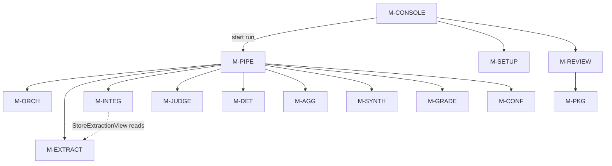

# Detailed Design Delta: Closing the Design ↔ Implementation Gaps

**Source:**
- `docs/design-gap-analysis.md` (GAP-01…GAP-24, D-1…D-6, DOC-1);
- `docs/design/detailed-design.md` v1.4 (the "base design");
- `docs/agentic-evaluation-harness-for-education.md` (HLD v3.3.3).

**Code baseline validated against:** `origin/main` @ `e0ac5626`, `src/aeh/*.py`.

**Version:** 1.5-delta  **Date:** 2026-09-14  **Status:** Draft, for review before `/create-test-plan`.
**Author:** `/detailed-design-generator`, gap-closure mode.

## Revision history

| Version | Date | Change | Author |
|---|---|---|---|
| 1.5.1-delta | 2026-09-14 | **Q-15 resolved by the user's decision:** "we should be able to easily switch between harness profiles using env variable update." <br>• Adds §3.15 (`M-CONF`: FR-CONF-13/14, CT-CONF-15/16), a per-profile config file whose section is selected by `HARNESS_PROFILE`, with the environment taking precedence. <br>• FR-CONSOLE-36's merge order is reversed to environment-over-`cfg`, which removes the contradiction with CT-CONSOLE-27. | `/detailed-design-generator` (user decision) |
| 1.5-delta | 2026-09-14 | A design delta for every verified gap. It adds one module (`M-PIPE`, run composition) and new append-only requirement and contract IDs on 14 existing modules, 6 ADRs (ADR-14…ADR-19), 6 design decisions for D-1…D-6, and a migration plan. Four further defects found while validating against `src/` are folded in as V-1…V-4 (§6). No existing `FR-*`/`NFR-*`/`CT-*` is renumbered. Where one is **amended**, the amendment is stated explicitly and classified under base §4.7 | `/detailed-design-generator` |

---

## 1. Scope & purpose

This document is a **delta** to `detailed-design.md`, not a replacement. For each gap it specifies the requirements, interfaces, data changes, data flow, contracts and error semantics an implementer needs. Every design element was checked against the shipped code (§6), so the plan builds on real signatures rather than the ones the base design only names.

**How to apply it.** When accepted, merge each §3 section into the matching base-design module section. New IDs append; amended IDs replace the base row and note the amendment in that row's Notes. §4.7 of the base design (the contract register) gets the deltas in §4.6 here.

**Out of scope.**
- Test cases (`/create-test-plan` owns them). §5 does name the existing tests a change un-marks or rewrites, so the plan stays honest about coverage.
- Issues (`/plan-to-issues` owns them).
- Code.

### 1.1 Conventions used here

- **IDs** continue each module's sequence from the base design's highest ID at `e0ac562`, for example FR-ORCH-26 → FR-ORCH-27. They are append-only.
- **Migrations.** Version numbers are the **next free version per tier at `e0ac562`**: Package 10 → 11, Cohort 19 → 20+, Durable 8 → 9+. If another migration lands first, the implementer takes the next free number. A migration always bumps `COMPLETE_SCHEMA_VERSIONS` (`store.py:1397-1401`) in the same change, and the `CLAUDE.md` migration-chain paragraph is updated with it.
- **Registration.** Each migration is appended to `TIER_MIGRATIONS[tier]` by its owning module at import time, following the existing idiom (`agg.py:1395-1396`, `grade.py:2825-2826`).
- **Declared SQL only.** Every new statement is a module-level `Statement` in the owning module's `*_STATEMENTS` registry (FR-STORE-08 / SEC-15), and every new `tx.execute` site is added to `KNOWN_EXECUTE_SITES`.
- **Knobs** are `HARNESS_<MODULE>_*`, read at call time, and an invalid value raises the module error (`CLAUDE.md` seam 3).
- **`Assumption:`** marks every number or choice the HLD, base design or gap analysis does not supply.

---

## 2. Module inventory (delta)

| Module ID | Name | Responsibility | Type | Depends on | Change |
|---|---|---|---|---|---|
| **M-PIPE** | **Run Composition & Process Entry** | **Composes one run end-to-end from the stage modules. It owns no stage logic, no schema and no model policy. It is the headless driver, the recovery entry point and the `python -m aeh` process.** | **library + job** | M-CONF, M-STORE, M-PROV, M-PKG, M-ORCH, M-EXTRACT, M-INTEG, M-JUDGE, M-DET, M-AGG, M-SYNTH, M-GRADE, M-REVIEW, M-CONSOLE | **New (ADR-15)** |
| M-ORCH | Run Orchestrator & Work Ledger | unchanged | library | unchanged | Stage-executor seam, cell phases, provider-error pauses, `validate_grade_policy`, alerts, metrics |
| M-EXTRACT | Evidence Extraction | unchanged | library | unchanged | Provider-error taxonomy, `extraction_metrics` |
| M-JUDGE | Panel Scoring | unchanged | library | unchanged | Provider-error taxonomy, `verdicts_for`, latency and assessment persistence |
| M-INTEG | Evidence Integrity | unchanged | library | + M-EXTRACT (read) | `StoreExtractionView`, indexes, per-run document cache |
| M-AGG | Aggregation | unchanged | library | unchanged | `write_score`, run-scoped `criterion_score`, `aggregation_signals` |
| M-DET | Deterministic Evaluator | unchanged | library | unchanged | Run-scoped upsert |
| M-GRADE | Grading | unchanged | library | unchanged | Run-scoped score reads |
| M-REVIEW | Review Queue | unchanged | library | + M-PKG (read) | Ranking inputs, `scoring_model_for`, label columns, `review_queue` columns |
| M-STATS | Validation Statistics | unchanged | library | unchanged | `judge_signals`, MVVP measurement drivers, NULL flag, export |
| M-CALIB | Calibration | unchanged | library | unchanged | Public roster registration |
| M-INGEST | Ingestion | unchanged | library | unchanged | Cluster resolution per region kind |
| M-SETUP / M-PKG | Setup / Package Catalog | unchanged | library | unchanged | `criterion.evaluation_mode` |
| M-CONSOLE | Console | unchanged | UI | + M-SETUP, M-REVIEW, M-GRADE, M-PIPE | Real HTTP server, wired actions, service-backed screens, environment-resolved profile |

**Dependency-graph note.** `M-PIPE` sits above every stage module. No stage module imports `M-PIPE`. `M-CONSOLE` calls `M-PIPE` only for "start run" and serving; `M-PIPE` imports `M-CONSOLE` only in its `console` sub-command. That edge is a deferred import inside `main()`, so no import cycle forms (§6, V-5).

---

## 3. Per-module design deltas

### 3.1 Module: Run Composition & Process Entry (`M-PIPE`) — **new** · closes GAP-01, GAP-06, V-2

**Responsibility.** Turn "a cohort, a published package version and a resolved `RunConfig`" into a completed run with evidence, verdicts, scores, narratives and grades, by calling each stage module's public door in the §4.2.2 order. It also recovers interrupted runs on process start and exposes the `aeh` command line.

**Does not own.**
- Leasing, ordering, concurrency or escalation policy (`M-ORCH`).
- Any table, statement or migration (every write goes through the owning module).
- Model-call retries or strikes (the stage workers).
- Any score arithmetic (`M-AGG`/`M-DET`).

**Functional requirements**

| ID | Requirement | Notes |
|---|---|---|
| FR-PIPE-01 | `run_to_completion(store, run_id, *, provider, run_config)` shall drive the run until `M-ORCH`'s completion predicate (FR-ORCH-12) holds or the run is paused. It returns a `RunResult` whose `status` equals the stored `run.status` and whose `stages` trace carries one entry per stage executed. | Seam 1; GAP-01 |
| FR-PIPE-02 | Every leased `extract`, `score` and `deterministic` unit shall be executed by the owning stage door: `ExtractionWorker.process` (`extract.py:860`), `ScoringWorker.dispatch` + `persist` (`judge.py:1698`, `:1794`), and `DeterministicEvaluator.evaluate` (`det.py:949`) followed by `Orchestrator.complete`. No unit shall be marked `done` without the stage's payload row (evidence, verdict or `criterion_score`) existing in the same cohort. | GAP-01; replaces the answer-discarding path |
| FR-PIPE-03 | When every `extract` unit of a (run, submission, criterion) cell is terminal and the cell has no `integrity_pre` phase, the module shall call `IntegrityGate.verify` once and record phase `integrity_pre` (FR-ORCH-28). | FR-ORCH-05 gate; §4.2.2 step 2 |
| FR-PIPE-04 | When every `score` unit of a judged cell is terminal and the count of terminal score units exceeds the cell's recorded `aggregated_units`, the module shall, in this order: <br>1. call `IntegrityGate.verify` (the post-panel sufficiency route); <br>2. read the cell's verdicts (FR-JUDGE-18); <br>3. call `aggregate(verdicts, criterion, signals, breaker_tripped=…, fallback=…)`; <br>4. in **one** cohort transaction: `write_score` (FR-AGG-15), evaluate `should_escalate`, and when it escalates call `Orchestrator.enqueue_escalation(tx, (run_id, submission_id, criterion_id))`; <br>5. record phase `aggregated` with the unit count consumed. | GAP-01/02; base §3.12 "same transaction" |
| FR-PIPE-05 | A cell whose score units leave exactly two verdicts after a terminal failure shall be aggregated with `fallback=True` (FR-AGG-12 / FR-ORCH-26), never with an even panel. | Existing `aggregate(fallback=)` keyword (`agg.py:580-589`) |
| FR-PIPE-06 | When the run reaches `complete`, the module shall synthesize every submission whose criteria all carry a `criterion_score` row for the run (`SynthesisWorker.synthesize_submission`, `synth.py:886`), then call `GradingService.compute_all(run_id)` (`grade.py:1361`), and record both in the trace. A synthesis failure shall not prevent grading (TC-REQ-85 behaviour). | FR-GRADE-01/10; CT-GRADE-? consumer of synth completeness |
| FR-PIPE-07 | `recover(store)` shall call `Orchestrator.sweep_expired_leases()` and then `Orchestrator.resume()`. It then calls `GradingService.compute_all` for every run in `complete` whose grades are not all final (review-window lapse, FR-GRADE-10), and returns a `RecoveryReport`. | GAP-06; PR #339 finding |
| FR-PIPE-08 | `python -m aeh run --data-dir D --cohort C --package-version V [--config FILE]` shall resolve the config through `aeh.conf.effective_config(file_cfg)` (FR-CONF-14: environment over file, per-profile section selected by `HARNESS_PROFILE`). It then creates or looks up the run, calls `recover`, then `run_to_completion`, prints the `RunResult` as JSON, and exits 0 on `complete`, 3 on `paused` and 1 on error. | GAP-06; seam 1 |
| FR-PIPE-09 | `python -m aeh recover --data-dir D` shall run FR-PIPE-07 and print the report. `python -m aeh console --data-dir D` shall call `recover`, then `aeh.console.serve_console(store)` with the environment-resolved config (FR-CONSOLE-36). | GAP-06, GAP-22/23 |
| FR-PIPE-10 | `StoreExtractionView(handle, catalog)` shall implement the five reads `IntegrityGate` performs on its view: `spans`, `second_family_spans`, `regions`, `panel_sufficiency` and `criterion_requires_citation` (`integ.py`, `self._view.*`). It reads the stored `evidence`/`verdict`/`document_region` rows and the package criterion, and it is the view `M-PIPE` constructs `IntegrityGate` with. | **V-2**: no production view exists; tests use `tests/support/e2e_world.py:423` `LedgerEvidenceView` |

**Interfaces**

```python
# aeh/pipeline.py
@dataclass(frozen=True)
class StageTrace:
    stage: str            # "extract" | "integrity_pre" | "score" | "deterministic" | "aggregate"
                          # | "synthesize" | "grade" | "recover"
    units: int            # units (or cells, or submissions) the stage processed this call
    done: int
    quarantined: int
    detail: tuple[str, ...]   # human-readable, never a bare status (seam 4)

@dataclass(frozen=True)
class RunResult:
    run_id: str
    status: str               # stored run.status after the call
    pause_reason: str | None
    stages: tuple[StageTrace, ...]
    grades_computed: int
    grades_final: int

@dataclass(frozen=True)
class RecoveryReport:
    leases_reclaimed: int
    runs_resumed: tuple[str, ...]
    runs_regraded: tuple[str, ...]

class ProductionStageExecutor:            # implements aeh.orch.StageExecutor (FR-ORCH-27)
    def __init__(self, store, provider, run_config, *, catalog=None,
                 high_risk_criteria: Sequence[str] = ()) -> None: ...
    def execute(self, unit: WorkUnit, governed_provider: Any) -> StageOutcome: ...

def run_to_completion(store, run_id: str, *, provider, run_config,
                      clock=None, max_passes: int | None = None) -> RunResult: ...
def recover(store, *, clock=None) -> RecoveryReport: ...
def main(argv: Sequence[str] | None = None) -> int: ...

# aeh/__main__.py
from aeh.pipeline import main; raise SystemExit(main())
```

**Data flow.** §4.2 gives the full sequence. One pass is:

1. `Orchestrator.progress(run_id)` runs one dispatch pass through the executor (FR-ORCH-27).
2. `M-PIPE` runs the cell hooks (FR-PIPE-03/04) on cells the orchestrator reports ready (FR-ORCH-29).
3. It loops until the predicate holds, or until `max_passes` (`Assumption:` unbounded by default).

**Dependencies.** Upstream callers: the CLI and `M-CONSOLE`'s "start run". Downstream: every module in §2's row, each through its public door only.

**Non-functional requirements**

| ID | Category | Requirement |
|---|---|---|
| NFR-PIPE-01 | Reliability | A process kill at any point followed by `recover` + `run_to_completion` produces the same stored evidence, verdicts, scores and grades as an uninterrupted run (FR-ORCH-03 plus each writer's idempotent upsert). |
| NFR-PIPE-02 | Performance efficiency | Composition overhead (hooks, readiness queries) shall add < 5% to the scheduling overhead budget of NFR-ORCH-01 at 23,000 units. `Assumption:` 5%, not in HLD. |
| NFR-PIPE-03 | Portability | `python -m aeh` runs from a clean `pip install .` with no dev requirements (GAP-06 packaging, §3.14). |

**Error handling.**
- `ProviderUnavailableError` and `BuildChangedError` raised by a worker propagate to the dispatch pass, which pauses the run with `cause=` (FR-ORCH-30). `run_to_completion` returns `status="paused"`.
- `RateLimitedError` requeues without a strike (FR-ORCH-30).
- Any other exception out of a hook is recorded in that stage's `detail`, and the run pauses with `pause_reason="composition fault: <type>: <msg>"`. It is never swallowed.

**Observability.** `RunResult.stages`. The `run_metrics` flush stays `M-ORCH`'s.

**Configuration.**
- `HARNESS_PIPE_MAX_PASSES` (default unset = unbounded).
- `HARNESS_PIPE_PASS_SLEEP_MS` (default 0; used only when a pass made no progress and units are leased by others).

**Contract** (`CT-PIPE`, v1.0) · Stability: provisional

A caller holding `M-PIPE` holds "run this to completion" and "recover after a crash", and no stage behaviour.

| ID | Kind | Clause (assertable) | Consumers |
|---|---|---|---|
| CT-PIPE-01 | surface | `run_to_completion`, `recover` and `main` exist with the signatures above; `python -m aeh` dispatches to `main`. | `M-CONSOLE`, operator |
| CT-PIPE-02 | behaviour | After `run_to_completion` returns `complete`, every judged (submission, criterion) pair admitted by FR-ORCH-22 has exactly one `criterion_score` row for the run **or** a quarantined extract/score unit, and every admitted submission has a current `submission_grade` row for the run. | `M-GRADE`, `M-REVIEW`, `M-CONSOLE` |
| CT-PIPE-03 | behaviour | Idempotent: calling `run_to_completion` again on a `complete` run writes no row (FR-ORCH-03) and returns the same `status`. | operator |
| CT-PIPE-04 | error | A provider outage or build change leaves the run `paused` with `pause_reason` naming the error class and no unit quarantined by it. | `M-CONSOLE` |
| CT-PIPE-05 | state | `M-PIPE` executes no SQL. Every row it causes is written by the owning module's declared statements (SEC-15 census gains no `aeh.pipeline` site). | `M-STORE`, SEC-15 |
| CT-PIPE-06 | security | `M-PIPE` makes no model call itself; every call goes through a stage worker holding the governed provider (ADR-14), so CT-PROV-15's single egress point holds. | `M-PROV` |
| CT-PIPE-07 | behaviour | **Not promised:** the order in which ready cells are post-processed within one pass. | all |

*Requires*

| Depends on | Clauses relied on | What this module assumes |
|---|---|---|
| `M-ORCH` | CT-ORCH-03, CT-ORCH-22…26 (new) | Resume and predicate semantics; the executor seam; cell phases; `validate_grade_policy` at `create_run` |
| `M-EXTRACT` / `M-JUDGE` | CT-EXTRACT-16, CT-JUDGE-19/20 (new) | Workers persist and complete in one transaction; taxonomy errors propagate |
| `M-INTEG` | CT-INTEG-16/17 (new) | `verify` is idempotent per cell and route (V-3) |
| `M-AGG` | CT-AGG-01, CT-AGG-18/19 (new) | `aggregate` pure; `write_score` uses the caller's transaction |
| `M-GRADE` | CT-GRADE-14, CT-GRADE-20 (new) | `compute_all` settles automatically on completion or window lapse |
| `M-SYNTH` | CT-SYNTH-05 | A submission with incomplete criteria is not synthesized |

*Compatibility.* This is a new contract, so everything in it is additive. Changing the exit-code mapping is breaking. The test double for `run_to_completion` is the real function over `RecordedFixtureProvider` (CT-PROV-10); the e2e suites must use it rather than `tests/support/e2e_world.py`'s aggregation walk.

**Open questions.** Whether `M-PIPE` should own synthesis scheduling as ledger units (a `synthesize` stage in M-ORCH) rather than as a post-completion hook. Chosen here: a hook (ADR-15 discusses the alternative).

---

### 3.2 Module: `M-ORCH` — delta · closes GAP-01 (seam), GAP-03 (keys), GAP-07, GAP-09, GAP-11; V-1 (pause half)

**Functional requirements (new)**

| ID | Requirement | Notes |
|---|---|---|
| FR-ORCH-27 | `Orchestrator(store, *, executor: StageExecutor | None = None, transport=None, …)`. When `executor` is bound, `_run_model_batch` shall submit `executor.execute(unit, governed)` to its pool instead of `transport.call(payload)`. `governed` is a `GovernedProvider` wrapping the run's provider that updates this run's dispatch counters on every `complete()` call (tokens, cost, cache tokens, resolved builds, in-flight and peak concurrency). The `transport=` seam stays as the **test-only** call-counting executor (`TransportStageExecutor`). Binding both is a `ValueError`. | GAP-01 / ADR-14. Validated: pool, counters and requeue at `orch.py:4940-5011` |
| FR-ORCH-28 | The module shall record per-cell composition phases in a Tier C table `cell_phase(run_id, submission_id, criterion_id, phase, units_consumed, recorded_at)`, with PK `(run_id, submission_id, criterion_id, phase)`, via `mark_cell_phase(tx, run_id, submission_id, criterion_id, phase, units_consumed)`. `phase ∈ {'integrity_pre', 'integrity_post', 'aggregated'}`. | Resume-safe hooks (NFR-PIPE-01) |
| FR-ORCH-29 | `ready_cells(run_id, hook) -> tuple[CellKey, ...]` shall return the cells for `hook='integrity_pre'` (all extract units terminal, no `integrity_pre` phase) and `hook='aggregate'` (all score units terminal, and terminal score-unit count > `units_consumed` of the `aggregated` phase, or no such phase). | FR-PIPE-03/04 |
| FR-ORCH-30 | **Only when an executor is bound** (`self._executor is not None`, i.e. a run driven by `M-PIPE`), the Sweep-2 claim gate (FR-ORCH-05) shall additionally require the cell's `integrity_pre` phase. The report-only path and the `transport=` test path keep today's gate unchanged, because nothing records `integrity_pre` on them and gating them would make every score unit unclaimable. Inside the dispatch pass: `RateLimitedError` requeues without an attempt (existing, `orch.py:4977-4980`); `ProviderUnavailableError` and `BuildChangedError` requeue the unit without an attempt and call `self.pause(run_id, cause=error)` (FR-ORCH-16/17), then stop the pass. | V-1 pause half: today these propagate raw out of `progress()` (`orch.py:4978-4985` handles only rate-limit and OOM) |
| FR-ORCH-31 | `create_run` shall call `validate_grade_policy(catalog, package_version_id)` before the run insert. It raises `PackageIntegrityError(PackageError)` listing every criterion id the grade policy references (per-question rules, gate criteria, best-k members, weights) that the version does not declare. | GAP-07 / CT-GRADE-15. Insert point: beside `_verify_retention_at_start` (`orch.py:2230`) |
| FR-ORCH-32 | `evaluate_alerts(*, run_row, metrics, breaker_rows, budget_state, cache_history) -> tuple[RunAlert, ...]` shall be pure and return the five base-§3.7 alerts by stable name: `orch_escalation_rate_above_budget`, `orch_criterion_breaker_tripped`, `orch_cost_near_ceiling` (spend ≥ `HARNESS_ORCH_COST_WARNING_FRACTION` × ceiling, default 0.9), `orch_cache_hit_rate_collapse` and `orch_run_paused`. `progress()` shall attach them to `ProgressReport.alerts`. | GAP-09 |
| FR-ORCH-33 | `_flush_run_metrics` shall additionally write `estimated_cost` (from `run.cost_estimate`), `cost_currency`, `retention_setting`, `resolved_builds` (a JSON list, the set over the run) and `wall_clock_ms` computed as `now − run.started_at − Σ(paused intervals from run_control)`. The in-memory `started_monotonic` is no longer used. | GAP-11. Validated: `orch.py:5229-5279`, `:4797`, `:5023` |
| FR-ORCH-34 | `enqueue_escalation(tx, criterion_score_key, …)` shall accept a `(run_id, submission_id, criterion_id)` key. The two-element form is deprecated and resolves the run from the unit ledger only when exactly one open run holds the pair, otherwise it raises `WorkLedgerError`. | GAP-03. Validated: the key is `(submission_id, criterion_id)` today (`orch.py:3844-3856`) |

**Interfaces**

```python
class StageExecutor(Protocol):
    def execute(self, unit: WorkUnit, governed_provider: Any) -> "StageOutcome": ...

@dataclass(frozen=True)
class StageOutcome:
    work_id: str
    status: str            # "done" | "struck" | "quarantined" — as the worker left the ledger
    detail: str = ""

class GovernedProvider:        # wraps an InferenceProvider (prov.py:1102 protocol)
    def complete(self, prompt, model_ref, params): ...   # counts, then delegates
    def capabilities(self, model_ref): ...
    def estimate_cost(self, plan): ...
    def verify_retention(self, model_refs): ...

CellKey = tuple[str, str, str]  # (run_id, submission_id, criterion_id)
def validate_grade_policy(catalog: Any, package_version_id: str) -> None: ...
def evaluate_alerts(*, run_row, metrics, breaker_rows, budget_state, cache_history) -> tuple[RunAlert, ...]: ...
```

**Data model.**
- Cohort migration **`orch_cell_phase`** (next free version, Assumption: 20): `CREATE TABLE cell_phase (…)` as FR-ORCH-28, plus `CREATE INDEX idx_wu_cell ON work_unit(run_id, submission_id, criterion_id, stage, status)`. The index serves FR-ORCH-29 and GAP-24's `count_units`.
- Add `cell_phase` to `_PURGE_DELETES` and `_COHORT_PURGE_ORDER` (base `store.py` rule: a cohort migration extends purge in the same change).

**Error handling.** `PackageIntegrityError` is raised before any row is written; `create_run` remains atomic.

**Observability.** `ProgressReport.alerts` (FR-ORCH-32); the new `run_metrics` names (FR-ORCH-33).

**Configuration.**
- `HARNESS_ORCH_COST_WARNING_FRACTION` (0.9).
- `HARNESS_ORCH_CACHE_COLLAPSE_SIGMA` (3.0).
- `HARNESS_ORCH_CACHE_COLLAPSE_FLOOR` (0.5).
- `HARNESS_ORCH_CACHE_COLLAPSE_MIN_HISTORY` (3).
- `Assumption:` the last three are PERF-04's runbook reading (PR #338); the HLD gives no number (see §4.4, D-7 open question).

**Contract delta** (`CT-ORCH` v1.0 → v1.1, additive except CT-ORCH-26)

| ID | Kind | Clause | Consumers |
|---|---|---|---|
| CT-ORCH-22 | surface | `Orchestrator(executor=…)` exists; with an executor bound, a unit reaches `done` only through the worker's own transaction or `complete()` after a deterministic `evaluate` (FR-PIPE-02). The orchestrator never marks an `extract` or `score` unit done itself. | `M-PIPE` |
| CT-ORCH-23 | observe | `GovernedProvider.complete` accrues every call's tokens, cost and resolved build to the run's counters, including calls a worker later strikes. | `M-STATS`, ops |
| CT-ORCH-24 | state | `cell_phase` is written only by `mark_cell_phase`, idempotently (`INSERT OR REPLACE` on the PK). | `M-PIPE` |
| CT-ORCH-25 | error | `create_run` raises `PackageIntegrityError` naming every missing criterion and writes no row (CT-GRADE-15). | `M-CONSOLE`, `M-PIPE` |
| CT-ORCH-26 | behaviour | **Amends CT-ORCH-08's key:** the escalation key is `(run_id, submission_id, criterion_id)`. The two-element form survives one contract version as deprecated. | `M-AGG`, `M-PIPE`, `M-INTEG` |
| CT-ORCH-27 | observe | `ProgressReport.alerts` carries exactly the five FR-ORCH-32 names; names are contract. | `M-CONSOLE` S7, ops |
| CT-ORCH-28 | error | A `ProviderUnavailableError`/`BuildChangedError` inside dispatch leaves the run `paused`, the unit `pending` with an unchanged `attempts`, and `progress()` returns rather than raising. | `M-PIPE`, `M-CONSOLE` |

*Compatibility.*
- CT-ORCH-26 is breaking for any caller passing the two-element key (today: tests and the `e2e_world` walk). It is shipped as deprecated for one version.
- The test double `TransportStageExecutor` must reproduce CT-ORCH-23's counting so the governor suites (TC-ORCH-24/33/35) keep their teeth.

---

### 3.3 Modules: `M-EXTRACT` and `M-JUDGE` — delta · closes V-1 (strike half), GAP-10, GAP-21 (verdict columns)

**Functional requirements (new)**

| ID | Requirement | Notes |
|---|---|---|
| FR-EXTRACT-11 | `ExtractionWorker.process` shall treat `RateLimitedError`, `ProviderUnavailableError` and `BuildChangedError` as **not strikes**. It re-raises them without calling `Orchestrator.fail` and without writing evidence. Other `ProviderError`s and parse `ValueError`s remain strikes. | **V-1.** Validated: `except (ProviderError, ValueError)` strikes every provider error (`extract.py:899-901`), which contradicts FR-PROV-07 and FR-ORCH-16/17 |
| FR-EXTRACT-12 | `extraction_metrics(handle, run_id) -> ExtractionMetrics` shall return, per criterion: the spans-per-unit distribution (count histogram), the empty-result rate, the second-family disagreement rate (`None` when no second family ran), and extraction latency p50/p95. It reads stored `evidence` rows plus the latency persisted by FR-EXTRACT-13. | GAP-10 / CT-EXTRACT-14 |
| FR-EXTRACT-13 | The evidence row shall carry `latency_ms INTEGER`, the wall time of the successful attempt. | Cohort migration `extract_latency` |
| FR-JUDGE-18 | `verdicts_for(handle, run_id, submission_id, criterion_id) -> tuple[StoredVerdict, ...]` shall return the cell's verdicts (band, band_ordinal, cited_spans, evidence_sufficient, uncited, judge_id) in `work_id` order, in the shape `aggregate` consumes (`agg._verdict_ordinal`/`_verdict_cited`, `agg.py:496-520`). | FR-PIPE-04 |
| FR-JUDGE-19 | `ScoringWorker.dispatch` shall treat the three taxonomy errors exactly as FR-EXTRACT-11 does. | V-1; `judge.py:1754` |
| FR-JUDGE-20 | `persist` shall additionally write `evidence_assessment TEXT` and `latency_ms INTEGER` on the verdict row. | GAP-21 row "verdict". Validated: `insert_verdict` omits both (`judge.py:316-320`) |
| FR-JUDGE-21 | `aeh.stats.judge_signals` (FR-STATS-20) is the emitter of CT-JUDGE-16. `M-JUDGE` supplies its inputs through FR-JUDGE-20, the `uncited`/`evidence_sufficient` columns, and a per-(criterion, judge) contract-violation count recorded as `run_metrics` rows `judge_contract_violations` by `dispatch`'s strike path. | GAP-10 |

**Data model.**
- Cohort migration `extract_latency`: `ALTER TABLE evidence ADD COLUMN latency_ms INTEGER`.
- Cohort migration `judge_verdict_assessment`: `ALTER TABLE verdict ADD COLUMN evidence_assessment TEXT`, `ADD COLUMN latency_ms INTEGER`.
- Both bump the Cohort pin.

**Contract delta**

| ID | Kind | Clause | Consumers |
|---|---|---|---|
| CT-EXTRACT-16 | error | The three provider taxonomy errors propagate out of `process` with no evidence row, no `fail()` and no attempt increment. | `M-ORCH`, `M-PIPE` |
| CT-EXTRACT-17 | observe | `extraction_metrics` names are contract: `spans_per_unit`, `empty_result_rate`, `second_family_disagreement_rate`, `extraction_latency_p50_ms`, `extraction_latency_p95_ms`. | `M-STATS`, ops |
| CT-JUDGE-19 | error | Same as CT-EXTRACT-16, for `dispatch`. | `M-ORCH`, `M-PIPE` |
| CT-JUDGE-20 | data | `verdicts_for` returns only the cell's verdicts for the named run, never another run's, ordered by `work_id`. | `M-PIPE`, `M-AGG` |

*Compatibility.* CT-EXTRACT-16/CT-JUDGE-19 **change behaviour** (a rate limit no longer consumes a strike). Consumers that pinned the old strike count (TC-EXTRACT-08 stub counters, TC-PROV-18) must be re-derived; this is breaking for those tests and a correction against FR-PROV-07.

---

### 3.4 Module: `M-INTEG` — delta · closes V-2 (view), V-3, GAP-24

**Functional requirements (new)**

| ID | Requirement | Notes |
|---|---|---|
| FR-INTEG-09 | `M-INTEG` shall publish `StoreExtractionView` (moved here from FR-PIPE-10's consumer need, because the view's five reads are this module's declared *Requires* surface). It is constructed as `StoreExtractionView(handle, catalog, package_version_id)`. | V-2. `M-PIPE` constructs it; the tests' `LedgerEvidenceView` becomes a double that must match CT-INTEG-17 |
| FR-INTEG-10 | `verify(run_id, submission_id, criterion_id)` shall be idempotent per (cell, route, **panel state**). Panel state is the set of terminal extract and score `work_id`s for the cell. A repeated call whose panel state equals the one recorded at the previous routed call writes no additional `work_unit`, `review_queue` or `run_metrics` row and performs no `bump_retries`. **This includes the self-inflicted case:** the sufficiency and verification branches insert the gate's own pending extract unit and then bump (`integ.py:911-956`), and that unit must not be bumped again by a repeat call. A changed panel state (for example, an escalation's verdicts landed) may route again. The recorded state lives in `cell_phase.units_consumed` (FR-ORCH-28), extended with an `integrity_post` phase. | **V-3.** Validated: `insert_unit`/`_enqueue_review` are `INSERT OR IGNORE`, but `bump_retries` (`integ.py:192-197`) increments attempts on **every** call for pending units, so a second call would burn a retry |
| FR-INTEG-11 | The gate shall read a submission's canonical document bytes at most once per (run, content_hash) within one `IntegrityGate` instance (an LRU bounded by `HARNESS_INTEG_DOCUMENT_CACHE_ENTRIES`, default 64), and the content-hash re-verification shall run once per cached entry. | GAP-24. Validated: `_document_bytes` re-reads and re-hashes per verify (`integ.py:620-660`) |
| FR-INTEG-12 | Cohort migration `integ_read_indexes` shall add `CREATE INDEX idx_document_submission ON document(submission_id, document_id)`. `count_units`/`max_retry_attempts` are served by `idx_wu_cell` (FR-ORCH-28's migration). | GAP-24. Validated: `read_document` filters `submission_id` with no index in any migration (`grep CREATE INDEX` finds none on `document`); `idx_wu_pairs` leads with `status` so it cannot seek `(run, submission, criterion)` (`orch.py:604-605`) |

**Non-functional (amended).** NFR-INTEG-01 stands unchanged (< 1% of run wall clock). The acceptance form is clarified: it is measured as **gate time excluding test-double reads**, on E4, as PERF-06/PERF-10 already do.

**Contract delta**

| ID | Kind | Clause | Consumers |
|---|---|---|---|
| CT-INTEG-16 | behaviour | `verify` twice on unchanged inputs leaves the ledger, review queue and metrics identical to one call. | `M-PIPE` |
| CT-INTEG-17 | surface | `StoreExtractionView` implements exactly `spans`, `second_family_spans`, `regions`, `panel_sufficiency`, `criterion_requires_citation`; each read faults by raising, and never by returning a substitute value, so the gate's fail-closed mapping (CT-INTEG-01) applies. | `M-PIPE`, test doubles |
| CT-INTEG-18 | perf | Median `verify` ≤ 2 ms per cell for a 4-page submission with ≤ 20 spans on E1. `Assumption:` derived from 1% of the PERF-06 run's per-cell wall share; re-baseline on E4. | ops, PERF-06 |

---

### 3.5 Module: `M-AGG` — delta · closes GAP-02, GAP-03, GAP-10

**Functional requirements (new / amended)**

| ID | Requirement | Notes |
|---|---|---|
| FR-AGG-15 | `write_score(tx, run_id, submission_id, score: CriterionScore, signals: IntegritySignals) -> None` shall upsert the `criterion_score` row keyed `(run_id, submission_id, criterion_id)` with: `band`, `modal_band`, `band_spread`, `points`, `judge_count`, `agreement`, `confidence`, `confidence_base`, the four stored integrity flags (FR-AGG-13), `described_evidence`, `extractor_disagreement` (NULL = not measured), `caps_fired` (JSON list of cap names), `routing` and `state`. It uses the caller's transaction and declares one statement, `AGG_STATEMENTS["upsert_criterion_score"]`. `aggregate` stays pure (CT-AGG-01). | GAP-02. Validated: `CriterionScore` carries `modal_band`, `band_spread`, `histogram`, `confidence`, `confidence_base` (`agg.py:319-345`) |
| FR-AGG-16 | Cohort migration `agg_run_scoped_score` (owned by `aeh.agg`) shall rebuild `criterion_score` with PK `(run_id, submission_id, criterion_id)`, adding `run_id TEXT NOT NULL`, `modal_band TEXT`, `band_spread INTEGER NOT NULL DEFAULT 0`, `described_evidence INTEGER`, `extractor_disagreement INTEGER` and `caps_fired TEXT`, and keeping the `judge_count` CHECK. Backfill: `run_id` = the cohort's only run when exactly one `run` row exists; if more than one exists and rows are present, the migration fails with `MigrationError("criterion_score rows cannot be attributed to a run: <n> runs")`. | GAP-03 / ADR-16. Rebuild precedent: grade v18 (`grade.py:2778-2826`) |
| FR-AGG-17 | `aggregation_signals(handle, run_id) -> AggregationSignals` shall return, per criterion: band histogram, `band_spread` distribution, ordinal α distribution, escalation rate, auto-accept rate and per-cap fired counts, read only from stored `criterion_score` and `work_unit` rows. | GAP-10 / CT-AGG-15 |
| FR-AGG-13 | **Amended:** the stored integrity inputs are all six signals (`described_evidence` and `extractor_disagreement` added), so CT-AGG-C15's disclosed per-cap residual closes. | Additive |

**Contract delta**

| ID | Kind | Clause | Consumers |
|---|---|---|---|
| CT-AGG-18 | state | `M-AGG` is the only writer of judged `criterion_score` rows; `M-DET` remains the writer of deterministic rows (CT-DET-*); `M-SYNTH` writes none (FR-AGG-14). | `M-GRADE`, `M-REVIEW`, `M-STATS`, `M-CONSOLE` |
| CT-AGG-19 | behaviour | `write_score` is idempotent on its key and writes nothing outside the caller's transaction; a raising `write_score` leaves the transaction to roll back whole. | `M-PIPE`, `M-ORCH` |
| CT-AGG-20 | data | Every `criterion_score` row names its `run_id`; no consumer may read scores without a run filter. | all readers |
| CT-AGG-21 | observe | `aggregation_signals` names (`band_histogram`, `band_spread_distribution`, `agreement_distribution`, `escalation_rate`, `auto_accept_rate`, `caps_fired.<cap>`) are contract. | `M-STATS`, ops |

*Compatibility.* CT-AGG-20 is **breaking** for every reader that queries by `submission_id` alone. Validated readers: `grade.py:780`, `:922`, `:934`; `review.py:544-547`, `:2640`; `console.py` score reads; `det.py:645-653`. All must change in the same PR as the migration (§4.5 landing order).

---

### 3.6 Module: `M-DET` — delta · GAP-03

| ID | Requirement | Notes |
|---|---|---|
| FR-DET-11 | `upsert_criterion_score` (`det.py:645-653`) shall key on `(run_id, submission_id, criterion_id)`, write `run_id` and `band_spread = 0`, and `rederive_for_key_change` shall re-derive only rows of the named run (today it resolves `_newest_run`, `det.py:258`). | GAP-03 |

| ID | Kind | Clause | Consumers |
|---|---|---|---|
| CT-DET-15 | state | A deterministic evaluation of run B never modifies run A's rows. | `M-GRADE`, `M-CONSOLE` S12 |

---

### 3.7 Module: `M-GRADE` — delta · GAP-03

| ID | Requirement | Notes |
|---|---|---|
| FR-GRADE-18 | Every `criterion_score` read in `M-GRADE` shall filter `run_id = :run_id` (`grade.py:780`, `:922`, `:934`), and `rollup_findings` shall scope findings to the run (the PR #308 disclosure lifts). | GAP-03 |

| ID | Kind | Clause | Consumers |
|---|---|---|---|
| CT-GRADE-20 | behaviour | `compute_all(run_id)` reads only run `run_id`'s scores; recomputing run A after run B's scores land returns run A's totals unchanged. | `M-PIPE`, `M-CONSOLE` |

---

### 3.8 Module: `M-REVIEW` — delta · closes GAP-08, GAP-13, and supports GAP-05

**Functional requirements (new)**

| ID | Requirement | Notes |
|---|---|---|
| FR-REVIEW-18 | The store form (`_StoredScoreRow`, `review.py:2665-2697`) shall populate FR-REVIEW-03's inputs from stored data, filtered by run: <br>• `panel_spread` ← `criterion_score.band_spread`; <br>• `adverse_integrity_signals` ← count of adverse stored flags; <br>• `transcription_overlap` ← `ocr_overlap_risk`; <br>• `scoring_model` and `criterion_weight` ← the run's package version (`criterion.scoring_model`; the weight from `grade_policy`); <br>• `historical_override_rate` ← Tier D `label` overrides ÷ judgments for (package lineage, criterion), `None` below `HARNESS_REVIEW_OVERRIDE_MIN_N` (5); <br>• `grade_boundary_delta` ← `PackageCatalog.distance_to_nearest_boundary` (`pkg.py:2842`) of the submission's current total; <br>• `est_seconds` ← `HARNESS_REVIEW_EST_SECONDS_ATOMIC` (45) / `_HOLISTIC` (90). <br>The hard-coded `scoring_model = "atomic"` (`review.py:2697`) is removed. | GAP-08. `Assumption:` 45/90 s |
| FR-REVIEW-19 | `ReviewService.scoring_model_for(criterion_id) -> str` shall return the criterion's stored `scoring_model` for the service's run, and raise `ReviewError` for an unknown criterion. | Un-marks CT-AGG-C09 |
| FR-REVIEW-20 | Cohort migration `review_queue_columns` shall add to `review_queue`: `run_id TEXT`, `rank_score REAL`, `est_seconds REAL`, `shown_at TEXT`, `action TEXT`, `new_band TEXT`, `new_points REAL`, `acted_at TEXT` (HLD §9.6, `:2380`). `build_queue` writes `rank_score`/`est_seconds`/`shown_at` for shown items, and `act` writes `action`/`new_band`/`new_points`/`acted_at`. Existing writers (`grade.py:866`, `integ.py:204`) add `run_id`. | GAP-08 / GAP-05 S9 |
| FR-REVIEW-21 | Durable migration `review_label_columns` shall add to `label`: `package_version_id`, `assignment_type`, `band_distance INTEGER`, `system_points REAL`, `teacher_points REAL`, `agreed INTEGER`, `panel_config TEXT` and `recorded_at TEXT`. `record_label`/`act` fill them: `assignment_type` from the package's population scope declaration (NULL when undeclared), `band_distance = |system_ordinal − teacher_ordinal|`, and `agreed = band_distance == 0`. | GAP-13 (Phase 2 consumer; the column is Phase 1 HLD DDL) |
| FR-REVIEW-22 | The `label.cohort_id` written by collection shall be the **cohort** id resolved from `run.cohort_id`, never the run id. Existing rows are rewritten by the migration through the durable→cohort run map where resolvable. | GAP-13 note (PR #307). Decision D-8 |

**Contract delta**

| ID | Kind | Clause | Consumers |
|---|---|---|---|
| CT-REVIEW-21 | behaviour | On a store whose queued scores differ only in `band_spread`, the store-form queue ranks the larger spread first at equal cost (EV > 0 for every admitted row with any adverse input). | `M-CONSOLE` |
| CT-REVIEW-22 | behaviour | At equal expected value a `holistic` criterion ranks above an `atomic` one in the store form (FR-AGG-06). | `M-AGG` (C09), `M-CONSOLE` |
| CT-REVIEW-23 | data | `label.cohort_id` is a cohort id (FR-REVIEW-22). | `M-STORE` purge, `M-STATS` |

*Knob prefix.* `review.py`'s `AEH_REVIEW_*` knobs (`review.py:1067-1086`) are renamed to `HARNESS_REVIEW_*`, and the old names are read as a fallback for one release. That is config-breaking only for anyone who set them; no setting exists in the repo.

---

### 3.9 Module: `M-STATS` — delta · closes GAP-10 (judge), GAP-14, GAP-18, GAP-19

| ID | Requirement | Notes |
|---|---|---|
| FR-STATS-20 | `judge_signals(handle, run_id) -> JudgeSignals` shall emit, per (criterion, judge): uncited-verdict rate, `evidence_sufficient=false` rate, band histogram, contract-violation rate, latency p50/p95 and prefix cache hit rate, reading verdict rows (FR-JUDGE-20) and `run_metrics` rows; and a `judge_contract_violations_concentrated` alert when one judge holds > `HARNESS_STATS_VIOLATION_CONCENTRATION` (0.5) of a criterion's violations with ≥ 5 violations. | GAP-10. Un-marks `test_ct_judge_c16_signal_dimensionality.py`. `Assumption:` 0.5 and 5 |
| FR-STATS-21 | `measure_position_bias(store, provider, panel, fixture_submissions, *, seed) -> Mapping[judge_id, PositionBiasRate]` shall re-score each fixture judgment with exemplar order and reference-material order permuted (via `HARNESS_JUDGE_EXEMPLAR_SEED` and assembly order) through `ScoringWorker.assemble`/`dispatch`, and return per-judge band-change rates. `measure_self_agreement(…, runs=3)` shall replicate each judgment ≥ 3 times. `run_mvvp`'s existing `measured_*` parameters (`stats.py:1629-1636`) consume the outputs unchanged. | GAP-14 (Phase 2, not yet due) |
| FR-STATS-22 | The admissibility predicate (`stats.py:579-583`) shall admit only `saw_system_output` that is present and equal to 0. A label **lacking** the attribute and a `None` flag both count into `excluded_count` as `saw_system_output_unrecorded`. | GAP-18. **Validated caveat:** the current predicate admits a missing attribute *deliberately* for pre-column shapes, so fixtures without the attribute must be updated in the same change (`/write-tests`) |
| FR-STATS-23 | **Amends NFR-STATS-03** (ADR-19): the long-horizon export is a read-only JSON Lines document per administration under `exports/`, with a documented schema. Parquet/DuckDB is a later optional extra. | GAP-19 |

| ID | Kind | Clause | Consumers |
|---|---|---|---|
| CT-STATS-22 | observe | `judge_signals` field names equal `tests/support/judge_vocabulary.JUDGE_SIGNAL_FIELDS`; the alert name is contract. | ops, `M-CONSOLE` |
| CT-STATS-23 | behaviour | A label with a NULL or absent `saw_system_output` never contributes to an agreement figure. | `M-CONSOLE`, `M-PKG` |

---

### 3.10 Module: `M-CALIB` — delta · GAP-15 (Phase 3, not yet due)

| ID | Requirement | Notes |
|---|---|---|
| FR-CALIB-15 | `register_dual_scored_roster(cohort_id, *, r0_version, r1_version, store)` shall build the roster from stored run-scoped `criterion_score` rows of the R₀ run and the bands `run_dual_scoring` returned for R₁. It persists the roster in a durable table `calib_roster(cohort_id, r0, r1, paper_id, criterion_id, r0_band, r1_band, recorded_at)` and populates `_CLASS_ROSTERS` from it on first use. `non_inferiority` (`calib.py:2050`, `:2088`) reads through it. The test seams remain for rung-0 cases. | Depends on GAP-02/03 |

| ID | Kind | Clause | Consumers |
|---|---|---|---|
| CT-CALIB-17 | state | A registered roster survives a process restart; `non_inferiority` on a restarted process gives the same result. | operator, `M-CONSOLE` |

---

### 3.11 Module: `M-INGEST` — delta · GAP-16

| ID | Requirement | Notes |
|---|---|---|
| FR-INGEST-36 | `resolve_cluster(cluster_id, resolution)` (`ingest.py:3828`) shall apply the resolution per region kind. <br>• `transcribed_text` and `described_graphic` regions: content replacement only; `selection_state` untouched. <br>• `selection_mark` regions: the resolution must equal a declared `question_option.option_id` for the region's question. When it does, `selection` and `selection_state='resolved'` are set together. Otherwise the region stays `ambiguous`, its content is replaced, and the returned report lists it under `selection_unresolved`. <br>The single statement `update_region_content` (`ingest.py:1857-1861`) is split into `update_region_text` and `resolve_selection_region`. | GAP-16 |
| FR-INGEST-37 | Cohort migration `ingest_selection_biconditional`: a `BEFORE UPDATE` and a `BEFORE INSERT` trigger on `document_region` shall abort `region_kind='selection_mark' AND selection_state='resolved' AND selection IS NULL`. | Defence in depth for CT-INGEST-05 |

| ID | Kind | Clause | Consumers |
|---|---|---|---|
| CT-INGEST-21 | data | No path, operator or pipeline, can store a resolved selection mark with a NULL selection; the trigger error is `IngestError` at the module boundary. | `M-DET` |

---

### 3.12 Modules: `M-SETUP` / `M-PKG` — delta · GAP-12, D-6-adjacent vocabulary

| ID | Requirement | Notes |
|---|---|---|
| FR-PKG-22 | Package migration `pkg_criterion_evaluation_mode` (Assumption: version 11) shall add `criterion.evaluation_mode TEXT NOT NULL DEFAULT 'judged' CHECK (evaluation_mode IN ('judged','deterministic'))`, backfilled `deterministic` where `kind='mcq'`. `_REVISION_COPY_KEYS` (`pkg.py:2053`) and `export_package` carry it. TC-REG-02's archive baseline and the F-SCHEMA goldens are regenerated on the declared ground (schema-version bump). | GAP-12 |
| FR-SETUP-17 | `SetupService` shall write `evaluation_mode` explicitly (`'deterministic'` for FR-SETUP-13 criteria, `'judged'` otherwise). `SCORING_MODELS` (`setup.py:295`) shall become `("atomic", "atomic_with_gate", "holistic")`, matching what `#52` already stores. | GAP-12; PR #244 |
| FR-ORCH-35 | Enumeration, the deterministic walk, `grade.separated_rollup`, `M-STATS` and `M-DET` shall read `criterion.evaluation_mode`, never `kind='mcq'`. | GAP-12 consumers (PR #251, #308, #343) |

| ID | Kind | Clause | Consumers |
|---|---|---|---|
| CT-PKG-19 | data | `criterion.evaluation_mode` is non-null and in the two-value domain on every version, including revision children and imports. | `M-ORCH`, `M-DET`, `M-GRADE`, `M-STATS` |

---

### 3.13 Module: `M-CONSOLE` — delta · closes GAP-04, GAP-05, GAP-17, GAP-20, GAP-22, GAP-23

**Functional requirements (new)**

| ID | Requirement | Notes |
|---|---|---|
| FR-CONSOLE-33 | `ConsoleServer` shall serve HTTP on the configured loopback socket with the standard library's `http.server.ThreadingHTTPServer` in-process (ADR-17): <br>• `GET` routes through `ConsoleApp.render(route, **query)` (`console.py:1389`) with `text/html; charset=utf-8`; <br>• `POST /actions/<slug>` routes through `perform(action, **form)`, restricted to `CONTROL_SURFACE_ACTIONS` (`console.py:387-403`); <br>• `POST /upload` streams to `store.blobs()` in chunks (FR-CONSOLE-04); <br>• `GET /assets/console.css` serves the packaged stylesheet `aeh/console_assets/console.css`; <br>• every unknown route → 404; <br>• `Cache-Control: no-store` on every response. <br>`_CHILD_SCRIPT` (`console.py:4131-4145`) is deleted. `terminate()` shuts the server down and joins its thread. | GAP-22. Validated: the configured socket never accepts; the child answers plain text |
| FR-CONSOLE-34 | On a store with `data_dir`, each Phase-1 control action shall perform its HLD §11.8 effect through the owning door (table below) and report `dispatched=True` only when that door returned without raising. A raised refusal returns `dispatched=False` with the refusal text. `contextlib.suppress(Exception)` around `finalize_batch` (`console.py:1965`) is removed. `amend_grade`, `set_review_window` and `record_gate_outcome` write through the store and read back from it; the in-memory ledgers `_grade_ledger`, `_review_windows` and `_gate_outcomes` stay only for the storeless audit double. | GAP-04 |
| FR-CONSOLE-35 | Screens shall render from service objects, not raw SQL: <br>• S9 from `ReviewService.build_queue(run_id, budget)` (`review.py:1410`, fields `flagged_total`, `shown`, `residual_provisional`, `reserved_for_blind_minutes`, `review.py:677-689`); <br>• S10/S11 from the M-REVIEW whole-grade sample and `blind_sample` session (`review.py:1716`, `:1922`); <br>• S3/S4/S5 from `SetupService.steps()` (`setup.py:1749`) and its proposals, with S3 rows editable per HLD §11.5 `:3073-3089`; <br>• S2 from the ingestion report / blob listing. <br>The queries on `review_queue.run_id`/`rank_position`, `review_budget`, `package_file`, `setup_skip`, `sample_selection` and `blind_sample` (`console.py:2486`, `:586-589`, `:1529`, `:1515`, `:1667`, `:1676`) are deleted. | GAP-05 |
| FR-CONSOLE-36 | `serve_console`/`start_console`/`ConsoleServer` shall resolve the effective config through `conf.effective_config(cfg, environ)` (FR-CONF-14), at start **and again on every control action**: process environment **over** `cfg`, so that `HARNESS_PROFILE` and `CONSOLE_BIND`/`CONSOLE_PORT` set in the environment win over any value in `cfg` or a config file. This happens before any check. The `cloud-hosted` refusal keys on the resolved `HARNESS_PROFILE`, then the loopback check on the resolved `CONSOLE_BIND`/`CONSOLE_PORT`. | GAP-23. Validated: only `cfg` is read (`console.py:4166-4183`); `conf.environment_snapshot` exists (`conf.py:945-955`) |
| FR-CONSOLE-37 | `_read_cohort_files` (`console.py:1354-1369`) shall not swallow `sqlite3.OperationalError`: it re-raises as `ConsoleReadError` naming the query and tier, and the page renders a visible "this view could not be read" section. Other per-ledger faults remain skippable but are counted in the page's build trace. | GAP-05, seam 4 |
| FR-CONSOLE-38 | `render_agreement_block` (`console.py:3163`) shall append `TOO_FEW_QUALIFIER = "too few to draw conclusions from"` whenever a figure renders with `n < aeh.stats.STATS_MIN_N_FOR_HEADLINE` (read at call time). | GAP-17; HLD `:3262` |
| FR-CONSOLE-39 | `grade_revision(revision=None)` shall read the row with `is_current = 1` for the named submission and run. | GAP-20 (`console.py:2808-2810`) |

**Action → door map (FR-CONSOLE-34; every door verified to exist at `e0ac562`)**

| §11.8 action | Door | Phase |
|---|---|---|
| approve question inventory | `SetupService.confirm_inventory` (`setup.py:2076`) | 1 |
| supply answer keys | `SetupService.set_answer_keys` (`setup.py:2379`) | 1 |
| accept or correct rubric read-back | `SetupService.read_back_rubric` (`setup.py:2217`) + its confirmation | 1 |
| set review window | M-PKG grade-policy write of `review_window_hours` (ADR-3) | 1 |
| start run | `Orchestrator.create_run` → `start` → `M-PIPE.run_to_completion` in a background thread owned by the server | 1 |
| pause/resume | existing `run_control` row (`console.py:2096-2127`) | 1 |
| resolve quarantine item | existing (`console.py:2172`ff) | 1 |
| review action | `ReviewService.act` / `act_on_group` (`review.py:1555`, `:1594`) | 1 |
| blind-sample submission | `ReviewService.blind_sample` session record (`review.py:1716`) | 1 |
| correct an answer key after a run | existing (`console.py:2213`ff) | 1 |
| finalize batch | `GradingService.finalize_batch` (`grade.py:1725`), refusals surfaced | 1 |
| amend a finalized grade | `GradingService.amend` (`grade.py:1770`) | 1 |
| approve exemplar paraphrases at export | `PackageCatalog.set_exemplar_provenance` (`pkg.py:2422`) | **3.5**: render present-and-unavailable naming 3.5 until then (FR-CONSOLE-25) |
| export/import package | `aeh.pkg.export_package` (`pkg.py:4360`) / import | 1 |
| purge cohort | existing | 1 |

**Non-functional (new)**

| ID | Category | Requirement |
|---|---|---|
| NFR-CONSOLE-08 | Reliability | "Start run" returns within 1 s; the run executes on a server-owned worker thread, so closing the browser or killing the server leaves the run resumable through `recover` (NFR-CONSOLE-03). |

**Contract delta**

| ID | Kind | Clause | Consumers |
|---|---|---|---|
| CT-CONSOLE-25 | surface | `GET /` on the served port returns 200 `text/html` rendered by `ConsoleApp.render`; `GET /assets/console.css` returns 200 `text/css`; an unknown route returns 404. | browser, operator |
| CT-CONSOLE-26 | state | On a real store, every Phase-1 action either causes its §11.8 row through the owning module and reports `dispatched=True`, or reports `dispatched=False` with the owning module's refusal text; no action reports success over a swallowed exception. | operator, `M-ORCH`, `M-GRADE`, `M-REVIEW`, `M-SETUP` |
| CT-CONSOLE-27 | security | With `HARNESS_PROFILE=cloud-hosted` in the process environment, and whatever `cfg` says, no console socket is bound. | operator |
| CT-CONSOLE-28 | error | A schema-level read failure renders a visible unreadable-view section and never a zero count. | teacher, operator |

*Requires (added rows)*

| Depends on | Clauses relied on | What this module assumes |
|---|---|---|
| `M-REVIEW` | CT-REVIEW-04, CT-REVIEW-21/22 | `build_queue` carries the header figures |
| `M-SETUP` | CT-SETUP-* steps | `steps()` enumerates blocking and optional steps |
| `M-PIPE` | CT-PIPE-01/04 | "start run" composition and pause semantics |
| `M-CONF` | CT-CONF-05 | `environment_snapshot` is the only env reader |

---

### 3.14 Modules: `M-STORE` / packaging — delta · GAP-06 (packaging), GAP-21 decisions

| ID | Requirement | Notes |
|---|---|---|
| FR-STORE-15 | `pyproject.toml` shall declare the following, so that `pip install .` provides the pipeline without dev requirements: <br>• `[build-system]` (setuptools ≥ 69); <br>• `[project.scripts] aeh = "aeh.pipeline:main"`; <br>• `dependencies = []` for the core (stdlib only, ADR-11); <br>• `[project.optional-dependencies] live-ingest = ["pypdf>=6.0", "pypdfium2>=4.0"]`; <br>• package data `aeh/console_assets/*`. | GAP-06 (`pyproject.toml` validated: no build-system, no scripts, empty deps) |

**GAP-21 schema decisions.** For each HLD §9 divergence the gap analysis lists, this delta takes a position, recorded in ADR-18 and the Data-structures notes:

| HLD item | Decision |
|---|---|
| `criterion_band` → `band`; `mcq_option` → `question_option`; `package_validation` → `validation_record`; `audit_id` → `audit_record_id`; `run_metrics` wide → EAV; `grade_policy` columns → JSON | **Adopt shipped.** HLD §9 and base Data structures updated by ADR-18 (documentation only) |
| `verdict.evidence_assessment`/`latency_ms` | Add (FR-JUDGE-20) |
| `criterion_score.run_id`/`band_spread` | Add (FR-AGG-16) |
| `review_queue` action columns | Add (FR-REVIEW-20) |
| `label` columns | Add (FR-REVIEW-21) |
| `criterion.evaluation_mode` | Add (FR-PKG-22) |
| `validation_record.expected_mean`/`expected_sd`/`expected_histogram` | **Add** in package migration `pkg_validation_baseline`, written by `M-STATS.promote` from the administration's judged distribution; read by `should_escalate`'s `baseline` (FR-PIPE-04) and the drift check (FR-STATS-09). Without it the escalation "distributional anomaly" input (FR-AGG-08) is always no-data |
| `document_region.question_id` | **Add**, written by the parser (PR #349 already keeps `question_id` on in-memory regions); removes the "preceding region owns the graphic" inference from storage consumers |
| `submission.document_id` | **Do not add.** The current head document is derivable (`Orchestrator.provenance`, #223); the column would duplicate a join and invite staleness |
| `package` metadata, `package_version` approval columns, `cohort` metadata, `submission` confidence columns, `criterion.text/ordinal/is_gate`, `criterion_dependency.rationale`, `population_scope` table, `criterion_stats` figure columns, `mcq_item_*` cohort keys | **Deferred, TBD (Q-D1).** No current consumer; each is added with the first story that renders or reads it. The base design records them as "HLD column, not yet materialized" |

---

### 3.15 Module: `M-CONF` — delta · switching harness profiles by environment variable (user decision, resolves test-plan Q-15)

**Context.**
- Today every `HARNESS_*` key is read from `cfg` only (`resolve_run_config`, `conf.py:1391`). `environment_snapshot()` exists, but no production caller merges it.
- The delta as first written merged the snapshot *under* `cfg` (FR-CONSOLE-36), so a config file silently overrode the environment.
- A profile also needs profile-specific non-environment keys (`panel`, `transcriber`, `retention_setting`, cost ceiling). So flipping `HARNESS_PROFILE` alone could not produce a valid `RunConfig`.
- The user's requirement is that an operator switches profiles by updating one environment variable.

**Functional requirements (new)**

| ID | Requirement | Notes |
|---|---|---|
| FR-CONF-13 | A config file (JSON, or TOML via stdlib `tomllib`, chosen by extension) may declare a `profiles` table with one section per backend profile (`edge-local`, `cloud-hosted`, `dev-ci`) alongside shared top-level keys. `select_profile_config(file_cfg, profile) -> dict` shall return the shared keys overlaid by that profile's section, with `HARNESS_PROFILE` set to `profile`. It is pure. A profile with no section raises `ConfigurationError` naming the profile and the sections present. A file with no `profiles` table is returned unchanged (single-profile files keep working). | One file serves all profiles, so switching needs no file edit |
| FR-CONF-14 | `effective_config(cfg, environ=None) -> dict` shall be the single composition rule for every process entry point: `python -m aeh run`, `recover`, `console`, `serve_console` and `start_console`. The rule is: <br>1. `snapshot = environment_snapshot(environ)`, extended to the console keys `CONSOLE_BIND` and `CONSOLE_PORT`; <br>2. `profile = snapshot.get("HARNESS_PROFILE", cfg.get("HARNESS_PROFILE"))`; <br>3. `base = select_profile_config(cfg, profile)`; <br>4. return `{**base, **snapshot}`, so the **environment wins** for every key it carries. <br>`resolve_run_config` stays pure (CT-CONF-05): it receives the composed dict. Changing `HARNESS_PROFILE` in the environment and starting a new process (or creating a new run from a running console, which re-reads the environment at action time) switches the profile with no code or file change. | Seam 3 ("env-gated knobs"); CLAUDE.md |
| FR-CONF-15 | A **resumed** run keeps its persisted profile (FR-CONF-04, CT-CONF-06). When the effective environment names a different `HARNESS_PROFILE` than a run being resumed, `recover`/`resume` shall leave that run `paused` with a pause reason naming both values ("run R was created under 'edge-local'; the environment now selects 'cloud-hosted'"). It does not raise out of `recover`, it does not rebind, and other runs are still recovered. | Switching must not silently regrade a half-finished run on a different grader |
| FR-CONF-16 | Every entry point shall print `profile_summary()` (FR-CONF-09) and the **source** of `HARNESS_PROFILE` (`environment` or `config file`) at start, so an operator can see which profile an env change selected. | Observability of the switch |

**Contract delta** (`CT-CONF` v1.0 → v1.1, additive)

| ID | Kind | Clause | Consumers |
|---|---|---|---|
| CT-CONF-15 | behaviour | `effective_config` gives the process environment precedence over `cfg` and the config file for every `HARNESS_*`, `CONSOLE_BIND` and `CONSOLE_PORT` key it carries. With a multi-profile file, setting only `HARNESS_PROFILE` in the environment yields that profile's section. | `M-PIPE`, `M-CONSOLE`, operator |
| CT-CONF-16 | behaviour | A profile switch never rebinds an existing run: a resumed run whose persisted profile differs from the effective one stays paused with both values named (FR-CONF-15). | `M-ORCH`, `M-PIPE`, `M-CONSOLE` |

*Requires (added to M-PIPE and M-CONSOLE).* `M-CONF` CT-CONF-15, CT-CONF-16.

*Compatibility.* Additive. `environment_snapshot` gains the two console keys. `resolve_run_config` is unchanged.

---

## 4. System-level design (delta)

### 4.1 Dependency diagram (delta)



### 4.2 Key flow: the composed overnight run (replaces the unrealized half of base §4.2.2)

```mermaid
sequenceDiagram
    participant CLI as python -m aeh / S6 start
    participant PI as M-PIPE
    participant OR as M-ORCH
    participant EX as M-EXTRACT
    participant IG as M-INTEG
    participant JU as M-JUDGE
    participant DE as M-DET
    participant AG as M-AGG
    participant SY as M-SYNTH
    participant GR as M-GRADE
    CLI->>PI: recover(store); run_to_completion(run)
    PI->>OR: create_run (validate_grade_policy, retention) / start
    loop until predicate or paused
      PI->>OR: progress(run) [executor bound]
      OR->>EX: execute(extract unit, GovernedProvider)
      EX-->>OR: evidence row + done (one tx)
      OR->>DE: execute(deterministic unit) → evaluate + complete
      OR->>JU: execute(score unit) [gated on integrity_pre]
      JU-->>OR: verdict row + done (one tx)
      PI->>OR: ready_cells('integrity_pre')
      PI->>IG: verify(cell) ; OR.mark_cell_phase(integrity_pre)
      PI->>OR: ready_cells('aggregate')
      PI->>IG: verify(cell)  (post-panel sufficiency route, idempotent)
      PI->>JU: verdicts_for(cell)
      PI->>AG: aggregate(...)   (pure)
      PI->>AG: write_score(tx) + should_escalate → OR.enqueue_escalation(tx, run-scoped key) + mark_cell_phase(aggregated)
    end
    PI->>SY: synthesize_submission (complete submissions)
    PI->>GR: compute_all(run)  → provisional/final per window
    PI-->>CLI: RunResult(status, stages, grades)
```

### 4.3 System-wide NFR (delta)

NFR-SYS-01 (the full pipeline runs with no network) becomes demonstrable: its acceptance form is `python -m aeh run` over `RecordedFixtureProvider` with the socket guard active (FR-PIPE-08).

### 4.4 Architecture Decision Records

**ADR-14: Stage workers own the model call; the orchestrator governs through a wrapped provider.**
- **Status:** Proposed.
- **Context:** GAP-01. The DD Protocols put the call in the workers (`ScoringWorker.dispatch`, base §3.10 `:1648-1651`; `ExtractionWorker.process` owns strikes and a one-transaction persist, `extract.py:860-960`). The shipped governor puts the call in `Orchestrator._run_model_batch` (`orch.py:4940-5011`) so FR-ORCH-19/21 and CT-PROV-11 see every call.
- **Decision:** Keep the pool, residency batching and requeue in M-ORCH. Replace `transport.call(request)` with `executor.execute(unit, GovernedProvider)`. The worker calls `governed.complete(...)`, which accrues counters and tracks in-flight state, then does its own strikes and persist.
- **Consequences:**
  - Exactly one model call per attempt.
  - Worker strike semantics and FR-JUDGE-10's re-request keep a single home.
  - The governor still caps in-flight calls, because pool width bounds concurrent executes and each execute makes at most one call at a time.
  - The price: governor tests move from "assembled request crosses the transport" to "a call crosses `GovernedProvider`". `TransportStageExecutor` keeps the old shape for them.
- **Alternatives:**
  - (a) The orchestrator calls and the workers expose persist-a-completion doors. This rejected because it splits strike and re-request logic across two modules and needs Protocol changes to M-JUDGE/M-EXTRACT.
  - (b) Workers lease independently, with the orchestrator as a report only. This was rejected because it loses FR-ORCH-21's exact in-flight cap and residency batching.

**ADR-15: Composition lives in a new top-level module (`M-PIPE`), not in `M-ORCH`.**
- **Context:** `aeh.orch` is imported by the stage modules (`extract.py:858` constructs `Orchestrator`), so it cannot import them at module load. It already defers imports to dodge this (`orch.py:4887`, `:4892`).
- **Decision:** Put the stage hooks, `StoreExtractionView` construction, synthesis/grade scheduling and the CLI in `aeh.pipeline`. `M-ORCH` gains only the executor seam and cell phases.
- **Consequences:** No import cycle. `M-ORCH`'s "Does not own" stays true. There is one more module in the register.
- **Alternative:** Enumerate `synthesize`/`aggregate` as ledger stages. More resumable, but it adds stages to FR-ORCH-01's `work_id` inputs and changes every enumeration golden (TC-REG-06). Kept as open question Q-D2.

**ADR-16: `criterion_score` is run-scoped.**
- **Context:** GAP-03. HLD §9.6 PK `(run_id, submission_id, criterion_id)`; shipped PK `(submission_id, criterion_id)`; ADR-9 already run-scopes grades.
- **Decision:** Rebuild the table with `run_id` in the PK (FR-AGG-16), change every reader in the same landing (CT-AGG-20), and run-scope the escalation key (CT-ORCH-26).
- **Consequences:** A breaking data contract; one coordinated PR (§4.5 step 2). Old stores with more than one run and existing scores cannot migrate automatically and fail loudly.
- **Alternative:** A `run_id` column without a PK change. Rejected because upserts would still collide.

**ADR-17: The console serves in-process with the standard library HTTP server.**
- **Context:** GAP-22. NFR-CONSOLE-02 forbids toolchains; NFR-CONSOLE-03 requires runs to survive console death.
- **Decision:** Use `ThreadingHTTPServer` on the configured loopback socket. Run execution happens in M-PIPE on a worker thread, and the ledger makes it resumable, so a separate child process is unnecessary.
- **Consequences:** Browser-level tests become meaningful. Killing the server stops in-process runs, and `recover` resumes them (NFR-CONSOLE-08).
- **Alternative:** A child-process server. Rejected: no benefit once runs are ledger-resumable.

**ADR-18: Adopt the shipped schema shape where it is a rename or representation change.** See the §3.14 table. **Documentation-only** for those rows.

**ADR-19: The long-horizon statistics export is JSON Lines until an optional columnar extra is justified.**
- **Context:** GAP-19; the requirement is "optional".
- **Decision:** Amend NFR-STATS-03 (FR-STATS-23).
- **Alternative:** `pyarrow` as an extra, which costs a SEC-14 dependency review. Deferred.

**Design decisions for D-1…D-6** (each amends base text; `/detailed-design-generator` owns them)

| ID | Decision |
|---|---|
| D-1 | **Amend FR-REVIEW-02 / NFR-REVIEW-05:** the blind reserve is `min(REVIEW_BLIND_RESERVE_MINUTES, budget_minutes)`. When the remaining budget fits no item, the queue shows the single top-ranked entry and states the residual (floor of one). The ranking rule is identical at every budget. This is what the code does (`console.py:2484`; `review.py`, PR #301/#311). |
| D-2 | **Amend CT-CONFORM-14:** the score-distribution gate requires a declared **ordinal** distribution statistic and threshold, computed per criterion over the two backends' band histograms. Until both are ratified, the gate stays `UNAVAILABLE` and can never pass (today's behaviour, PR #328). Which statistic and threshold to use is calibration, and is left open as Q-D5. |
| D-3 | **Amend FR-INGEST-26:** a proposal lists every stored lineage whose structural signal matches; the semantic signal is computed per candidate lineage rather than being `absent` for multi-lineage stores (ADR-7 extension). Until implemented, single-candidate proposals are the documented behaviour. |
| D-4 | **Record in base §3.12/§3.14:** α convention per PR #284 (formula as in `agg.py`); entropy in nats; half-up rounding; gate minimum inclusive. |
| D-5 | **Add FR-STATS-24:** `criterion_override_history(package_lineage, criterion_id) -> OverrideHistory | NoValidationData`, which is the read FR-REVIEW-18 and `should_escalate`'s `history` both consume, giving CT-STATS-09 its requirement. |
| D-6 | **Ratify:** "different family" = a different `(provider, build_id)` pair; "load-bearing facts" = number multiset plus a content-word Jaccard floor (`HARNESS_INGEST_SECOND_DESCRIPTION_MIN_SIMILARITY` 0.35); a graphic belongs to its preceding question region until FR-INGEST (question_id on regions, §3.14) stores ownership directly. |

**DOC-1.** Add every surface in `design-gap-analysis.md` §F to the owning module's Interfaces or Configuration block, with the px-not-DPI resolution-floor note stated as an amendment of the FR-INGEST resolution text.

### 4.5 Landing order (dependency-safe sequencing for `/plan-to-issues`)

1. **Independent fixes:** FR-CONF-13…16 (profile switching), GAP-16 (FR-INGEST-36/37), GAP-17, GAP-18, GAP-20, GAP-23, V-1 (FR-EXTRACT-11, FR-JUDGE-19, FR-ORCH-30), GAP-07 (FR-ORCH-31), packaging (FR-STORE-15).
2. **Schema landing (one PR):** FR-AGG-16 + FR-DET-11 + FR-GRADE-18 + FR-ORCH-34 + reader updates in `review.py`/`console.py`, with pin bumps and goldens.
3. **Writers:** FR-AGG-15, FR-JUDGE-18/20, FR-EXTRACT-13, FR-INTEG-09/10/11/12, FR-ORCH-27/28/29.
4. **Composition:** M-PIPE FR-PIPE-01…10 (depends on 2–3).
5. **Console:** FR-CONSOLE-33 (server), then FR-CONSOLE-34/35/37 (depend on 4 for "start run").
6. **Review and stats:** FR-REVIEW-18…22, FR-PKG-22/FR-SETUP-17/FR-ORCH-35, FR-STATS-20/22/23, FR-AGG-17, FR-EXTRACT-12, FR-ORCH-32/33, and the §3.14 `validation_record.expected_*` / `document_region.question_id` migrations.
7. **Phase 2/3 (not yet due):** FR-STATS-21, FR-CALIB-15, D-2, D-3.

### 4.6 Contract register (delta)

| Module | Contract | Version | Stability | New clauses | Consumed by (added) |
|---|---|---|---|---|---|
| `M-PIPE` | CT-PIPE | 1.0 | provisional | 7 | `M-CONSOLE`, operator |
| `M-ORCH` | CT-ORCH | 1.1 (CT-ORCH-26 breaking) | stable | 7 | `M-PIPE` |
| `M-EXTRACT` | CT-EXTRACT | 1.1 (CT-EXTRACT-16 behaviour change) | stable | 2 | `M-PIPE` |
| `M-JUDGE` | CT-JUDGE | 1.1 | stable | 2 | `M-PIPE` |
| `M-INTEG` | CT-INTEG | 1.1 | stable | 3 | `M-PIPE` |
| `M-AGG` | CT-AGG | 2.0 (CT-AGG-20 breaking) | stable | 4 | `M-PIPE` |
| `M-DET` | CT-DET | 1.1 | stable | 1 | — |
| `M-GRADE` | CT-GRADE | 1.1 | stable | 1 | `M-PIPE` |
| `M-REVIEW` | CT-REVIEW | 1.1 | stable | 3 | — |
| `M-STATS` | CT-STATS | 1.1 | stable | 2 | — |
| `M-CALIB` | CT-CALIB | 1.1 | provisional | 1 | — |
| `M-INGEST` | CT-INGEST | 1.1 | stable | 1 | — |
| `M-PKG` | CT-PKG | 1.1 | stable | 1 | — |
| `M-CONSOLE` | CT-CONSOLE | 1.1 | stable | 4 | — |

**Breaking changes and their obligations** (per base §4.7): CT-AGG v2.0 and CT-ORCH-26 re-verify every consumer in their Consumers columns (`M-GRADE`, `M-REVIEW`, `M-STATS`, `M-CONSOLE`, `M-INTEG`) and the contract doubles in `tests/support/*_vocabulary.py`.

---

## 5. Gap → design traceability

The third column is **input for `/create-test-plan` and `/write-tests` to reconcile, not an instruction**. It names the existing cases and written-ahead entries each design element touches, so the next stages do not miss them. Which test changes, and how, is their decision.

| Gap | Design elements | Existing cases affected (for `/create-test-plan` to reconcile) |
|---|---|---|
| GAP-01 | FR-PIPE-01…10, FR-ORCH-27/28/29, CT-PIPE-*, ADR-14/15 | Retire the aggregation walk in `tests/support/e2e_world.py:976-1180` and `grade_vocabulary.write_criterion_scores` stand-ins; TC-E2E-01..03, TC-SMOKE-09/10, TC-REQ-17/26/40 over `run_to_completion` |
| GAP-02 | FR-AGG-15, CT-AGG-18/19 | TC-REQ-26 real writer |
| GAP-03 | FR-AGG-16, FR-DET-11, FR-GRADE-18, FR-ORCH-34, ADR-16 | TC-STORE-04 golden, F-SCHEMA, direct seeding helpers |
| GAP-04 | FR-CONSOLE-34, CT-CONSOLE-26 | TC-CONSOLE-02/39, CT-CONSOLE-C02/C03 over a real store |
| GAP-05 | FR-CONSOLE-35/37, FR-REVIEW-20, CT-CONSOLE-28 | TC-CONSOLE-33 (goes green), TC-REQ-77 finding |
| GAP-06 | FR-PIPE-07/08/09, FR-STORE-15 | RES-18, TC-E2E-02 kill variants via `recover` |
| GAP-07 | FR-ORCH-31, CT-ORCH-25 | Un-mark `test_ct_grade_c15_error_discipline.py::…refused_at_run_start`, drop `#107 c15` |
| GAP-08 | FR-REVIEW-18/19, CT-REVIEW-21/22 | Un-mark `test_tc_agg_c09_a_holistic_…`, drop `#96 c09` |
| GAP-09 | FR-ORCH-32, CT-ORCH-27 | Un-mark `tests/integration/orch/test_alert_rules.py`, drop `#66 TS-25 alert rules` |
| GAP-10 | FR-AGG-17, FR-EXTRACT-12/13, FR-JUDGE-20/21, FR-STATS-20 | Un-mark `test_ct_extract_c14_extraction_metrics.py` (`#68 metrics`), `test_ct_judge_c16_signal_dimensionality.py` (`#148 judge_signals`) |
| GAP-11 | FR-ORCH-33 | TC-ORCH-35 metric sweep |
| GAP-12 | FR-PKG-22, FR-SETUP-17, FR-ORCH-35, CT-PKG-19 | TC-REQ-50, TC-REG-02 baseline |
| GAP-13 | FR-REVIEW-21/22, CT-REVIEW-23 | TC-STATS MVVP step-4 cases |
| GAP-14 | FR-STATS-21 | TC-STATS-16/17 (live) |
| GAP-15 | FR-CALIB-15, CT-CALIB-17 | `tests/contract/calib` moves off `_CLASS_ROSTERS` |
| GAP-16 | FR-INGEST-36/37, CT-INGEST-21 | New regression + TC row (defect exception) |
| GAP-17 | FR-CONSOLE-38 | Un-mark `test_tc_stats_04_row7_…`, drop `#119 too-few` |
| GAP-18 | FR-STATS-22, CT-STATS-23 | Un-mark `test_tc_stats_01_a_null_saw_system_output_…`, drop `#119 null saw_system_output`; update attribute-less fixtures |
| GAP-19 | FR-STATS-23, ADR-19 | — |
| GAP-20 | FR-CONSOLE-39 | New regression (defect exception) |
| GAP-21 | §3.14 table, ADR-18 | F-SCHEMA per added migration |
| GAP-22 | FR-CONSOLE-33, CT-CONSOLE-25, ADR-17 | TC-CONSOLE-34/37/40/41 go green |
| GAP-23 | FR-CONSOLE-36, CT-CONSOLE-27 | TC-CONSOLE-05 goes green |
| GAP-24 | FR-INTEG-11/12, CT-INTEG-18, FR-ORCH-28 index | PERF-06 re-run (E1), PERF-10 (E4) |
| D-1…D-6 | §4.4 decisions | TC-REVIEW-C01 (D-1), TC-CONFORM-C* (D-2), TC-INGEST-39 (D-3) |
| DOC-1 | §4.4 DOC-1 | — |
| V-1…V-5 | §6 | TC-EXTRACT-08, TC-PROV-18 re-derivation (V-1) |

---

## 6. Validation log: design assumptions checked against `src/aeh` at `e0ac562`

Every design element above that names existing code was checked by reading the named lines. The checks that changed the design, or added scope, are listed here.

| # | Assumption tested | Finding | Effect on the design |
|---|---|---|---|
| 1 | Workers can be driven by the orchestrator | `ExtractionWorker.process` already calls the provider, strikes via its own `Orchestrator(store).fail`, and persists evidence plus the done transition in one transaction (`extract.py:820-960`); `ScoringWorker.dispatch` holds strikes and FR-JUDGE-10 re-requests, and `persist` does verdict + done (`judge.py:1689-1830`) | ADR-14 (workers keep the call; a governed provider supplies accounting) |
| 2 | **V-1:** workers honour the provider taxonomy | **They do not.** `except (ProviderError, ValueError)` counts `RateLimitedError`, `ProviderUnavailableError` and `BuildChangedError` as strikes (`extract.py:899`, `judge.py:1754`). The dispatch pass pauses on none of the latter two (`orch.py:4977-4985`), although `pause(cause=)` exists (`orch.py:2626`, `:2643`) | FR-EXTRACT-11, FR-JUDGE-19, FR-ORCH-30 (new scope) |
| 3 | **V-2:** a production `ExtractionView` exists for `IntegrityGate` | **None.** `IntegrityGate(handle, blobs, extraction_view, …)` (`integ.py:609-613`) needs five reads; only `tests/support/e2e_world.py:423` implements them | FR-INTEG-09 / FR-PIPE-10 (new scope) |
| 4 | **V-3:** `verify` can be called post-extraction and post-panel | Routes are `INSERT OR IGNORE`, but `bump_retries` increments attempts on every call for pending cells (`integ.py:192-197`, `:911-956`) | FR-INTEG-10 idempotency requirement before FR-PIPE-04 may call it twice |
| 5 | **V-4:** escalation and grade reads can become run-scoped | `enqueue_escalation`'s key is `(submission_id, criterion_id)` (`orch.py:3844-3856`); grade reads filter `submission_id` only (`grade.py:780`); the M-DET upsert conflicts on the two-column key (`det.py:645-653`) | FR-ORCH-34, FR-GRADE-18, FR-DET-11 in the same landing as FR-AGG-16 |
| 6 | **V-5:** import-cycle risk | Stage modules import `aeh.orch` (`extract.py:858`); `orch.py` defers its stage imports (`:4887`, `:4892`) | ADR-15 (`M-PIPE` above both); CLI imports console lazily |
| 7 | `aggregate` can supply everything `write_score` stores | `CriterionScore` has `modal_band`, `band_spread`, `histogram`, `confidence`, `confidence_base`, routing/state (`agg.py:306-380`); `aggregate(…, fallback=, breaker_tripped=)` (`agg.py:580-589`) | FR-AGG-15/FR-PIPE-05 use real fields and keywords |
| 8 | Migration mechanics | `Migration(version, name, statements)` (`store.py:1281-1291`); per-module append (`agg.py:1395`, `grade.py:2825`); pins P=10, C=19, D=8 (`store.py:1397-1401`); a rebuild precedent exists (grade v18) | §1.1 numbering; FR-AGG-16 rebuild |
| 9 | GAP-24 root cause | `read_document` filters `document.submission_id` and no migration indexes `document`; `count_units` filters `(run_id, submission_id, criterion_id)` while `idx_wu_pairs` leads with `status` (`integ.py:160-172`, `orch.py:600-606`); bytes are re-read and re-hashed per verify (`integ.py:620-660`) | FR-INTEG-11/12 and the `idx_wu_cell` index |
| 10 | Console doors exist | `SetupService.confirm_inventory`/`set_answer_keys`/`read_back_rubric`/`steps` (`setup.py:2076`, `:2379`, `:2217`, `:1749`); `ReviewService.act`/`act_on_group`/`build_queue`/`blind_sample`/`render_blind_flow` (`review.py:1555`, `:1594`, `:1410`, `:1716`, `:1922`); `GradingService.finalize_batch`/`amend` (`grade.py:1725`, `:1770`); `PackageCatalog.set_exemplar_provenance` (`pkg.py:2422`); `export_package` (`pkg.py:4360`) | FR-CONSOLE-34 map is buildable today |
| 11 | Console environment resolution has a sanctioned reader | `conf.environment_snapshot(environ=None)` is the single `os.environ` reader (`conf.py:945-955`), and `resolve_run_config` is pure (`conf.py:1345-1348`) | FR-CONSOLE-36 reuses it (no second env reader) |
| 12 | Stats predicate change is safe | The predicate admits a **missing** attribute on purpose (`stats.py:570-583` docstring) | FR-STATS-22 carries the fixture-update caveat |
| 13 | Automatic finalization exists | `compute_all` settles grades as `final` when the run completed or the window lapsed (`grade.py:1331`, `:1370`, `:1395`) | FR-PIPE-06/07 only need to call it on completion and on recovery |
| 14 | Dual-scoring roster | `_CLASS_ROSTERS: dict[str, _ClassRoster]` (`calib.py:1966`) read by `non_inferiority` and `plan_dual_scoring` (`calib.py:2088`, `:2354`) | FR-CALIB-15 persists and populates it, and needs GAP-02/03 first |

---

## 7. Open questions

| ID | Question | Default taken here |
|---|---|---|
| Q-D1 | Which deferred HLD columns (§3.14 last row) have a Phase-1 consumer? | None; add each with its first reader |
| Q-D2 | Should synthesis and aggregation become ledger stages (ADR-15 alternative)? | Hooks with `cell_phase` |
| Q-D3 | Cache-collapse alert thresholds (σ, floor, minimum history) | PERF-04 runbook's reading (3σ, 0.5, 3) |
| Q-D4 | `est_seconds` defaults per scoring model | 45 s atomic, 90 s holistic |
| Q-D5 | CT-CONFORM-14 statistic and threshold (D-2) | None declared. One candidate for the calibration owner: band-histogram earth mover's distance normalized by (K−1), threshold to be calibrated on F-FROZEN. The gate stays UNAVAILABLE until then |
| Q-D6 | Migration of multi-run stores holding scores (FR-AGG-16) | Fail loudly; no heuristic attribution |
| Q-D8 | Profile precedence (test-plan Q-15) | **Resolved:** environment over `cfg`/file; per-profile file sections (§3.15) |
| Q-D7 | Should the served console run executions in-process (ADR-17) or delegate to a separate `aeh run` process? | In-process thread; `recover` resumes on restart |

---

## Handoff

This delta is stage 1 of 4. The next stage is:

```bash
/create-test-plan docs/design/
```

**Point it at both documents explicitly.** `docs/design/` now holds the base design (`detailed-design.md`) and this delta. The delta amends the base; it does not replace it. `/create-test-plan` must read the base, then apply this file on top, and must not treat the delta as the whole design.

That turns the new `FR-*`/`NFR-*` rows into test cases. The new `CT-*` clauses are the contract and regression layer:
- CT-PIPE-02/03 are the end-to-end composition properties;
- CT-AGG-20 and CT-ORCH-26 are breaking data contracts whose Consumers columns name the suites that must re-run;
- CT-EXTRACT-16/CT-JUDGE-19 change strike semantics, so TC-EXTRACT-08 and TC-PROV-18 must be re-derived rather than patched.

After that, `/plan-to-issues docs/design/` should follow §4.5's landing order.
