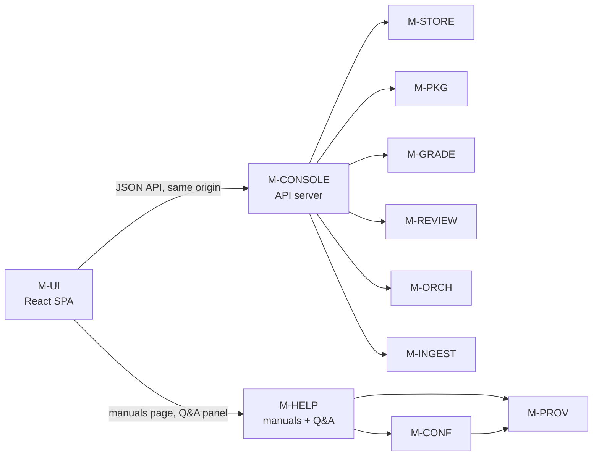

# Detailed Design Delta: Operator & Teacher Requirements — Console SPA, Default Jev, Name-Based Identity, Rubric Methods, Standard Dependencies

**Source:**
- The user's directive (2026-10-04, message id 6647): thirteen operator/teacher requirements, with the
  precedence rule *"these comments take precedence over any previous requirements where they conflict;
  fix the previous requirements accordingly"*, and the instruction to double-check the work and ask
  clarifying questions before the test-plan and issue stages.
- User decisions taken in the clarification round of 2026-10-04 (§1.3): **React** for the SPA;
  **answers-only** for the Q&A assistant; **Jev default on the cloud profiles only**; **system-derived
  bands with teacher confirmation** for the general criterion type.
- `docs/design/detailed-design.md` v1.4 (the "base design").
- `docs/design/fix_gaps_detailed_design_plan.md` v1.5.1-delta (the "gap delta").
- `docs/design/jev_decision_engine_design_delta.md` v1.8-delta (the "Jev delta").
- `docs/design/closeout_design_delta.md` v1.9.1-delta (the "close-out delta"). This document applies
  on top of all four.
- The repo's packaging as shipped: `pyproject.toml` (`dependencies = []`, extras `live-ingest` and
  `jev-cloud`), `requirements-dev.txt`, `docs/tutorials/deployment-tutorial.md` (which instructs
  `pip install ".[live-ingest]" Pillow`), and `docs/live-tests/` (which leaves the Jev engine off).

**Code baseline validated against:** `main` @ `aca3a43`.

**Version:** 1.10-delta  **Date:** 2026-10-04  **Status:** Draft, for review before `/create-test-plan`.
**Author:** `/detailed-design-generator`, delta mode.

## Revision history

| Version | Date | Change | Author |
|---|---|---|---|
| 1.10-delta | 2026-10-04 | **The operator/teacher requirements.** <br>• **Standard dependencies** (R-1): `pypdf`, `pypdfium2`, `Pillow` and `typesafe-sdk` become `[project] dependencies`; the `live-ingest` and `jev-cloud` extras are retired. ADR-36 supersedes ADR-11's packaging rule; FR-STORE-15 and FR-PROV-42 are amended; TC-STORE-26, TC-PIPE-12 and TC-PROV-53 flip. <br>• **Jev is the default grading engine** (R-2) on `cloud-hosted` and `dev-ci`, threshold 0.80 configurable (the Jev delta already built the engine and the gate; this delta flips the default). FR-CONF-29; CT-CONF v2.2. <br>• **The OpenRouter live test makes real calls** (R-3): real Jev decision model, real vision models, real judge models on OpenRouter; recorded fixtures never substitute in that tier (FR-CONFORM-17/18). <br>• **Console split** (R-4…R-8): `M-CONSOLE` becomes the loopback API server (existing contract preserved, two clauses amended); new `M-UI` (React SPA, self-hosted built assets, home-hub navigation, modern design tokens) and `M-HELP` (manuals page + grounded answers-only Q&A). CT-CONSOLE v2.0; new CT-UI, CT-HELP. ADR-35/40. <br>• **Name-based student identity** (R-11): roster carries `full_name` (required at cohort creation) beside the optional `student_ref`; V3 matches primarily by normalized name; IDs stay optional per cohort. Cohort migration 33; FR-INGEST-39/40; ADR-38. <br>• **No teacher-authored package TOML** (R-12): the console publishes the package from the confirmed setup flow; the spec TOML becomes a system-emitted export (FR-PKG-27, FR-SETUP-18). <br>• **Rubric methods** (R-13): `score_method ∈ {bands, evidence_sum, general}` on the criterion (Package migration 15); evidence-sum composites decompose into binary aspect criteria so judges stay band-only; the general type is teacher prose → system-derived bands → teacher confirmation. FR-PKG-24…27, FR-GRADE-22, ADR-39. <br>• **New IDs:** FR-STORE-20; FR-CONF-29…32; FR-CONFORM-17/18; FR-CONSOLE-41…45; FR-UI-01…08; FR-HELP-01…05; FR-INGEST-39/40; FR-SETUP-18/19; FR-PKG-24…27; FR-GRADE-22; FR-JUDGE-38; NFR-CONSOLE-09; NFR-UI-01…03; NFR-HELP-01; NFR-SYS-17; CT-CONF-22; CT-CONSOLE-30; CT-UI-01…06; CT-HELP-01…05; CT-INGEST-23; CT-PKG-21/22; CT-GRADE-22; CT-CONFORM-17; CT-SETUP-17; ADR-35…40. <br>• **Amended:** FR-CONF-18, FR-STORE-15, FR-PROV-42, FR-INGEST-24, CT-CONF-19, CT-CONSOLE-21, NFR-CONSOLE-02, TC-STORE-26, TC-PIPE-12, TC-PROV-53. <br>• **No ID is renumbered.** Every amendment is classified under base §4.7 in §6.2. | `/detailed-design-generator` (user directive) |

---

## 1. Scope & purpose

This is a **delta**, not a replacement. The four prior documents specify the grading engine; this one
changes who operates it and how it is installed, configured and taught. The thirteen directive
requirements are restated in §5 with the design elements that discharge each.

### 1.1 The one-sentence reading of the directive

The system's *grading machinery* is right and stays right; its *operator experience* is wrong and is
rebuilt: a non-technical teacher must be able to install, configure, set up a test and a class, load
papers, run, monitor, and get results without ever opening a terminal, authoring a TOML file, or
installing a Python extra by hand — and must be able to ask the system how to do any of it.

### 1.2 What changes, what does not

**Changes:** installation and dependency declaration; the default decision-engine configuration; the
definition of the OpenRouter live test; the console's client architecture, navigation, appearance and
coverage; the identity method for students; how a package comes into existence; the vocabulary of
rubric scoring methods.

**Stays the same.** Every structural guarantee the four prior documents assert, including each of
these, is either untouched or *extended* to the new surfaces, never weakened:

- Judgment isolation, the numeral-free rubric surface, band-only verdicts (CT-JUDGE-02/03, R39/R40).
- Median-band aggregation, the confidence inversion caps, escalation 1→3→5 (CT-AGG-05, ADR-10).
- The §6.2 package schema lock and the closed grade-policy vocabulary (FR-PKG-14).
- The PII boundaries: Tier D carries no student-name columns (FR-STORE-12); model requests carry
  `student_ref` only, never a name (NFR-PROV-04, NFR-JUDGE-04).
- The single egress point and the recorded transport (CT-PROV-15, CT-PROV-10).
- The work ledger, exactly-once semantics, pause/resume, and the R60 zero-action acceptance test.
- The decision seat rule, the confidence gate, and engine-blind aggregation (Jev delta, CT-JUDGE-21…27).
- No pipeline state in the console; idempotent enumerated controls; no browser storage of student
  text (FR-CONSOLE-01/02/03/17 — now asserted of the SPA as well).

### 1.3 User decisions recorded here (2026-10-04)

1. **React** is the SPA framework. Angular and Vue were offered; React was chosen.
2. **The Q&A assistant answers only.** It never executes an operation, writes a row, or changes
   state. Every action remains an explicit console control.
3. **Jev is the default on `cloud-hosted` and `dev-ci`; `edge-local` defaults to `off`.** A machine
   that cannot host a decision model is never silently graded by a different engine than the
   operator believes; it is graded by the LLM panel the configuration names, and the banner says so.
4. **The general criterion type derives bands.** The teacher's prose description produces a proposed
   band set, descriptors and points, shown back through the existing blocking read-back gate; after
   confirmation the stored form is an ordinary `bands` criterion with derivation provenance. No
   free-form numeric formula ever enters the package.

### 1.4 Conventions

- IDs continue from the highest number in use across the four prior documents, `src/` and `tests/`
  at `aca3a43`. First new IDs per module:

  | Module | First new FR | First new NFR | First new CT |
  |---|---|---|---|
  | M-STORE | FR-STORE-20 | — | — |
  | M-CONF | FR-CONF-29 | — | CT-CONF-22 |
  | M-CONFORM | FR-CONFORM-17 | — | CT-CONFORM-17 |
  | M-CONSOLE | FR-CONSOLE-41 | NFR-CONSOLE-09 | CT-CONSOLE-30 |
  | **M-UI (new)** | FR-UI-01 | NFR-UI-01 | CT-UI-01 |
  | **M-HELP (new)** | FR-HELP-01 | NFR-HELP-01 | CT-HELP-01 |
  | M-INGEST | FR-INGEST-39 | — | CT-INGEST-23 |
  | M-SETUP | FR-SETUP-18 | — | CT-SETUP-17 |
  | M-PKG | FR-PKG-24 | — | CT-PKG-21 |
  | M-GRADE | FR-GRADE-22 | — | CT-GRADE-22 |
  | M-JUDGE | FR-JUDGE-38 | — | — |
  | system | — | NFR-SYS-17 | — |
  | ADRs | ADR-35 | | |

- **Migrations.** Package's last is 14 (`pkg_decision_engine_noninferior`, `aeh.pkg`), so this delta's
  Package migration is **15**. Cohort's last is 32 (`ingest_upload_part`, `aeh.ingest`), so this
  delta's Cohort migration is **33**. Each bumps `COMPLETE_SCHEMA_VERSIONS` and the `CLAUDE.md`
  migration-chain paragraph in the same change.
- **Knobs** are named `HARNESS_*` and refuse invalid values (seam 3). The SPA build is *not* an
  environment-sensitive constant; it is a build artifact shipped as package data.
- `Assumption:` marks any number or choice the prior documents do not supply.

---

## 2. Module inventory (delta)

| Module ID | Name | Change | Depends on (delta) |
|---|---|---|---|
| M-CONF | Deployment Profile & Run Configuration | Decision-engine default per profile (R-2). Q&A model selection (R-10). | unchanged |
| M-STORE | Persistence | Packaging declaration moves to `[project] dependencies` (R-1, with M-PROV). Cohort migration 33 (roster names). Package migration 15 (`score_method`). | unchanged |
| M-CONFORM | Backend Conformance | The OpenRouter-profile live tier exercises real Jev and real vision calls (R-3). | unchanged |
| M-CONSOLE | **Console API server** (renamed *role*, not ID) | The loopback server that owns the pipeline-facing contract: enumerated controls, no pipeline state, no inference. Now also serves the SPA bundle and the JSON API the SPA consumes. Two clauses amended (CT-CONSOLE-21, NFR-CONSOLE-02). | unchanged, plus serves M-UI assets |
| **M-UI** | **Console SPA** (new) | The React single-page application: home-hub navigation, complete lifecycle screens, modern design tokens, manuals and help entry points. Holds no pipeline logic. | `M-CONSOLE` (its API), `M-HELP` (manuals page, Q&A endpoint) — and nothing else |
| **M-HELP** | **Manuals & Q&A** (new) | Serves the operation and deployment manuals as a console page; answers teacher questions grounded in those manuals through a model call that goes through `M-PROV`. Answers only; takes no action. | `M-CONSOLE` (routing), `M-PROV` (the one model call), `M-CONF` (model selection) |
| M-INGEST | Intake & Validation | Roster gains `full_name`; V3 matches primarily by normalized name (R-11). | unchanged |
| M-SETUP | Package Setup | Rubric method selection and the general-type derivation read-back (R-13, R-12). | unchanged |
| M-PKG | Package | `score_method` vocabulary; composite criteria; the package file is system-emitted (R-13, R-12). | unchanged |
| M-GRADE | Grading | Score composition per declared method (R-13). | unchanged |
| M-JUDGE | Panel Scoring | One guard: a composite criterion never becomes a score unit (R-13). | unchanged |

**No existing module is removed.** The console becomes a two-module surface (server `M-CONSOLE`, client
`M-UI`) plus one knowledge module (`M-HELP`); the split, not a rename, is what keeps every existing
`FR-CONSOLE-*`/`CT-CONSOLE-*` ID meaningful — they continue to describe the server that owns the
pipeline-facing contract.

---

## 3. Per-module design deltas

### 3.1 Packaging — module `M-STORE` (+ `M-PROV`), R-1

**The problem, stated as the user stated it.** The operator is today told, in the deployment tutorial
and the live-test documents, to run `pip install ".[live-ingest]" Pillow` and, for the Jev engine,
`pip install ".[jev-cloud]"`. The extras exist because ADR-11 declared the core stdlib-only so that
"no transitive dependency enters the machine that grades student work". Pillow is not even in an
extra — it is a manual third install, and the tutorial explains that without it PDF reading stops
with a `PIL` error. Every one of these is a step a non-technical operator can get wrong, and the
directive says none of them may remain.

**The decision (ADR-36).** The packaging rule is inverted: **everything the documented operator
workflows need is a standard dependency of the single install.** `[project] dependencies` becomes the
complete, pinned runtime set; the extras are retired; the tutorial and live-test install instructions
reduce to `pip install .`.

**Why the ADR-11 argument loses.** It was a supply-chain-minimization argument made when the operator
was assumed technical. The directive overrides it with a stronger requirement: the operator must not
fail at install time. The mitigation that remains is the one ADR-11 cannot be accused of abandoning:
every dependency is exactly pinned, the supply-chain inventory test (`tests/artifact/
test_supply_chain.py`) enumerates the full set with a reason per entry, and the lazy-import seams
(the fast tier never imports `pypdf`, `pypdfium2`, `Pillow` or the SDK) stay exactly as they are.
What changes is where the *install boundary* sits, not where the *import boundary* sits.

**Amendments.**

| ID | Amendment |
|---|---|
| FR-STORE-15 | Amended: "pip install . provides the pipeline **and every library the documented operator workflows use**" — the sentence separating dev requirements from runtime dependencies is rewritten. The setuptools/build-isolation note is unchanged. |
| FR-PROV-42 | Amended: the TypeSafe SDK is declared in `[project] dependencies` (exact pin `typesafe-sdk==0.7.2`), not as the `jev-cloud` extra. The run-start refusal "naming the extra" becomes a dead path and is deleted: with the SDK always installed, `JevOpenRouterProvider` constructs without a packaging check. The confinement requirements (FR-PROV-39/40/41, CT-PROV-29) are unchanged. |
| TC-STORE-26 | Amended by this delta (the test plan owns the edit): `[project].dependencies == []` becomes the asserted four-package set with exact pins; the `optional-dependencies` assertion is removed with the extras. |
| TC-PIPE-12 | Amended by this delta: the assertion "import pypdf FAILS in a core install" becomes "the core install imports all four lazily-imported libraries successfully, and the fast tier still executes none of their code paths" — the lazy import remains the seam (TC-INGEST-01's sweep is unchanged). |
| TC-PROV-53 | Amended by this delta: the extra-pinning assertion is replaced by the dependency-pinning assertion; the refusal test becomes a construction test. |

**Functional requirements (new)**

| ID | Requirement | Traces to | Phase |
|---|---|---|---|
| FR-STORE-20 | `pyproject.toml` `[project] dependencies` shall declare exactly: `pypdf>=6.0`, `pypdfium2>=4.0`, `Pillow>=10.0`, `typesafe-sdk==0.7.2`, each exact-pinned or bounded-minor, with a comment naming the module and issue that introduced it. The extras `live-ingest` and `jev-cloud` shall be removed. `pip install .` shall succeed on a fresh Python 3.11+ environment with no other arguments and yield a working `aeh` command, PDF reading, page-picture decoding and the OpenRouter Jev provider. | User directive R-1; ADR-36 | 1 |
| FR-STORE-21 | The `docs/tutorials/deployment-tutorial.md` and `docs/live-tests/` install instructions shall be reduced to `pip install .` (plus the venv step) in the same change; no operator-facing document shall name an extra or a manual `Pillow` install again. A check in the artifact supply-chain suite shall grep the operator-facing docs for the removed strings. | User directive R-1 | 1 |

**Consequences.**
- A school install is still one command, but it now fetches wheels: an air-gapped machine installs
  from a wheelhouse (`pip download` once on a connected machine, `pip install --no-index --find-links`
  at the school). The tutorial gains that paragraph. This is the honest cost of the directive and it
  is stated rather than hidden.
- `requirements-dev.txt` keeps its entries (test tooling) and drops the four that are now runtime
  dependencies (it keeps the pins it adds beyond them: `pytest`, `pytest-randomly`, `hypothesis`,
  `playwright`).
- NFR-SYS-06 is unaffected: the fast tier still makes no live model call and executes none of the
  four libraries' code paths.

### 3.2 Module: `M-CONF` — delta · the default engine and the Q&A model

**Functional requirements (new)**

| ID | Requirement | Traces to | Phase |
|---|---|---|---|
| FR-CONF-29 | **Default decision engine.** *(Amends FR-CONF-18.)* `HARNESS_DECISION_ENGINE` shall default to `jev` when the resolved profile is `cloud-hosted` or `dev-ci`, and to `off` when it is `edge-local`. An explicit setting overrides the default on every profile; the domain remains `{jev, off}`. With the default in force, resolution proceeds exactly as FR-CONF-19/20 specify: `openrouter-jev` on the cloud profiles, and the explicit-config path on `edge-local` when the operator turns the engine on there. `config/harness.example.toml` shall show `HARNESS_DECISION_ENGINE = "jev"` commented-in for `edge-local` with the residency warning beside it (FR-CONF-28). | User directive R-2; user decision 3; CT-CONF-14 | 1 |
| FR-CONF-30 | **Q&A model selection.** The assistant's model shall be resolved at profile resolution and frozen with the rest: on `cloud-hosted` and `dev-ci`, from `HARNESS_QA_MODEL` (an OpenRouter model ref satisfying `is_resolved()`, no floating tag; default: the run panel's first judge model); on `edge-local`, `RunConfig.panel[0]` — the first existing grading judge — with no separate knob. The resolved choice is recorded on the run's `provider_config` under `qa_model` and appears in `format_profile_banner` as `QA_ASSISTANT: <provider>:<build>`. | User directive R-10; CT-CONF-03 | 1 |
| FR-CONF-31 | The Q&A model shall never be a student-data surface: `M-HELP`'s requests to it carry manual-derived context and the teacher's question only (§3.4), and the R31 consent gate shall not treat it as remote dispatch of student work on any profile. | R31; NFR-PROV-04 posture | 1 |
| FR-CONF-32 | **The Jev confidence threshold is a first-class configuration value, not a constant.** *(Restates the Jev delta's FR-CONF-21 and extends its surfaces.)* The decision gate's threshold shall be settable from both configuration surfaces: the profile's config file (`config/harness.toml`, key `decision_confidence_threshold` under the engine settings) and the environment knob `HARNESS_JEV_CONFIDENCE_THRESHOLD`; the environment overrides the file, the file overrides the default — Assumption: this precedence order matches the other `HARNESS_*` knobs; confirm against the Jev delta's resolution order. Default **0.80** (0.85 for `openjev-small`, per FR-CONF-21); domain [0.50, 1.00); an out-of-domain value is refused at profile resolution with a message naming the knob, the value and the domain. The resolved value is frozen at run start, recorded on the run's `provider_config`, rehydrated identically on resume, shown in the profile banner (`DECISION_GATE: jev > 0.80`), and editable in the console's run-start screen (FR-CONSOLE-43), which writes the same explicit setting every other path writes. | User directive R-2; FR-JUDGE-27; CT-CONF-14 | 1 |

**Contract delta** (`CT-CONF` → **v2.2**, breaking)

| ID | Kind | Amendment / clause | Consumers |
|---|---|---|---|
| CT-CONF-19 (amended) | config | Was: "`HARNESS_DECISION_ENGINE` has no default, and absence raises." Now: "`HARNESS_DECISION_ENGINE` defaults to `jev` on `cloud-hosted`/`dev-ci` and `off` on `edge-local`; an explicit value overrides. Every other sentence is unchanged." The old clause's rationale ("no silent default, because a default selects a backend") is superseded by user decision 3; what replaces it is the *pair* of guarantees that no machine is ever silently re-graded by a different engine than its banner names (CT-CONF-14 is untouched) and that the default is a function of the declared profile, never of the hardware. | operator, `M-PROV`, `M-HELP` |
| CT-CONF-22 | config | `HARNESS_QA_MODEL` exists on the cloud profiles with the panel-first default; on `edge-local` the Q&A model is `RunConfig.panel[0]` and no knob overrides it. The resolved value is frozen for the run and rehydrated identically on resume. | `M-HELP` |

*Compatibility.* **Breaking (v2.2).** CT-CONF-19's semantics change; re-verify `M-PROV`, `M-INGEST`,
`M-SETUP`, `M-ORCH`, `M-STATS`, `M-CONFORM`, `M-CONSOLE`, `M-PIPE` per the standing CT-CONF v2.0
obligation, plus `M-HELP`. Every `resolve_run_config` fixture without an explicit
`HARNESS_DECISION_ENGINE` changes resolved value on the cloud profiles; the differential tests that
pin engine-off byte-identity (CT-ORCH-30, CT-PIPE-09) must set the knob explicitly to `off` to keep
their subject.

### 3.3 Module: `M-CONFORM` — delta · the live OpenRouter test is real end to end, R-3

**The problem.** The live-test documents leave the Jev engine off "on purpose" (`docs/live-tests/
02-live-readiness-and-blockers.md`), because it needed a manual extra and a pinned build. With R-1
the extra is gone and with R-2 the engine is on by default on the cloud profiles, so the excuse is
gone too — and the directive requires the live test on the OpenRouter profile to exercise the real
models end to end.

**Functional requirements (new)**

| ID | Requirement | Traces to | Phase |
|---|---|---|---|
| FR-CONFORM-17 | **The OpenRouter-profile live acceptance test** shall make real calls, over the real network, to OpenRouter, for every leg the profile uses: the ingest vision model (VLM page transcription on real sample PDFs), the judge panel, the synthesis model, and the Jev decision model through the TypeSafe SDK path (FR-PROV-38). No recorded fixture substitutes for any leg in this tier; `RecordedFixtureProvider` is the fast tier's instrument and appears here only as the comparison oracle for recorded-vs-live divergence (FR-CONFORM-06's existing machinery). The test's report names each leg with its model ref, call count, token totals and cost, and records them in the run's metrics. | User directive R-3; NFR-SYS-06 | 1 |
| FR-CONFORM-18 | The live acceptance run shall exercise the decision engine on the same submissions as the LLM panel, so the report contains, per criterion: the Jev accepted rate, the fallback rate, and the band agreement between the Jev verdicts and the LLM panel medians on the same cells (the live form of FR-CONFORM-10/11). The run is invalid as a live acceptance result if the decision engine never accepted a unit or never fell back — both extremes indicate a misconfigured gate, not a passing test. | User directive R-2/R-3; FR-JUDGE-36 | 1 |

**Contract delta** (`CT-CONFORM` → v1.3, additive)

| ID | Kind | Clause | Consumers |
|---|---|---|---|
| CT-CONFORM-17 | observe | The OpenRouter live acceptance report names, per leg: `live_calls`, `live_tokens_in`, `live_tokens_out`, `live_cost`, and for the decision leg additionally `decision_accepted_rate` and `decision_fallback_rate` with the CT-JUDGE-28 names. A leg with zero calls fails the report. | CI and release gating, operator |

*Requires.* `M-PROV` CT-PROV-29/30 (the SDK wire path is what the live leg drives); `M-CONF`
CT-CONF-22 (the profile resolved the engine and pinned the build).

### 3.4 Modules: `M-CONSOLE` (amended), `M-UI` (new), `M-HELP` (new) — R-4…R-10

#### 3.4.1 The split, and what each side owns

```
browser (teacher/operator)                    school machine, loopback only
┌──────────────────────────────┐   JSON API   ┌────────────────────────────────────────────┐
│ M-UI — React SPA             │ ───────────▶ │ M-CONSOLE — API server                     │
│  home hub, lifecycle screens │ ◀─────────── │   enumerated control rows, no pipeline     │
│  manuals page, Q&A panel     │  static env  │   state, no inference (unchanged contract) │
│  (built assets, own origin)  │ ───────────▶ │ M-HELP — manuals page + grounded Q&A       │
└──────────────────────────────┘              │   (one model call, via M-PROV)             │
                                              └──────────────┬─────────────────────────────┘
                                                             ▼
                                                   M-PROV (the only egress point)
```

- **`M-CONSOLE` keeps every existing ID and clause** except the two the SPA supersedes. It remains
  the module that holds no pipeline state, performs no inference, writes enumerated idempotent
  control rows, binds loopback, and is replaceable without touching the harness. What changes is the
  presentation contract: it serves a JSON API plus static built assets instead of server-rendered
  pages.
- **`M-UI` is a pure client.** It renders, routes and calls the API. It holds no business rule, reads
  no store, and knows no module. Its contract is with the API surface only.
- **`M-HELP` is the manuals and the assistant.** The manuals are repository documents packaged as
  data; the assistant is a retrieval-then-answer model call through `M-PROV`. It is **answers-only**
  (user decision 2): it cannot write a row, start a run, or change any state, and the API surface it
  is reached through offers it exactly one verb.

#### 3.4.2 `M-CONSOLE` amendments

| ID | Amendment |
|---|---|
| NFR-CONSOLE-02 | Amended: "The console shall require no npm toolchain, no build step, and no network at render time" is retained **for the installed system**: the SPA's built bundle ships as package data, so an install has no toolchain and render-time makes no external request. The words "it shall be repairable by whoever is present at the school" are replaced by: *the API server shall be repairable in place; the SPA is replaced by redeploying a rebuilt bundle, which is a developer action by design.* |
| CT-CONSOLE-21 | Amended: "No build step, no npm toolchain, no client framework" is deleted; replaced by "The server runs with no Node toolchain present and serves the SPA from its own origin with zero external requests (FR-CONSOLE-18). The console is **replaceable without touching the harness** — the seam is unchanged: it only reads stores and writes the enumerated control rows (NFR-CONSOLE-05)." The replaceability property is what the amendment preserves; the no-framework implementation detail is what it gives up, deliberately, per ADR-35. |

**Functional requirements (new)**

| ID | Requirement | Traces to | Phase |
|---|---|---|---|
| FR-CONSOLE-41 | Every operation the CLI offers to a teacher or operator shall be reachable from the console: package setup, cohort creation, roster loading, run start, recover, monitor, review, results and export. The CLI remains fully functional and is documented as the debugging surface; no operator or teacher workflow shall require it. The parity check is an inventory: every `aeh` subcommand either has a console path or is listed in the console's own "debugging-only" help section with the reason. | User directive R-4/R-5 | 1 |
| FR-CONSOLE-42 | The console shall create a cohort and load its roster: names entered as first and last (one per row, paste-tolerant), an optional student ID per row, and a visible statement that the ID is optional. The cohort's consent class is chosen at creation (ADR-5's vocabulary). | User directive R-5, R-11 | 1 |
| FR-CONSOLE-43 | Starting a run from the console shall display the profile banner (backend, panel builds, decision engine and threshold, QA model — FR-CONF-25/30) and the cost estimate, and require one explicit confirmation before dispatch. The confirmation writes the same run-start rows the CLI writes; there is no second start path. | R14; FR-CONF-25 | 1 |
| FR-CONSOLE-44 | The console shall deliver results: per-student and class views, narrative access, and the export actions (CSV/PDF) the CLI offers, with the same coverage and revision semantics (FR-GRADE-12/13). | User directive R-5 | 1 |
| FR-CONSOLE-45 | The server shall expose the control surface as a versioned JSON API at same-origin paths under `/api/`, serving the SPA bundle and its assets from the same origin at `/` and `/assets/`. Every API mutation is the same enumerated, idempotent control write FR-CONSOLE-01/02 already require — the API adds a transport, not a second write path. | FR-CONSOLE-01/02; ADR-35 | 1 |
| NFR-CONSOLE-09 | The console is the primary operator surface; the CLI is the debugging surface. Documentation, onboarding and the manuals page are written to that split, and the console's help explains what each CLI command is *for* when a developer needs it. | User directive R-4 | 1 |

**Contract delta** (`CT-CONSOLE` → **v2.0**, breaking: two clauses amended, one added)

| ID | Kind | Clause | Consumers |
|---|---|---|---|
| CT-CONSOLE-30 | surface | The API under `/api/` and the SPA under `/` are served from one origin with zero external requests (FR-CONSOLE-18 holds of the SPA bundle and every asset it loads, fonts included). The API's mutations are exactly the enumerated control writes; no mutation exists in the API that the server-rendered console did not have, and none is added without being an enumerated control row. | `M-UI`, `M-HELP`, operator |

*Compatibility.* Breaking (v2.0): the render contract changes from HTML pages to JSON + static
assets; the browser-tier test cases (E6, Playwright) re-point at the SPA. Everything the SPA depends
on is re-verified through CT-CONSOLE-30, and the E6 suite is the consumer.

#### 3.4.3 Module: `M-UI` — the React SPA

**Responsibility.** Render the console: navigation, lifecycle screens, design. Call `M-CONSOLE`'s
API. **Does not own:** any business rule, any store access, any model call, any state that outlives a
page reload beyond the per-viewer conveniences the storage prohibition allows (it allows none for
student text — FR-CONSOLE-17 applies to the SPA unchanged: no `localStorage`, no `sessionStorage`,
no client-side cache, no service worker).

**Functional requirements**

| ID | Requirement | Traces to | Phase |
|---|---|---|---|
| FR-UI-01 | The SPA shall be a React application built ahead of install (dev toolchain only), shipped as prebuilt static assets inside the package, served by `M-CONSOLE` from its own origin. The repository shall carry the built bundle for release; a package-data gate test asserts the bundle exists, is non-empty, and contains no absolute external URL (`http://`/`https://` references to non-localhost origins in the built HTML/CSS/JS). | ADR-35; FR-CONSOLE-18 | 1 |
| FR-UI-02 | The home page shall be a navigation hub: a card per destination — set up a test/package, set up a class, load papers, start a run, monitor the run, review, results, manuals & help, system status — each card showing live state (e.g. current package version, last run status, engine in use). Every screen is reachable from the hub in one click. | User directive R-8 | 1 |
| FR-UI-03 | The lifecycle screens shall cover, in teacher language: (a) package setup — upload assessment/reference/rubric PDFs, the M-SETUP blocking gates and optional cards verbatim (§4.2.1's flow, this time fully in-console); (b) class setup — FR-CONSOLE-42's roster editor; (c) loading papers — per-student upload with the V0–V4 preflight shown per gate; (d) run start — FR-CONSOLE-43; (e) monitoring — the existing run monitor's data through the API; (f) review and blind sample — the existing queue's rules unchanged (FR-CONSOLE-16/19/20 hold); (g) results — FR-CONSOLE-44. | User directive R-5 | 1 |
| FR-UI-04 | The visual design shall be modern and consistent: a declared design-token set (color palette, type scale, spacing scale, radius, elevation) applied everywhere; a self-hosted font (bundled, no CDN); responsive layout usable at tablet width; visible focus states and WCAG 2.1 AA contrast for text and controls; consistent loading, empty, and error states for every screen. | User directive R-7 | 1 |
| FR-UI-05 | Every destructive or irreversible action (publish package, start run, finalize grades) shall require an explicit confirmation step naming what it does; the confirmations are the API's, the SPA renders them. | FR-CONSOLE-02 posture | 1 |
| FR-UI-06 | The Q&A panel shall present the assistant's answer with its manual citations (section links into the manuals page) and a persistent "this assistant answers questions; it does not operate the system" affordance. | User directive R-10; user decision 2 | 1 |
| FR-UI-07 | The SPA shall degrade to a readable no-data state on every screen when the API is unreachable, naming the recovery action (check that the console service is running) rather than showing a blank page or a stack trace. | NFR-CONSOLE-03 posture | 1 |
| FR-UI-08 | The SPA shall carry no student text in any client-side storage and no service worker (FR-CONSOLE-17 applies verbatim); polling, not push, for monitor state, at `CONSOLE_POLL_INTERVAL_MS`. | R67 | 1 |

**Non-functional requirements**

| ID | Category | Requirement |
|---|---|---|
| NFR-UI-01 | Performance efficiency | The SPA's first contentful paint on the loopback connection shall be under 2 s on the reference school hardware; screen transitions are client-side and under 300 ms. Assumption: measured, not derived. |
| NFR-UI-02 | Maintainability | The SPA source is TypeScript; the design tokens are a single source of truth consumed by the components; a component-library boundary (no screen imports a primitive directly from a vendor package) keeps the visual system replaceable. |
| NFR-UI-03 | Portability | The built bundle runs in the evergreen browsers shipped on the reference school machines without transpilation-at-runtime, polyfill CDNs, or external requests of any kind. |

**Contract** (`CT-UI`, v1.0) · Stability: provisional (new module, first release)

A consumer holding `M-UI` holds a client that renders and calls; it holds no promise about grading,
state, or data beyond what it displays.

| ID | Kind | Clause | Consumers |
|---|---|---|---|
| CT-UI-01 | surface | The SPA communicates with exactly one origin: the `M-CONSOLE` API. It makes zero requests to any other origin (fonts, scripts, analytics: none), verifiable from the built bundle. | `M-CONSOLE`, operator |
| CT-UI-02 | behaviour | The SPA holds no authoritative state: a full page reload at any moment leaves the system's state exactly as the API reports it. No screen caches server state in a way that survives reload. | operator |
| CT-UI-03 | security | No student text is written to browser storage, no service worker is registered, and no student text is included in any URL, log, or error report the SPA produces (FR-CONSOLE-17). | `M-CONSOLE`, auditors |
| CT-UI-04 | error | An API error renders a named, recoverable message per screen; the SPA never renders a raw stack trace or an unhandled Promise rejection to the teacher. | operator |
| CT-UI-05 | data | Band displays are editable band controls wherever editing is offered (FR-CONSOLE-20's rule, client side); the SPA offers no numeric score entry anywhere (the base prohibition). | `M-CONSOLE` |
| CT-UI-06 | observe | The bundle build is reproducible from the committed source with the pinned toolchain; the gate test (FR-UI-01) fails the release if the bundle is stale or carries an external origin. | CI |

*Requires.* `M-CONSOLE` CT-CONSOLE-30 (the API and its same-origin serving), CT-CONSOLE-19 (poll
interval).

*Compatibility.* Additive while screen URLs and API paths are added; breaking when an API path the
SPA depends on changes shape (then CT-CONSOLE v-bumps with it). The canonical double for API-level
tests is the recorded API fixture set; the browser tier (E6) is the integration check.

#### 3.4.4 Module: `M-HELP` — manuals and the grounded Q&A assistant

**Responsibility.** Serve the operation and deployment manuals as console pages with search; answer
teacher questions about operating the system, grounded in those manuals. **Does not own:** any
operational capability (it takes no action), any student data (it never receives any), any grading
behavior.

**The knowledge base.** The manuals are the repository's operator-facing documents, packaged with the
install: the teacher guide, the deployment tutorial, the live-test documents, and the console's own
help content. They are indexed at console start (a local, deterministic index — chunked by heading,
no external service). The index is rebuilt from the packaged files at every console start; there is
no stale-index state to manage.

**Functional requirements**

| ID | Requirement | Traces to | Phase |
|---|---|---|---|
| FR-HELP-01 | The console shall contain a manuals page rendering every operator-facing manual packaged with the system, with a table of contents, in-page search, and stable anchors (the anchors are what Q&A citations link to). The page is reachable from the home hub and from every screen's help affordance. | User directive R-9 | 1 |
| FR-HELP-02 | The Q&A endpoint shall accept a natural-language question and return an answer composed only from retrieved manual passages, each answer carrying citations to the manual sections it used. When retrieval finds no relevant passage, the assistant shall say so and point to the manuals page — it shall never answer from model memory alone. | User directive R-10 | 1 |
| FR-HELP-03 | The retrieval index shall cover only the packaged manuals; teacher-entered data, cohort data, and run data are outside its corpus and unreachable by it. A question about a specific class's grades is answered by pointing to the results screen, not by answering from data. | User decision 2; R-10 | 1 |
| FR-HELP-04 | The assistant shall take no action: its API surface is one read-only endpoint; it writes no control row, starts nothing, changes nothing. Every question-and-answer pair is logged (question text, cited sections, model ref, tokens, latency) for accountability. | User decision 2 | 1 |
| FR-HELP-05 | The assistant's model call shall go through `M-PROV` (the only egress point), using the model resolved by FR-CONF-30. The prompt follows the ADR-13 posture: the teacher's question is untrusted input rendered inside a delimited block, the system prompt instructs answering from the provided passages, and the output is constrained to prose (no tool calls, no structured commands are parsed from it). | CT-PROV-15; ADR-13 | 1 |

**Non-functional requirements**

| ID | Category | Requirement |
|---|---|---|
| NFR-HELP-01 | Performance efficiency | An answer shall return within 10 s p95 on the cloud profiles and 30 s on `edge-local` (where the answer model is the local judge, contending with nothing when no run is active). Retrieval itself is local and under 200 ms. Assumption: measured, not derived. |

**Contract** (`CT-HELP`, v1.0) · Stability: provisional

A consumer holding `M-HELP` holds a manuals library and a grounded, actionless question-answerer —
nothing that operates the system.

| ID | Kind | Clause | Consumers |
|---|---|---|---|
| CT-HELP-01 | surface | One read-only endpoint: ask(question) → {answer, citations[]}. No other operation exists on the module. | `M-UI`, operator |
| CT-HELP-02 | behaviour | Every answer's citations resolve to real manual anchors; a no-grounding question returns an explicit not-found answer, never an unsourced claim. | `M-UI`, auditors |
| CT-HELP-03 | security | The endpoint receives manual text and the question only — never cohort, roster, submission, or grade data; its model requests carry no student-ref-bearing payload at all. | `M-CONF`, auditors |
| CT-HELP-04 | state | The module writes nothing to any store except its own question/answer log (Tier D, no student data by construction — FR-STORE-12 holds trivially). | auditors |
| CT-HELP-05 | observe | The Q&A log records per exchange: question, cited anchors, model ref, tokens in/out, latency, and whether the answer was grounded or not-found. | ops |

*Requires.* `M-PROV` CT-PROV-01/10/13 (one completion call, recorded transport, no credential
leakage); `M-CONF` CT-CONF-22 (the resolved Q&A model); `M-CONSOLE` CT-CONSOLE-30 (same-origin
serving of the manuals page).

*Compatibility.* Additive: more manuals, better retrieval. Breaking: any change that gives the
assistant an action, or lets it see student data — neither is planned, and both would require an ADR.

### 3.5 Module: `M-INGEST` — delta · identity by name, R-11

**The problem.** The roster is today a list of opaque `student_ref`s (`ps9-roster.txt` is six IDs);
V3 extracts "a student name or ID" and matches against it (FR-INGEST-24). The directive: students
are identified by **first and last name**; a student ID is never expected; a cohort may optionally
use IDs as an additional method, but never as the only one.

**Data model.** Cohort migration 33 (`ingest_roster_names`, owner `aeh.ingest`):

- `roster` gains `full_name TEXT` (nullable in the schema — the migration cannot invent names for
  existing rows — and **required at cohort creation**: the console's roster editor (FR-CONSOLE-42)
  and the CLI's roster loader both refuse a roster row without a name).
- `student_ref` stays the internal key and stays what model requests carry (NFR-PROV-04 is untouched
  — names never enter a model request). When a cohort supplies no IDs, `student_ref` is generated
  (opaque, stable, derived from the name plus a cohort-unique ordinal).
- Names live in Tier C only. Tier D gains nothing (FR-STORE-12 unchanged); exports resolve names from
  the Tier C roster at read time, which is where they already resolve submissions.

**Functional requirements (new)**

| ID | Requirement | Traces to | Phase |
|---|---|---|---|
| FR-INGEST-39 | *(Amends FR-INGEST-24.)* V3 identity shall extract the **student name** written on the paper as the primary identity signal and match it against the roster's `full_name` values under normalization (case-folding, whitespace collapse, diacritic folding, last-name/first-name order tolerance). A roster entry whose cohort declared student IDs shall additionally match on the ID when the name is ambiguous. An ambiguous match (two roster rows normalize equally) or an unmatched name routes to triage with candidate options and is never guessed — FR-INGEST-24's existing rule, unchanged in force. | User directive R-11 | 1 |
| FR-INGEST-40 | A cohort shall be creatable with names only. A roster consisting solely of IDs (no names) shall be refused at cohort creation with a message naming the requirement; a cohort that supplies IDs in addition to names shall use them only as a secondary signal and for display convenience. | User directive R-11 | 1 |

**Contract delta** (`CT-INGEST` → v1.3, additive)

| ID | Kind | Clause | Consumers |
|---|---|---|---|
| CT-INGEST-23 | behaviour | V3 matches by normalized name first; a student ID is a secondary signal only and its absence is never an error. Identity resolution outputs a `student_ref`; the name extracted from a paper never leaves the module except into Tier C rows and triage display. | `M-ORCH`, `M-CONSOLE` |

*Requires.* `M-STORE` (Cohort 33), `M-CONSOLE` (the roster editor that makes names loadable without
the CLI).

### 3.6 Modules: `M-SETUP` + `M-PKG` + `M-GRADE` — delta · rubric methods and the system-built package, R-12/R-13

**The problem.** Building a package today means hand-authoring a TOML spec (`ps9-forces-01.package.toml`)
and running `aeh package build --spec …` — a developer's workflow imposed on a teacher. And the only
scoring method is the even band set. The directive asks for: the system builds the package from an
uploaded rubric PDF; and a vocabulary of scoring methods, including evidence-based summation and a
teacher-described general type, each with a declared way to compute the final score from its
components — all without violating the bias design (band-only judges, no numerals to the model,
closed grade-policy vocabulary).

**The key structural insight (ADR-39).** Every new method is expressible **as composition over the
existing binary-or-banded criterion**, so the judge, the aggregator and the confidence machinery are
 untouched:

| Method | What the teacher provides | What is stored | How the final score is computed | What a judge ever sees |
|---|---|---|---|---|
| `bands` (existing, default) | Band descriptors (or the rubric PDF's) | Even band set 2–6, points per band | Points of the awarded band | The band set |
| `evidence_sum` | Ordered aspects (correct details, structure, coherence…), points per aspect | The composite criterion (a grouping record) + one **binary (2-band) aspect criterion per aspect** | Sum of the aspects' awarded points; max is the sum of aspect maxima | One aspect's 2-band set — never the composite |
| `general` | A prose description of how to arrive at a score | A `bands` criterion with `derived_from` provenance pointing at the description | Points of the awarded band (it *is* a bands criterion once confirmed) | The derived band set |

Checklist scoring — the natural classroom reading of "did they include each required element" — is
`evidence_sum` with every aspect worth its own points and no partial bands; it needs no separate
method value. Single-point-rubric-style "meets / above / below" is `bands` with three descriptors.
The vocabulary stays closed; §6.2's lock applies to the new columns exactly as to the old ones.

**Data model.** Package migration 15 (`pkg_criterion_score_method`, owner `aeh.pkg`):

- `criterion` gains `score_method TEXT NOT NULL DEFAULT 'bands' CHECK (score_method IN
  ('bands','evidence_sum','general'))` and `component_of TEXT NULL` (set on aspect criteria,
  naming their composite's criterion id; `NULL` on every standalone criterion).
- The composite is a criterion row with `score_method = 'evidence_sum'`, `component_of = NULL`, and
  aspect criteria referencing it. A composite carries no band set and no answer key.
- The `general` type's provenance (the teacher's description text and the derivation that produced
  the band set) is stored on the criterion's read-back record, inside the §6.2-locked schema.

**Functional requirements (new)**

| ID | Requirement | Traces to | Phase |
|---|---|---|---|
| FR-PKG-24 | A criterion shall declare exactly one `score_method` from the closed set `{bands, evidence_sum, general}`. `bands` and `general` criteria carry a band set and points exactly as today (CT-PKG-04's rules apply to both). An `evidence_sum` criterion carries no band set; it carries its aspect criteria, each of which is a 2-band criterion satisfying CT-PKG-04. Any other value is refused at publish. | User directive R-13; §6.2 lock | 1 |
| FR-PKG-25 | Grade computation shall compute a criterion's awarded points by its declared method: `bands`/`general` — the awarded band's points (unchanged); `evidence_sum` — the sum of its aspect criteria's awarded points. The computation is deterministic from score rows and the package's declared structure; two runs with identical score rows produce identical grades whatever method each criterion declares. | User directive R-13; CT-GRADE-07 | 1 |
| FR-PKG-26 | A `general` criterion shall be created only through the derivation-and-confirmation flow (FR-SETUP-18): the stored form is a `bands` criterion whose provenance records the teacher's description and the derived band set. A `general` criterion without confirmed derivation is unpublishable. | User decision 4; §6.2 lock | 1 |
| FR-PKG-27 | The package spec TOML shall be a **system-emitted export** of a confirmed setup, not a teacher-authored input: the console publishes the package directly from the setup flow's confirmed state, and the CLI gains the inverse export (`aeh package export --package-version … --spec out.toml`) which writes a spec that `aeh package build --spec` accepts unchanged. No teacher-facing surface shall require or present TOML authoring. | User directive R-12 | 1 |
| FR-SETUP-18 | The setup flow shall offer the rubric method per criterion in teacher language (per-band description / evidence checklist with aspects / describe-in-your-own-words), defaulting to `bands`. Choosing `general` presents the teacher's description back with the **system-derived** band set, descriptors and points as a blocking read-back card (the FR-SETUP-04/06 posture): nothing publishes until the teacher confirms the derived structure or edits it into one of the declared methods. | User decision 4; R9 | 1 |
| FR-SETUP-19 | The setup flow shall build an `evidence_sum` criterion by letting the teacher name its aspects and per-aspect points, generating the per-aspect binary criteria automatically (descriptor text derived from the aspect name, editable before confirmation). The composite and its aspects pass the existing decomposability test in reverse: if an aspect needs more than two bands, setup proposes promoting it to a standalone `bands` criterion instead. | User directive R-13 | 1 |
| FR-JUDGE-38 | A composite (`evidence_sum`) criterion shall never be dispatched as a score unit: only its aspect criteria are. The guard is in the work-enumeration path; a package that somehow carries a composite with no aspects is refused at publish (FR-PKG-24), and enumeration refuses a composite unit with the same finality as a malformed unit. | ADR-39; CT-JUDGE-03 | 1 |
| FR-GRADE-22 | The grade rollup and per-criterion views shall present composite criteria as one line (sum awarded / sum max) while keeping every aspect's own score row, audit record and review path intact beneath it. Review, blind sampling and statistics operate on aspect criteria exactly as on any criterion; nothing about them changes. | User directive R-13 | 1 |

**Contract deltas.** `CT-PKG` → v1.3 (additive): CT-PKG-21 below. `CT-GRADE` → v1.3: CT-GRADE-22.
`CT-SETUP` → v1.1: CT-SETUP-17.

| ID | Kind | Clause | Consumers |
|---|---|---|---|
| CT-PKG-21 | data | Every criterion carries `score_method` in the closed three-value set; `evidence_sum` criteria have ≥ 1 aspect criterion, each 2-band, each with `component_of` naming the composite; composites never carry bands or keys. `bands` and `general` criteria have `component_of = NULL`. | `M-SETUP`, `M-JUDGE`, `M-GRADE`, `M-ORCH` |
| CT-GRADE-22 | behaviour | Awarded points per criterion follow the declared method (FR-PKG-25); a `general` criterion grades exactly as a `bands` criterion; an `evidence_sum` criterion's points are the sum of its aspects'. The method is never an input to confidence, routing or escalation. | `M-REVIEW`, `M-STATS`, `M-CONSOLE` |
| CT-SETUP-17 | behaviour | The `general` derivation read-back is a blocking gate: no publish while a `general` criterion lacks confirmed derivation, and the card shows the derived bands before confirmation. | `M-CONSOLE`, `M-PKG` |

*Why the bias design survives* (the ADR-39 argument, compressed): no judge ever sees a composite, a
sum, or the teacher's prose method description — every judged unit is still one criterion with one
declared, even, numeral-free band set; aggregation still medians band ordinals; the final score is
still derived once, deterministically, from band-derived points; and the teacher's only free-text
input ends up either as band descriptors (which the FR-JUDGE-03 numeral scan already polices) or as
stored provenance no model reads. The "general" type adds no formula language to the system — the
derivation happens at setup time, under the teacher's confirmation, and produces exactly the
structures that already exist.

### 3.7 What the Jev delta already built, restated against R-2

The directive's second requirement — *Jev is the first/default grading method; judges activate only
when Jev confidence is below a configurable threshold* — is **already specified** by the Jev delta
and needs no new machinery here:

- Jev answers first on the decision seat; the LLM panel is the fallback (ADR-20, FR-JUDGE-22…35).
- The activation rule is the confidence gate: `min(c_band, c_sufficient) > confidence_threshold`
  (FR-JUDGE-27, CT-JUDGE-22), with the threshold configurable and **default 0.80** (FR-CONF-21).
- The seat rule, the engine-blind aggregation, the outage-pauses-not-falls-back rule and the
  calibration report are all in force (CT-JUDGE-21…27, NFR-STATS-06).

What this delta adds is the *default* and the threshold's configuration surfaces: FR-CONF-29 makes
the engine the configured default on the cloud profiles so that the Jev-first behavior is what an
unmodified install does, and keeps `edge-local` off by default so a small machine is never graded by
an engine its operator did not choose (user decision 3); FR-CONF-32 makes the activation threshold a
first-class configuration value — default **0.80**, settable in the config file and overridable by
the `HARNESS_JEV_CONFIDENCE_THRESHOLD` environment knob, frozen at run start, shown in the banner,
and editable in the console's run-start screen.

---

## 4. System-level design (delta)

### 4.1 Dependency diagram (delta)



The console's existing edges (STORE, PKG, GRADE, REVIEW, ORCH, INGEST) are unchanged; the SPA adds
**no edge to any pipeline module** — `M-UI` sees only `M-CONSOLE` and `M-HELP`. `M-HELP` adds the
one new model-calling consumer of `M-PROV`. No cycle is introduced: `M-HELP` is a leaf like
`M-CONSOLE` was.

### 4.2 Key flow: a teacher's day, entirely in the console

1. **Install** (once): `pip install .` — every library the workflow needs is inside (R-1).
2. **Set up the test**: hub card → upload the three PDFs → the M-SETUP gates and cards, rubric
   methods chosen in teacher language → publish. The package file, if anyone wants one, is an export
   (R-12).
3. **Set up the class**: hub card → paste the name list → consent class → done (R-11).
4. **Load papers**: hub card → per-student upload → preflight per gate shown.
5. **Start the run**: hub card → banner (profile, panel, Jev engine at 0.80 by default on cloud,
   off on edge-local unless chosen) + cost estimate → confirm (R-2).
6. **Monitor** overnight: the monitor screen; the R60 guarantee means zero action is required.
7. **Next morning**: review queue with its budget, blind sample, results, export.
8. **Any point**: the manuals page, or ask the assistant — which answers from the manuals and does
   nothing else (R-9, R-10).

The CLI still does every one of these steps, for debugging.

### 4.3 System-wide NFR (delta)

| ID | Requirement |
|---|---|
| NFR-SYS-17 | **Installability.** A fresh machine deployment shall be: create a virtualenv, `pip install .`, run the console. No step of any documented operator or teacher workflow — install, configure, set up a test or class, load papers, run, monitor, review, export, ask for help — shall require a manual package installation, an extra specifier, a hand-authored TOML file, or a terminal command. The acceptance form is a walkthrough of the deployment tutorial performed with the terminal closed after step one. |

### 4.4 Architecture Decision Records

#### ADR-35: The console becomes an API server plus a built React SPA

- **Context.** The directive requires a modern web application (React or Angular), a modern visual
  design, hub navigation, a manuals page and a Q&A panel. The base design's NFR-CONSOLE-02 and
  CT-CONSOLE-21 forbade a client framework and a build step — a decision made for repairability at
  the school, when the operator was assumed technical. The two cannot both hold.
- **Decision.** Split the surface: `M-CONSOLE` keeps the pipeline-facing contract (enumerated
  idempotent controls, no pipeline state, loopback, replaceability seam) and becomes a JSON API that
  also serves static files; `M-UI` is a React SPA built ahead of time and shipped as package data.
  React (user decision 1), built with the pinned dev toolchain, TypeScript source, self-hosted
  design tokens and fonts. The zero-external-origins rule (FR-CONSOLE-18) is retained *by construction*:
  the gate test greps the built bundle.
- **Why this shape and not a second server.** One process, one port, one origin: the SPA and the API
  share the loopback bind the security story already reasons about (CT-CONSOLE-05, NFR-SYS-12). The
  browser storage prohibition and the poll interval carry over unchanged.
- **What is given up, stated.** "Repairable by whoever is present at the school" no longer includes
  the UI: fixing a UI defect means rebuilding and redeploying the bundle, which needs the dev
  toolchain. The API server remains repairable in place, and the seam that matters — the console can
  be replaced without touching the harness — is preserved verbatim. The trade is accepted because
  the directive names the modern application as a requirement.
- **Alternatives rejected.** (a) Keeping server-rendered HTML and styling it heavily: it cannot host
  the hub-and-panel interaction model the directive describes, and it was the thing being replaced.
  (b) Angular/Vue: offered to the user; React chosen. (c) A CDN-hosted SPA: violates FR-CONSOLE-18
  and the air-gapped school reality.

#### ADR-36: Standard dependencies; the extras are retired

- **Context.** ADR-11's packaging rule (`dependencies = []`, extras for the live legs) made the
  operator run `pip install ".[live-ingest]"`, `pip install ".[jev-cloud]"`, and name `Pillow` by
  hand — three ways to fail before the first run, all documented as *required steps* in
  operator-facing documents.
- **Decision.** The four libraries become `[project] dependencies` with exact or bounded-minor pins;
  the extras are removed; operator-facing docs reduce to `pip install .`. The lazy-import seams stay:
  the fast tier still executes none of the four libraries' code paths, and the import-census tests
  keep enforcing that.
- **Consequences.** The supply-chain surface of the grading machine grows by exactly the four
  packages and their transitive sets; the mitigation is the pins plus the enumerated
  supply-chain test, which now covers all four. Air-gapped installs move to the wheelhouse pattern.
  ADR-11's *language* rule (Python 3.11+) and its *import-discipline* rule are untouched; only its
  packaging clause is superseded.
- **Alternatives rejected.** (a) Keeping extras and shipping a wrapper script that installs them:
  the wrapper is still a step, and the directive names the pip commands themselves. (b) Vendoring
  the libraries into the repo: a larger supply-chain and update burden for the same outcome.

#### ADR-37: Jev is the default engine on the cloud profiles; edge-local defaults off

- **Context.** The Jev delta deliberately gave `HARNESS_DECISION_ENGINE` no default, arguing that a
  default selects a backend. The directive overrides the conclusion ("configured by default") while
  the argument's *underlying* concern — no machine silently graded by an engine nobody chose —
  remains binding (CT-CONF-14).
- **Decision.** Default `jev` on `cloud-hosted`/`dev-ci`, `off` on `edge-local` (user decision 3),
  explicit setting overriding everywhere, and the activation threshold configurable in the config
  file and via `HARNESS_JEV_CONFIDENCE_THRESHOLD` at default 0.80 (FR-CONF-32) — so the "configurable
  threshold" the directive names is itself part of the default configuration, not a buried constant. On the cloud profiles the profile→provider binding
  (FR-CONF-19) picks `openrouter-jev`, so the default is complete and needs no local model. On
  `edge-local`, turning Jev on remains an explicit configuration act, because it requires a local
  decision model whose residency must be checked (FR-CONF-28) — a default here would either refuse
  half the fleet or silently run an engine on machines that cannot host it well.
- **Consequences.** An unmodified cloud install grades Jev-first; the banner names it (FR-CONF-25);
  the calibration report (NFR-STATS-06) measures it like any other configuration. CT-CONF v-bumps
  breaking, and every test that pinned engine-off behavior pins the knob explicitly now.
- **Alternatives rejected.** (a) Jev everywhere by default: refuses on `unified-small` hardware, and
  the refusal-on-startup experience for a non-technical operator is worse than an off-by-default
  engine that the reference config documents how to enable. (b) A hardware-probing default: makes
  the grader a function of the machine, which ADR-27 already rejected for `openjev-small`.

#### ADR-38: Names identify students; IDs are optional secondary data

- **Context.** The directive: identification by first and last name; never expect a student ID; IDs
  optional per cohort, never the only method. The PII architecture already keeps names out of model
  requests (NFR-PROV-04) and out of Tier D (FR-STORE-12); the change is to *matching* and *input*,
  not to the privacy boundaries.
- **Decision.** Roster rows carry `full_name` (required at cohort creation) and an optional
  `student_ref` (generated when absent). V3 matches primarily on normalized names with candidate
  triage on ambiguity (the existing never-guess rule). IDs, when present, are a secondary signal and
  a display convenience.
- **Consequences.** Name normalization becomes part of the identity contract and needs its own
  fixtures (transliteration, diacritics, order swaps, two-student-same-name). The triage path
  becomes the common path for illegible names — which is what it was designed for. Exports gain a
  names column resolved from Tier C at read time.
- **Alternatives rejected.** (a) Fuzzy matching with auto-accept above a similarity threshold: it
  guesses, which FR-INGEST-24 forbids. (b) Storing names in Tier D for export convenience: breaks
  FR-STORE-12 for no need.

#### ADR-39: Rubric methods compose over band criteria; nothing new reaches a judge

- **Context.** The directive asks for evidence-based summation, standard rubric methods, and a
  teacher-described "general" type, each with a declared score computation — without contradicting
  the bias design. The bias design's hard center is: a judge sees exactly one criterion's declared,
  even, numeral-free band set and returns a band (R39/R40/CT-JUDGE-03); points are derived once,
  after aggregation, by declared rules (R41/FR-AGG-02); the grade-policy vocabulary is closed
  (FR-PKG-14).
- **Decision.** Three method values, all of which compile down to the structures that already exist:
  `bands` (the default, unchanged), `evidence_sum` (a composite whose aspects are 2-band criteria;
  the final score is the sum of aspect points), and `general` (teacher prose → system-derived bands
  → blocking confirmation; the stored form is a bands criterion with provenance). Checklist and
  single-point rubrics are expressible within these (ADR-39's table); the vocabulary stays closed.
  The judge, aggregator and confidence machinery are untouched; FR-JUDGE-38 guards that composites
  are never dispatched as units.
- **Why not free-form formulas.** A teacher-authored numeric formula in a criterion would put
  numerals back into the rubric surface, would need an expression language outside the closed
  grade-policy vocabulary, and would break the "score derived once from bands" property the
  ordinal design rests on. Offered to the user; declined (user decision 4).
- **Consequences.** The §6.2 lock gains two columns and one flow; review, statistics and audit
  operate per aspect unchanged; composites are a presentation and grade-arithmetic layer. The
  derivation step for `general` adds one blocking card to setup — within NFR-SYS-07's budget of
  "at most two blocking screens plus at most six optional confirmations" only if counted among the
  optional confirmations; stated here as the assumption that it is, and flagged in §8 if the pilot
  disagrees.
- **Alternatives rejected.** (a) Teaching judges to emit evidence counts per aspect directly: it
  would replace band verdicts with numeric outputs for a whole class of criteria — the exact thing
  R39 forbids. (b) An open formula DSL: above.

#### ADR-40: The manuals ship with the system; the assistant answers from them and does nothing else

- **Context.** The directive requires a manuals page in the console and a Q&A interface grounded in
  those manuals, with the model chosen from the deployment profile's configuration.
- **Decision.** The operator-facing manuals are packaged as data and rendered with search and stable
  anchors. The assistant retrieves over a local index of those manuals only, answers with citations,
  refuses when ungrounded, and is **answers-only** (user decision 2): one read-only endpoint, no
  writes, no actions, no student data. Its model is resolved by FR-CONF-30 (OpenRouter model on the
  cloud profiles, the first grading judge on `edge-local`) and reaches it through `M-PROV`.
- **Why retrieval-grounded rather than open chat.** The manuals are the knowledge base the directive
  names; grounding keeps answers true to the shipped version of the system (a model's memory of
  "how this system works" is guaranteed to drift), makes every answer auditable, and gives the
  not-found path instead of a confident hallucination — for a non-technical teacher, the honest
  "I don't know; here is the manuals page" is the trustworthy answer.
- **Consequences.** The Q&A log is new accountability surface (CT-HELP-05). The prompt-injection
  posture (ADR-13) applies to the teacher's question, which is untrusted input; the blast radius is
  bounded by the answers-only rule — the worst an injected question can achieve is a bad answer.
- **Alternatives rejected.** (a) An agentic assistant that operates the system: offered to the user;
  declined — every action stays an explicit console control. (b) A general chat over the whole
  system: violates the no-student-data boundary for no teacher benefit.

### 4.5 Landing order (dependency-safe sequencing for `/plan-to-issues`)

1. **Packaging** (R-1): FR-STORE-20/21, the FR-STORE-15 and FR-PROV-42 amendments, the three
   amended test cases, docs. Depends on nothing. Unblocks 2 and 3.
2. **Default Jev** (R-2): FR-CONF-29…31, CT-CONF-19 amendment, example config, the engine-off
   differential tests re-pinned. Depends on 1 (the SDK is now always present).
3. **Live OpenRouter test** (R-3): FR-CONFORM-17/18, CT-CONFORM-17, the live-test documents.
   Depends on 1 and 2.
4. **Identity by name** (R-11): Cohort 33, FR-INGEST-39/40, CT-INGEST-23, roster loader changes,
   export name resolution. Depends on nothing above.
5. **Rubric methods** (R-13): Package 15, FR-PKG-24…26, FR-SETUP-18/19, FR-JUDGE-38, FR-GRADE-22,
   CT-PKG-21/CT-GRADE-22/CT-SETUP-17. Depends on nothing above; largest single work item.
6. **System-built package** (R-12): FR-PKG-27, the export command, setup-flow wiring. Depends on 5.
7. **Console API** (R-4/R-5 transport): FR-CONSOLE-45, CT-CONSOLE-30, the amendments to
   NFR-CONSOLE-02/CT-CONSOLE-21, API fixtures. Depends on nothing above; can start any time.
8. **Console coverage** (R-5): FR-CONSOLE-41…44. Depends on 4, 5, 6 and 7 (the screens it adds
   cover the new capabilities).
9. **SPA** (R-6…R-8): FR-UI-01…08, NFR-UI-01…03, CT-UI-01…06, the build pipeline and gate test.
   Depends on 7. Largest UI item; can proceed screen-by-screen against the API from 7.
10. **Manuals & Q&A** (R-9, R-10): FR-HELP-01…05, NFR-HELP-01, CT-HELP-01…05, FR-CONF-30's
    consumer side. Depends on 7 and 2 (the model config).
11. **NFR-SYS-17 walkthrough** last: it is the acceptance form of everything above.

Every step pairs its `type:story` with its `type:test` issue per CLAUDE.md; test stories land red
under `@pytest.mark.writtenahead` with `WRITTEN_AHEAD_BLOCKERS` entries.

### 4.6 Contract register (delta)

| Module | Contract | Version | Stability | New clauses | Amended | Consumed by (added) |
|---|---|---|---|---|---|---|
| `M-CONF` | CT-CONF | **2.2 (breaking)** | stable | 1 (22) | CT-CONF-19 | `M-HELP` |
| `M-STORE` | CT-STORE | 1.1 (additive) | stable | — | (FR-STORE-15; migrations) | — |
| `M-PROV` | CT-PROV | 2.1 (additive) | stable | — | (FR-PROV-42) | `M-HELP` |
| `M-CONFORM` | CT-CONFORM | 1.3 (additive) | stable | 1 (17) | — | — |
| `M-CONSOLE` | CT-CONSOLE | **2.0 (breaking)** | stable | 1 (30) | CT-CONSOLE-21, NFR-CONSOLE-02 | `M-UI`, `M-HELP` |
| **`M-UI`** | CT-UI | 1.0 | **provisional** | 6 | — | operator |
| **`M-HELP`** | CT-HELP | 1.0 | **provisional** | 5 | — | `M-UI` |
| `M-INGEST` | CT-INGEST | 1.3 (additive) | stable | 1 (23) | (FR-INGEST-24) | — |
| `M-SETUP` | CT-SETUP | 1.1 (additive) | stable | 1 (17) | — | — |
| `M-PKG` | CT-PKG | 1.3 (additive) | stable | 2 (21–22*) | — | `M-GRADE` |
| `M-GRADE` | CT-GRADE | 1.3 (additive) | stable | 1 (22) | — | — |
| `M-JUDGE` | CT-JUDGE | 2.1 (additive) | stable | — | — | — |

\* CT-PKG-22 is reserved for the composite-refusal clause if the enumeration guard needs a
contract-level statement at implementation; FR-JUDGE-38 carries it at Phase 1.

**Breaking obligations.**
- **CT-CONF v2.2:** re-verify the standing CT-CONF v2.0 consumer list plus `M-HELP`.
- **CT-CONSOLE v2.0:** re-verify the browser tier (E6), `M-STORE` (the control-row write path is
  unchanged and must be proven so), and every operator-facing document that describes console
  behavior.

**Safety properties touched:** none weakened. FR-CONSOLE-17/18 are *extended* to the SPA;
CT-PROV-15 gains `M-HELP` as a consumer through its existing clauses; CT-CONF-14 is untouched by
the default change (the engine is still frozen per run). The new `M-HELP` writes nothing a score
reads (CT-HELP-04), which is what keeps a knowledge module out of the grading path.

---

## 5. Directive → design traceability

| # | Directive requirement (abbreviated) | Design elements |
|---|---|---|
| R-1 | No manual pip installs; extras and Pillow become standard dependencies | ADR-36; FR-STORE-20/21; FR-STORE-15, FR-PROV-42 amended; TC-STORE-26/TC-PIPE-12/TC-PROV-53 flipped; tutorial and live-test docs |
| R-2 | Jev first/default; judges activate below a configurable confidence threshold | The Jev delta's engine and gate (restated §3.7); FR-CONF-29; **FR-CONF-32** (threshold configurable in config file and env, default 0.80); CT-CONF-19 amended; ADR-37; user decision 3 |
| R-3 | Live test on OpenRouter uses real Jev Judge and vision models | FR-CONFORM-17/18; CT-CONFORM-17; §4.5 step 3 |
| R-4 | Teacher non-technical; CLI for debugging only; console augmented to operate everything | FR-CONSOLE-41; NFR-CONSOLE-09; §4.2's flow |
| R-5 | Complete grading lifecycle in the console | FR-CONSOLE-41…44; FR-UI-03; §4.2 |
| R-6 | Modern web application (React/Angular) | ADR-35; M-UI; FR-UI-01; user decision 1 |
| R-7 | Modern design: fonts, colors, layout | FR-UI-04; NFR-UI-02 |
| R-8 | Modern navigation: home page as hub | FR-UI-02 |
| R-9 | Manuals page in the console | FR-HELP-01; ADR-40 |
| R-10 | Q&A interface grounded in the manuals; model from configuration | FR-HELP-02…05; FR-CONF-30/31; CT-CONF-22; ADR-40; user decisions 2 |
| R-11 | Identification by first and last name; student ID optional, never the only method | FR-INGEST-39/40; Cohort 33; CT-INGEST-23; FR-CONSOLE-42; ADR-38 |
| R-12 | Teacher uploads rubric PDF; system creates the valid package file | FR-PKG-27; FR-SETUP-18 (flow context); §4.5 step 6 |
| R-13 | Multiple rubric types and score-computation methods; evidence-based; general type; per-criterion computation declaration | FR-PKG-24…26; FR-SETUP-18/19; FR-JUDGE-38; FR-GRADE-22; CT-PKG-21; CT-GRADE-22; ADR-39; user decision 4 |

## 6. Open questions

| ID | Question | Default taken here |
|---|---|---|
| Q-O1 | Which OpenRouter model ids are the reference vision and judge models for the live acceptance test (R-3)? The design requires *real* models, not which ones. | `HARNESS_QA_MODEL`'s default rule extends: the live-test config names them explicitly per test day; the reference config carries commented suggestions. |
| Q-O2 | Does the manuals page include the HLD and the detailed design, or only operator-facing manuals? | Operator-facing only (teacher guide, deployment tutorial, live-test docs, console help). Design documents are developer material; the assistant's corpus is the operator set. Flagged because "all operation and deployment manuals" could be read wider. |
| Q-O3 | SPA toolchain pin and whether the built bundle is committed or built at package time. | Committed per release with the gate test asserting freshness; the dev toolchain is pinned in `requirements-dev.txt`-adjacent tool config. Implementation detail for `/fix-issue`. |
| Q-O4 | Does the `general` derivation read-back count against NFR-SYS-07's "at most six optional confirmations"? | Counted as one of the six. Flagged for the pilot (§4.6 of the base design's open questions already watches setup-step skip rates). |
| Q-O5 | Name normalization scope: which scripts and transliterations must round-trip for the pilot population? | Latin-script normalization with diacritic folding for Phase 1; the fixtures encode the pilot's population; wider scripts are an open requirement, not a Phase 1 promise. |
| Q-O6 | Should `aeh package build --spec` remain for backwards compatibility with the two shipped sample specs? | Yes, as a debugging/export path (FR-PKG-27 makes it the inverse of export). No operator doc references it. |

## Handoff

This delta is stage 1 of 4. Next:

```bash
/create-test-plan docs/design/
```

**Point it at all five design documents**: the base (`detailed-design.md`), then
`fix_gaps_detailed_design_plan.md`, `jev_decision_engine_design_delta.md`,
`closeout_design_delta.md`, and this file on top. None replaces another; §6.2 classifies every
amendment this one makes.

What the next stage should know:

- The new `CT-*` clauses are the contract and regression layer. The most consequential new ones:
  **CT-CONSOLE-30** (one origin, enumerated controls only — the SPA's entire security story),
  **CT-UI-03** (no student text in the browser, ever), **CT-HELP-03** (the assistant never sees
  student data), **CT-PKG-21** (the closed method vocabulary and the composite shape),
  **CT-GRADE-22** (composition is deterministic and engine/method-blind where it must be),
  **CT-CONF-19 as amended** (the default is a function of the profile, never of the hardware).
- Two breaking contract bumps land here: **CT-CONF v2.2** and **CT-CONSOLE v2.0**. Their consumer
  lists (§4.6) are the suites that must re-run, and several existing tests flip rather than move:
  TC-STORE-26, TC-PIPE-12, TC-PROV-53 assert the *opposite* of what they did.
- Three existing prohibitions are deliberately superseded and must not be "fixed back" by a
  well-meaning reviewer: ADR-11's packaging clause (by ADR-36), NFR-CONSOLE-02/CT-CONSOLE-21's
  no-framework rule (by ADR-35), and FR-CONF-18's no-default rule (by ADR-37). The *properties*
  behind each — import discipline, the replaceability seam, and no engine nobody chose — are all
  preserved, and the tests that guarded them are amended to guard the property, not the mechanism.
- Every test story lands red under `@pytest.mark.writtenahead` until its implementing issue closes.
- Migrations: Package 15 (`aeh.pkg`), Cohort 33 (`aeh.ingest`); each bumps `COMPLETE_SCHEMA_VERSIONS`
  and the `CLAUDE.md` chain paragraph in the same change.

After that, `/plan-to-issues docs/design/` should follow §4.5's landing order. Steps 4, 5 and 7 are
mutually independent and can proceed in parallel once 1–3 are in.
