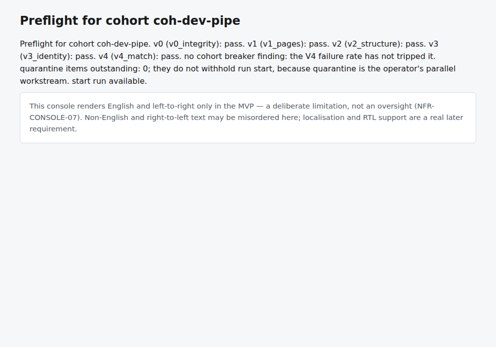
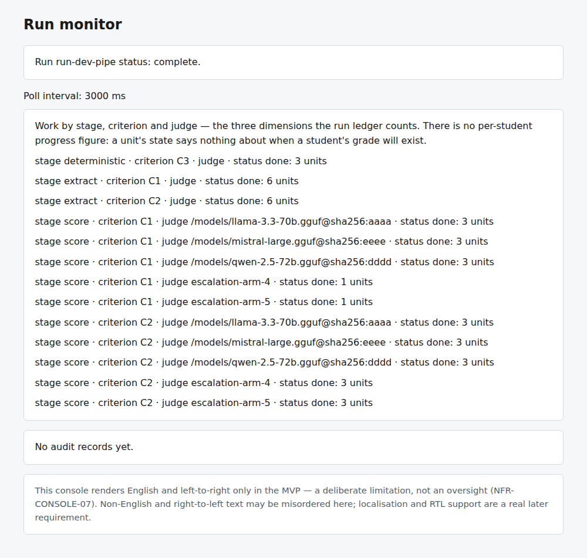
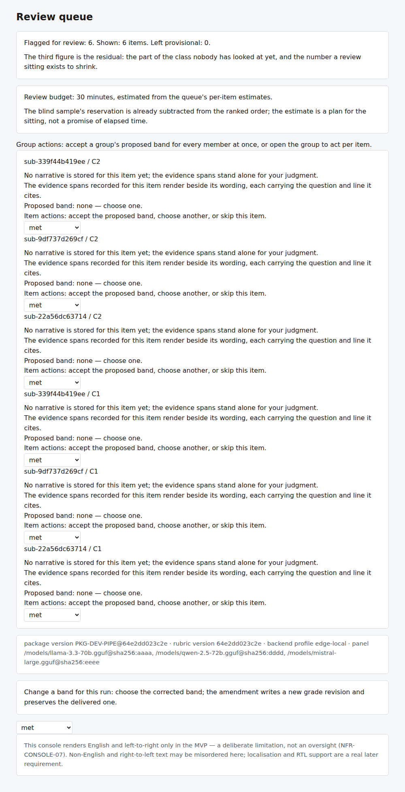
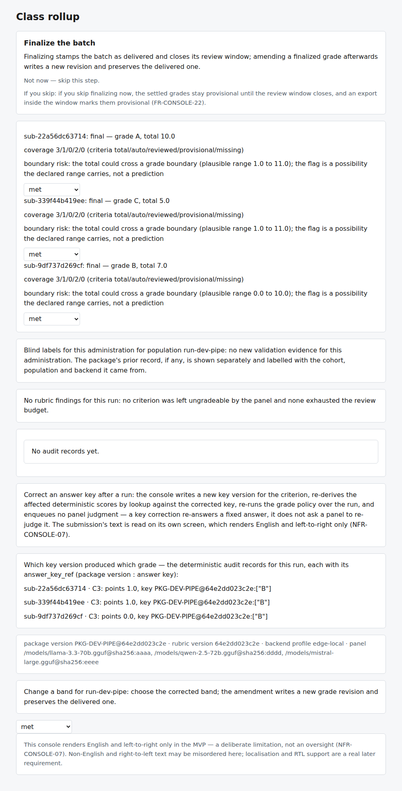

# Operating the Grading System: A Tutorial for Operators and Teachers

*For people who are comfortable with a web browser and can follow a recipe in a terminal window, but are not programmers.*

This tutorial walks through the whole life of one test in the grading system: set it up, load the student papers, let the system grade them, review the result, hand out the grades, and tidy up. It is written for the first live teacher test, so every step says **who** does it, **what you will see**, and **what to type**.

> ### Read this box first
> Everything in this tutorial was **run and checked against the code** on a practice copy of the system. But the system, in the form it is in today, still has gaps a teacher would meet alone: nothing on screen reads your PDFs or the scans you upload. An engineer does those steps with three commands, `aeh cohort create`, `aeh package build` and `aeh ingest` (see the [deployment tutorial](deployment-tutorial.md), sections 8.1 to 8.3), and runs then grade through OpenRouter under `dev-ci` (section 7.6). Those gaps are listed, with proof, in [`docs/live-tests/02-live-readiness-and-blockers.md`](../live-tests/02-live-readiness-and-blockers.md). Where a step below depends on one, it carries a **⚠ Engineer step** label.
>
> What you *can* do today, with no gaps, is: start the console, read the screens that have content, review items, finalize, amend a grade, export a package, and restart after a crash. The **practice data** in section 2 lets you rehearse all of that. Be aware that the console shows less than the teacher guide describes: it does not display the package's question list or keys (S3, S4), it lists no papers for the blind sample (S10, S11), it does not say why a paper was parked (S8), and it shows no cost or finalizing name. Section 4 says exactly which pages work.

---

## 1. The people and the words

### The three roles

| Role | Who | What they do |
|---|---|---|
| **Teacher** | The person whose class is being graded | Approves the question list and answer keys, reviews the system's marks, finalizes grades. Can be the same person as the operator in a small school. |
| **Operator** | Whoever runs the machine and handles scanning | Starts the console, uploads scans, watches the run, sorts out papers the system could not match. |
| **Engineer** | A technical helper | Does the steps marked **⚠ Engineer step**, until those become one-click. |

### The words you will meet

| Word | Plain meaning |
|---|---|
| **Test / assessment** | The paper the students sat. It has an ID printed on it, such as `PS9-FORCES-01`. |
| **Package** | Everything about one test, stored as one unit: the questions, the rubric, the answer keys, the grade policy. Once published it is locked. |
| **Cohort** | One group of students sitting the test (a class). It has a list of student IDs (the **roster**) and a **consent class**: `synthetic` (made-up practice papers), `consented`, or `real`. |
| **Run** | One grading pass over one cohort with one package. It can take hours and survives the browser being closed. |
| **Criterion / rubric line** | One thing being marked, for example "names both forces". Each question has one or more. |
| **Band** | One of the written descriptions a rubric line can earn, such as *adequate*. Judges choose a band; points follow from it. There are no numbers to type anywhere. |
| **Provisional** | A grade nobody has looked at yet, honestly labelled. It is still a complete grade. |
| **Quarantine** | Where a paper waits when the system could not be sure whose it is, whether it is the right test, or whether a mark is readable. The system never guesses; the operator decides. |
| **Finalize** | Stamp the batch as delivered. |
| **Amend** | Change one band on a finalized grade. This writes a *new revision* and keeps the original. |

---

## 2. Before anything else: a practice folder

Do this once, on the machine you will use. It is the safe way to learn every screen, and it spends no money and sends nothing anywhere.

**⚠ Engineer step** (a few minutes, once):

```bash
python docs/live-tests/sample-materials/build_rehearsal_data.py
```

This builds a finished run over three demo students in a private folder, `~/aeh-rehearsal`. When it ends it prints the three IDs you will use below. On the machine this tutorial was checked on they were:

```
run id ............ run-dev-pipe
cohort id ......... coh-dev-pipe
package version ... PKG-DEV-PIPE@64e2dd023c2e
```

Use the values it prints for you. The three demo students are not the sample answer sheets in `docs/live-tests/`; they exist so that every screen has something on it.

---

## 3. Start the console, and stop it

The **console** is the system's web page. It runs on the same computer you are sitting at and can only be reached from that computer. That is deliberate: it has no login, so it refuses to listen to anyone else.

### The console is the operator surface; the terminal is for debugging

This tutorial teaches the console first, on purpose: no operator or teacher workflow requires the terminal (NFR-CONSOLE-09). Every `aeh` terminal command has a home here, or is a debugging tool the console's own help page lists with the reason — the system keeps that inventory and fails a check if a new command appears without one. The commands, and what each is for:

| Command | What it is for | Where you do it instead |
|---|---|---|
| `aeh run` | Drive a cohort's run to completion | The console's **Start run** control (section 5) |
| `aeh recover` | Reclaim leases, resume and settle grades after a crash | The console's **Recover** control (section 5) |
| `aeh console` | Recover, then serve this console | The console is already running |
| `aeh cohort create` | Make a cohort with its consent class and roster | The console's **Create cohort** control (section 5) |
| `aeh cohort add-students` | Extend a cohort's roster | The console's **Add students** control (section 5) |
| `aeh cohort show` | Print one cohort's consent class and roster size | The **Cohort** page (section 4.1) |
| `aeh package build` | Build a package from a spec file | **Publish** on the Package screens (section 4.1) |
| `aeh package export` | Write the spec file for rebuilding or diffing | The console's **Export** delivers the school-facing package |
| `aeh ingest` | Read test papers and answer sheets through the intake checks | The console's **Upload scans** control (section 5) |
| `aeh results show` | Print per-student records and the class rollup as JSON | The **Results** page (section 4.1) |
| `aeh results export` | Write the marks CSV and one PDF per student | The console's **Export** control (section 5) |

### 3.1 Start it

Open a terminal in the project folder, activate the project's Python environment, and run:

```bash
python -m aeh console --data-dir ~/aeh-rehearsal
```

(On Windows PowerShell, use `$HOME\aeh-rehearsal` for the folder.) You will see one line, for example:

```
console listening on port 57369 (pid 1270); Ctrl-C to stop
```

**The port number is different every time** unless you choose one. To choose it, set `CONSOLE_PORT` first (`export CONSOLE_PORT=8765` on macOS/Linux, `$env:CONSOLE_PORT = "8765"` on Windows PowerShell). Then open `http://127.0.0.1:8765` in your browser. The window must stay open: this command runs until you press **Ctrl-C**.

Starting the console also does a safety sweep first: work a previous crash left half-claimed is released, and, **if a profile is set** (see below), a run that was still going is resumed.

**Profile.** To merely look at a data folder you need no profile. To let the console start runs, or resume them, it must know the profile: pass `--config <file>` with a file that names one (the shipped `docs/live-tests/config/live-test.dev-ci.toml` does), or set `HARNESS_PROFILE` in the terminal. Without one, the `start-run` command answers *"HARNESS_PROFILE must be one of … got None"* (checked). On start-up the console resumes only runs whose own frozen profile equals the one in use; the practice run froze `edge-local`.

### 3.2 Where the data lives

`--data-dir` is the system's whole memory: every package, every student's text, every grade. Facts about it, all checked:

* It must **not** be under `/tmp` or any folder other people's accounts can write to. The system refuses with *"is not a safe data directory … Choose a directory outside the world-writable tree (e.g. under the operator's home)"*. Use a folder in your own home directory.
* If the folder does not exist, it is created. It is locked so only you can open it (owner-only permissions), even if you made it wider.
* Back it up like a student record: copy the whole folder while the console is stopped.

### 3.3 Stop it

Press **Ctrl-C** in the terminal. Closing the browser does **not** stop anything, and a run keeps going when the browser is closed. If the computer is switched off in the middle of a run, start the console again **under the same profile**: by design it releases the half-done work and carries on from where the run stopped. (This restart behaviour is read from the code and covered by the project's own tests; it was not tried on a live run.)

### 3.4 Someone else needs to look at it

The console cannot be opened to the network, by design. If a teacher at another desk must use it, the supported route is for them to connect to *your* computer over a secure tunnel (for example `ssh -L 8765:127.0.0.1:8765 you@the-machine`) and then open `http://127.0.0.1:8765` on their own screen. Never try to make it listen on `0.0.0.0` or a network address: it refuses (*"the console refuses a non-loopback bind … an unauthenticated student-record system runs on one machine, loopback only"*).

---

## 4. How the console works (and the one surprise)

The console has **14 pages**. You open them by typing the address into the browser. **There are no menus, buttons or links.** Every page is a read-only report. Anything that *changes* something is sent as a short command, described in section 5.

> **The drop-down lists are not live.** On the review (S9), rollup (S12), student (S13) and export (S14) pages they look like band pickers, but they are connected to nothing: no page has a form, button, link or script (all 14 checked). To change a band, use the `review-action` or `amend-a-finalized-grade` command in section 5. These drop-downs also list generic words (*met / partially met / not met*), which are not the band names of your rubric; the commands need the rubric's real band names (see 5.3).

### 4.1 The page map

Replace `<PORT>` with your port, and the `{...}` parts with your own IDs. Each page was opened and read on the practice data.

| Page | Address | Who | What it shows |
|---|---|---|---|
| S1 Packages | `/packages?package_version={version}` | Teacher | A card for the package you name. With no `?package_version=` it shows a placeholder card (*"Package pkg-unaddressed"*). It shows the name and *"no validation data for this population"*, not the contents. |
| S2 Upload | `/packages/new?cohort_id={cohort}` | Operator | Accepted format, and the uploaded files in page order |
| S3 Question inventory | `/setup/inventory?package_id={package}` | Teacher | The question list to confirm; **blocks the run until confirmed.** For a package built with `aeh package build` (Phase 1), adding `?package_id=` lists every question with its text (checked: all six for the sample physics test). Without it the page shows *"Questions read back from the package: 0"*. |
| S4 Answer keys | `/setup/answer-keys` | Teacher | Meant to show the keys to supply; **blocks the run until supplied.** It showed *"Answer keys read back from the package: 0"* (checked). It does not show your keys today. |
| S5 Optional setup | `/setup/optional` | Teacher | Five optional cards, each skippable, each saying what skipping costs |
| S6 Preflight | `/cohorts/{cohort}/preflight` | Operator | The five intake checks, and whether "start run" is available |
| S7 Run monitor | `/runs/{run}/monitor` | Operator | Work counts by stage, criterion and judge; the run's status |
| S8 Quarantine | `/quarantine` | Operator | Each waiting paper's ID (*"… — parked for operator triage"*) and any stored image crop. It does **not** say why the paper was parked. |
| S9 Review queue | `/runs/{run}/review` | Teacher | The marks most worth a second look, fitted to your time |
| S10 Whole-grade sample | `/runs/{run}/sample` | Teacher | One fixed sentence about the sample. **It lists no grades today.** |
| S11 Blind sample | `/runs/{run}/blind` | Teacher | One fixed sentence about the blind sample. **It lists no papers today**, so the blind sample cannot be done from the console. |
| S12 Class rollup | `/runs/{run}/rollup` | Teacher | Every student's grade, and the finalize step |
| S13 Student detail | `/students/{submission-id}` | Teacher | The narrative feedback and, per rubric line, *"C1: final"* with the (inert) band list. It shows no points or band. |
| S14 Export gate | `/packages/{package-version}/export-gate` | Teacher | The decision to export a package |

Two facts that are easy to trip over:

* **S13 takes the system's submission ID** (looks like `sub-22a56dc63714`, copied from the rollup page), **not** the student's own ID. Using the student's ID (for example `P-0001`) opens a page that says *"No scores are settled for this submission."*
* **Every page also prints a small note** that the console renders English, left to right only. That is a stated limit, not a fault.

### 4.2 Reading a page

What the real pages say (practice data), so you know what normal looks like:

**S6 Preflight** — *"v0 (v0_integrity): pass. v1 (v1_pages): pass. v2 (v2_structure): pass. v3 (v3_identity): pass. v4 (v4_match): pass. no cohort breaker finding … quarantine items outstanding: 0; they do not withhold run start … start run available."*



The five checks, in plain words:

| Check | Plain meaning | Fails when |
|---|---|---|
| **v0 integrity** | The file is a sound PDF | Corrupt file, or too many blank pages |
| **v1 pages** | Every page is there | A page is missing or doubled |
| **v2 structure** | The paper has the questions the package expects, and every mark is readable | Wrong question layout, or a mark with two ticks / an unreadable tick |
| **v3 identity** | The student named on the page is on the class list | No name, or a name not on the roster |
| **v4 match** | The paper is the right test | The printed test name is different, or the answers share almost no words with the questions |

**S7 Run monitor** — *"Run run-dev-pipe status: complete."* followed by lines such as *"stage score · criterion C2 · judge … · status done: 3 units"*. There is deliberately no per-student progress figure, because the work is done by criterion, not by student. The page text says it refreshes every 3000 ms, but there is no script on the page, so **press F5 to refresh**.



**S9 Review queue** — the top line is the one to read: *"Flagged for review: 6. Shown: 6 items. Left provisional: 0."* That is: how many marks the system wants checked, how many fit in your time budget (default **30 minutes**), and how many are left unreviewed and therefore provisional.



**S12 Class rollup** — one block per student: *"sub-22a56dc63714: final — grade A, total 10.0"*, then *"coverage 3/1/0/2/0 (criteria total/auto/reviewed/provisional/missing)"* and a *boundary risk* sentence when an unreviewed mark could change the letter grade.



**S8 Quarantine** (empty) — *"No quarantine items are parked for this cohort."* With items, it lists each paper's ID, *"parked for operator triage"*, and any stored image crop (an item with no stored crop says so). It does not state the reason; the reasons for the sample sheets are in the table in Phase 2.

**S14 Export gate** — *"a package carrying real student text cannot be exported. Exemplar paraphrases are approved here, at export, by you …"* and the line *"Approve exemplar paraphrases at export"* is **not available** in this version (the action says: *"approving exemplar paraphrases is not available until Phase 3.5; nothing was approved"*).

---

## 5. Sending a command (changing something)

### 5.1 The recipe

Every change is a `POST` to `/actions/<name>` with the details as `field=value` pairs. Use `curl`, which ships with macOS, Linux and current Windows.

**macOS / Linux**

```bash
curl -X POST http://127.0.0.1:<PORT>/actions/finalize-batch \
  --data-urlencode "run_id=run-dev-pipe" \
  --data-urlencode "actor=Ms Okafor"
```

**Windows PowerShell** (type `curl.exe`, not `curl`; PowerShell has a different command called `curl`)

```powershell
curl.exe -X POST http://127.0.0.1:<PORT>/actions/finalize-batch --data-urlencode "run_id=run-dev-pipe" --data-urlencode "actor=Ms Okafor"
```

The reply is one line of data. Read three words:

```json
{"action": "finalize batch", "dispatched": true, "refused": false, "detail": "batch for run run-dev-pipe finalized through M-GRADE", "rows_written": 0}
```

* `"dispatched": true` means it **really happened**. `false` means **nothing was changed**, and `detail` says why in plain words. The system never claims something it did not do.
* `"refused": true` is rare and means the screen you were looking at was stale: refresh and try again.
* A name that is not one of the 15 below gives `not found` and nothing happens.

Repeating a command: an identical **amendment** or **review action** is safe (the second answers *"already carries … nothing changed"*, or is refused because the item has left the queue). Other commands may repeat their effect: a second `finalize-batch` again answers `dispatched: true`, and each `pause-resume` writes another request.

### 5.2 The 15 commands

The name goes after `/actions/`. "Checked" means it was run against a real data folder and the result below is what it really said. Fields not listed are not needed.

> This rehearsal table predates the newest controls: the console also takes `create-cohort` (section 3's table), `recover-runs` and `add-students`, and their screens, which the manuals rewrite will fold in here. Until then, section 3's table is the full list.

| Name | Fields | Checked result | Who / when |
|---|---|---|---|
| `approve-question-inventory` | `package_version` | With no package it refuses: *"names no stored package"*. The success path (confirming a draft package's question list) was not exercised; S3 does not show the list to confirm. | Teacher, setup |
| `supply-answer-keys` | `package_version`, `criterion_id`, `answer_key` (e.g. `C`) | With no keys it refuses: *"names no keys"*. | Teacher, setup |
| `accept-or-correct-rubric-read-back` | `package_version`, `cohort_id`, `rubric_doc`, `assessment_doc` | **Cannot succeed over the web.** The console started by `aeh` holds no model (*"this console holds no provider … so nothing was read or written"*), and the command needs a model reference object that a web form cannot carry. Not sent during checking. | ⚠ Engineer step |
| `set-review-window` | `run_id`, `hours` | Refused on a finished package: *"is published (locked = 1) and immutable"*. The window must be set **before** the package is published. | Engineer, before publish |
| `start-run` | `cohort_id`, `package_version` (or `run_id`) | **Needs a profile** (see 3.1): without one it answers *"HARNESS_PROFILE must be one of … got None"*. With one, on a finished run it refuses: *"is already complete; nothing was started"*. On a new run it starts a background worker (see the box below). | Operator |
| `pause-resume` | `run_id`, `state` = `paused` or `running` | A request is queued: *"queued as run_control row ctl-… the orchestrator applies it on its next read"*. Tried only on a finished run, where it changes nothing visible. Whether a resume restarts a paused live run without restarting the console was not verified. | Operator |
| `resolve-quarantine-item` | `submission_id`, `resolution` | An unknown ID refuses: *"no submission named … exists in any cohort ledger"* (every refusal names the ID it was given). **`resolution=matched` releases the paper to scoring; `resolution=unresolvable` closes it** (criteria MISSING, grade INCOMPLETE, never zero). Any other word, or none, is refused and changes nothing (checked). `matched` is also refused for a paper whose student the identity check did not match, because it would be graded under nobody, and for a paper whose pages were never read, because there is nothing to grade (checked). It records **no** student, mark or test: only the release or the close. | Operator |
| `review-action` | `run_id`, `submission_id`, `criterion_id`, `decision` = `accept` or `edit`, `band` (for `edit`) | Accept works: *"review accept of … recorded … as label label-…"*. Once an item is actioned it leaves the queue, so a second action on it refuses. | Teacher, morning |
| `blind-sample-submission` | `run_id`, `submission_id`, `criterion_id`, `band` | Refuses unless that paper was drawn for the blind sample: *"is not in run … blind draw"*. No page shows which papers were drawn (S11 is one fixed sentence), so this cannot be used from the console today. | Teacher |
| `correct-an-answer-key-after-a-run` | `run_id`, `criterion_id`, `answer_key` | Works: *"answer key for C3 corrected: package version PKG-DEV-PIPE@… written … 3 deterministic score(s) re-derived by lookup … run run-dev-pipe re-pointed to the corrected version and the grade policy re-ran over it"*. **It creates a new package version and moves the run to it**; no judge is asked again. If the key is already that value it says so and writes nothing. | Teacher |
| `finalize-batch` | `run_id`, `actor` | Works: *"batch for run … finalized through M-GRADE"*. The name is passed to the grading module; no page shows it afterwards. | Teacher |
| `amend-a-finalized-grade` | `run_id`, `submission_id`, `criterion_id`, `band`, `actor`, `reason` | Works only with a band name the rubric line really has (see 5.3). *"amended … C2 to developing (3.0 points), revision 2"*. | Teacher |
| `approve-exemplar-paraphrases-at-export` | none | Not available in this version. | — |
| `export-import-package` | `package_version` | Works: *"exported … to PKG-DEV-PIPE@….aehpkg"*, a file in the data folder's `exports/` | Teacher |
| `purge-cohort` | `cohort_id` | Refuses until the cohort's evidence is saved for validation: *"is not promoted to Tier D … Unmet gates: audit records, labels, per-criterion statistics"*. Nothing is deleted. | Operator, last |

> **About `start-run`.** `aeh console` starts a run on a background worker that calls the model service named by the profile. Under `dev-ci` that is OpenRouter, with zero data retention enforced on every request; with `HARNESS_FIXTURE_DIR` set it replays recordings instead. On start-up the console prints which (`provider for runs started here: …`). The console refuses `cloud-hosted` on purpose. Before a *live* run the engineer creates the class, builds the package and reads the papers in (deployment tutorial, sections 8.1 to 8.3). Practice runs and replays are unaffected.

### 5.3 Finding the real band names

The page shows `met / partially met / not met`, but each rubric line has its own bands. **The band names are in your rubric PDF**; no console page lists them (the *which key produced which grade* block on S12 shows multiple-choice keys and points, not bands). If you pick a name the line does not have, the answer says so and changes nothing:

```
M-PKG refused the band 'not met' for C2: criterion 'C2' declares no band 'not met'. — nothing was written
```

In the practice data the written lines have six bands, worst to best: *absent, minimal, emerging, developing, secure, comprehensive*, and the multiple-choice line has *incorrect* and *correct*. For the sample tests in `docs/live-tests/` the four-band written lines have *none, limited, adequate, full*, the English yes/no lines have *not met* and *met*, and the multiple-choice lines have *incorrect* and *correct*.

---

## 6. The grading life cycle, step by step

Six phases. Phases 1 to 3 depend on engineering steps today; phases 4 to 6 you can rehearse right now.

### Phase 1: Set up the test (teacher, once, 30 to 60 minutes) — ⚠ Engineer step

**What the design says.** You give the system four PDFs (the test paper, your model answer, your rubric, and, optionally, 10 to 15 papers you already marked). It shows you its reading of the question list (page S3) and you confirm. You supply the multiple-choice answer keys (S4). You may check how it read your rubric, say which lines can be split, and describe how the grade is calculated (S5). Only S3 and S4 block the run. Nothing about the rubric, weights or number of lines can be changed once the package is locked.

**What exists today.** Nothing you can click reads your PDFs yet. Instead the engineer writes the test down in a short text file (the questions, model answers, rubric lines with their bands, the multiple-choice keys and the grade boundaries) and builds it with one command, `aeh package build` (deployment tutorial, section 8.2). Writing that file is the engineer's debugging path, not the teacher's: the system creates the valid package file itself from the state the teacher confirms in setup, and a published version's file can be written out again by `aeh package export` (deployment tutorial, section 8.2). `docs/live-tests/config/ps9-forces-01.package.toml` is the sample physics test written the engineer's way. Page S3 then shows the question list for you to check, at `/setup/inventory?package_id=<the test name>` (checked). Page S4 still does not read the keys back (*"Answer keys read back from the package: 0"*), so check the keys in the file itself. S5 shows its five optional cards.

**What you do.** Hand the engineer the three setup PDFs for your test (`docs/live-tests/sample-materials/pdf/<TEST>/01-test-paper.pdf`, `02-model-answer.pdf`, `03-rubric.pdf`). Ask the engineer to read the question list and the answer keys out of the package to you (or print them) so you can confirm them against your paper. Open `/packages?package_version=<version>` to see that the package exists.

### Phase 2: Load the student papers (operator) — ⚠ Engineer step for the last half

**Prepare the scans.** One PDF per student, or several files per student if a scanner splits them (the console lists them in order). PDF only. Every sheet needs the **test name** and the **student's ID** written at the top; the checks depend on both.

**Upload.** Each file is one command:

```bash
curl -X POST "http://127.0.0.1:<PORT>/upload?cohort_id=<cohort>&filename=S9-001-strong.pdf" \
  -H "Content-Type: application/pdf" --data-binary @docs/live-tests/sample-materials/pdf/PS9-FORCES-01/answer-sheets/S9-001-strong.pdf
```

Checked on the practice cohort: the reply was `{"dispatched": true, "blob_refs": ["sha256:…"], "detail": "dispatched to the orchestrator's schedule; the handler awaited nothing"}`, and a file that is not a PDF gives HTTP 400 *"the console accepts PDF scans only … nothing was staged"*. Then open `/packages/new?cohort_id=<cohort>` and you will see `Page 1: S9-001-strong.pdf` in the list.

**What happens next, today.** A file uploaded on this page is stored and listed, but **nothing reads it**. Instead, the engineer reads the scans in with one command, `aeh ingest` (deployment tutorial, section 8.3): it reads the test paper and a folder of answer sheets, one PDF per student, through the five checks, and parks every paper that fails one. Running it again skips papers already read. Then open S6 and S8 as below.

**Preflight (S6).** Once papers are read, open `/cohorts/{cohort}/preflight`. The five checks must pass for the cohort as a whole (a "cohort breaker" holds the run back if the right-test check fails for too large a share of papers). Papers with problems do **not** hold the run back: they wait in quarantine (S8) while the rest are graded.

**Quarantine (S8).** What each sample problem looks like, as the checks decide it (verified for the sample files). S8 itself lists only the paper's ID and any crop, so use this table to know *why*:

| Sample sheet | Status the system gives | Which check | What you do |
|---|---|---|---|
| Two ticks on Q1 | `incomplete` | v2 structure | Look at the paper and decide the tick yourself, then release it (`resolution=matched`) or close it (`resolution=unresolvable`) |
| Wrong test (names another test) | `unmatched_assessment` | v4 match | Find which test it really belongs to. Release it (`resolution=matched`) **only** if it really is this test (for example the name was miswritten): a released paper is graded against *this* package. If it belongs to another test, close it here (`resolution=unresolvable`) and read it in under the right package with `aeh ingest` |
| No name written | `incomplete` | v3 identity | Work out whose it is. It **cannot be released** (it would be graded under nobody): close it (`resolution=unresolvable`), or have the student's ID written on it, rescan it, and read it in again with `aeh ingest` |

**What the command does and does not record.** `resolve-quarantine-item` only releases the paper (`matched`) or closes it (`unresolvable`); any other word is refused, so a typo no longer closes a paper by accident. It does not record *which tick*, *which student* or *which test* you decided; there is no field for that yet (blocker B8). So for a doubled mark, the released paper is scored on what the page reader read, not on your decision: write your decision on the record sheet.

Closing as **unresolvable** never gives zero: the unscored lines are marked MISSING and the grade INCOMPLETE. The system will **not** reassign a paper by itself.

### Phase 3: Start the run, and watch it (operator)

* **Start**: `start-run` with `cohort_id` and `package_version`. Before a live start, the engineer builds the package (`aeh package build`) and reads the papers in (`aeh ingest`); see the deployment tutorial, sections 8.1 to 8.3.
* **Watch** S7 (press F5). Statuses are `pending`, `running`, `paused`, `complete`.
* **Pause / resume.** These commands queue a request; they are meant to work at any time:

```bash
curl -X POST http://127.0.0.1:<PORT>/actions/pause-resume --data-urlencode "run_id=<run>" --data-urlencode "state=paused"
curl -X POST http://127.0.0.1:<PORT>/actions/pause-resume --data-urlencode "run_id=<run>" --data-urlencode "state=running"
```

  Only the request is queued, and it was tried only on a finished run. The worker that does the grading stops when a run pauses, so a **resume** may wait until the console is next started (read from the code; not verified on a live run). Plan for that, and note the real behaviour on the record sheet.
* **If the machine restarts**: start the console again, **under the same profile as the run** (3.1). It releases the half-done work and resumes the run. `python -m aeh recover --data-dir <folder>` only releases the half-done work and prints a report (`leases_reclaimed`, `runs_regraded`, `runs_resumed`); it does **not** finish the run.
* **A run from the command line** is `python -m aeh run --data-dir <folder> --cohort <cohort> --package-version <version> --config <file>`. Its exit code: **0** finished, **3** *not finished* (paused, or stopped for another reason; read the `status` and `pause_reason` it prints), **1** an error, with the reason printed after `aeh run:`.

### Phase 4: Morning review (teacher; you choose how long)

All of this is optional. If you do nothing, every student still has a complete grade.

1. **Read S9** (`/runs/{run}/review`). Each item shows the narrative first, then the evidence quotes, then the proposed band. Items that are about a whole group of students appear as a group action.
2. **Act on an item.** Accept the proposed band:

```bash
curl -X POST http://127.0.0.1:<PORT>/actions/review-action \
  --data-urlencode "run_id=<run>" --data-urlencode "submission_id=sub-339f44b419ee" \
  --data-urlencode "criterion_id=C2" --data-urlencode "decision=accept"
```

   or choose a different band with `decision=edit` and `band=<a real band name>`. An accepted item leaves the queue.
3. **Blind sample (S11).** The design: papers drawn for you to mark *without* seeing the system's mark, the only honest measure of how well the system agrees with you. **Today S11 is one sentence and lists no papers, and the command needs the drawn paper and line**, so it cannot be done from the console. Skipping it costs one thing: the system says *"no new validation evidence for this administration"* rather than quoting an old number. To keep an honest comparison, mark some papers by hand before looking at the system's marks (the test-day plan does this).
4. **Whole-grade sample (S10).** The design: read a handful of finished grades as the student will see them. Today S10 is one sentence and lists none; use S12 and S13.

### Phase 5: Finalize, amend, export (teacher)

1. **Finalize** (`finalize-batch` with `run_id` and `actor`) and read the reply. The name you give as `actor` is passed to the grading module. The console has no accounts, so it is a label, not a login. No page shows it afterwards: after a finalize and an amend, S12 and S7 still said *"No audit records yet."* (checked).
2. **Review window.** If the package declared one, finalizing inside the window leaves the grades *provisional* (the timestamp is delayed, the grades still export). The system settles them when the window ends.
3. **Amend** a finalized grade at any time. It writes a new revision and keeps the original:

```bash
curl -X POST http://127.0.0.1:<PORT>/actions/amend-a-finalized-grade \
  --data-urlencode "run_id=<run>" --data-urlencode "submission_id=sub-22a56dc63714" \
  --data-urlencode "criterion_id=C2" --data-urlencode "band=developing" \
  --data-urlencode "actor=Ms Okafor" --data-urlencode "reason=checked against the paper"
```

   Checked reply: *"grade for sub-… amended through M-GRADE: C2 to developing (3.0 points), revision 2"*. Sending it again says *"already carries C2 = developing; nothing changed"*.
4. **Open S13** for one student to read their feedback and marks.
5. **Export the package** so the tuned test can be reused (a USB stick is fine): `export-import-package` with `package_version`. The file appears in `<data folder>/exports/`. A package containing real student text cannot be exported (S14).

### Phase 6: Afterwards

* **Keep or erase.** `purge-cohort` deletes a cohort's student work, but the system refuses until that cohort's audit records, labels and statistics have been saved to the durable record (*"is not promoted to Tier D"*). Nothing is deleted when it refuses.
* **Back up** the data folder.
* **Record what happened** using the sheet in `docs/live-tests/04-test-day-plan.md`.

---

## 7. When something goes wrong

Every message below is the system's real wording.

| You see | It means | Do this |
|---|---|---|
| `InsecureLocationError: … is not a safe data directory: /tmp is world-writable` | The data folder is somewhere other users can reach | Choose a folder in your own home directory |
| `ConsoleBindRefused: … refuses a non-loopback bind` | Something asked the console to listen to the network | Remove `CONSOLE_BIND`; use a tunnel (3.4) |
| `ConsoleBindRefused: … refuses to start under the cloud-hosted profile` | `HARNESS_PROFILE` is `cloud-hosted` | Use another profile for the console |
| `ConfigurationError: HARNESS_PROFILE must be one of ('edge-local', 'cloud-hosted', 'dev-ci'), got None` | A run was started with no profile | Set `HARNESS_PROFILE`, or choose one in the config file |
| `ConsentGateError: cohort … has consent_class 'real' … may not be sent to a 'dev-ci' provider` | Real student work is not allowed to leave the machine without recorded authority | Use a `synthetic` or `consented` cohort, or supply the override with a named person |
| `HTTP 404 … No endpoints found matching your data policy` | No host that keeps zero data serves that model on OpenRouter | Choose another model (deployment tutorial, 7.6) |
| `RetentionPolicyError: … zero-retention routing unconfirmed …` | A run was started on a provider that cannot confirm zero retention for every model (for example the Jev decision model) | Use the shipped `dev-ci` setup; leave the decision engine `off` |
| `404 not found` from a command | The name is not one of the 15 | Check the spelling against 5.2 |
| `"refused": true … refresh_required` | The screen was out of date | Press F5 and send the command again |
| `…is already complete; nothing was started` | You tried to start a run twice | Nothing to do |
| `M-PKG refused the band '…'` | That band name does not exist for that rubric line | Use a real one (5.3) |
| Page says `No scores are settled for this submission` | You used the student's ID | Use the `sub-…` ID from S12 |
| `aeh run` exits with **3** | The run did not finish (paused, or stopped for another reason) | Read the `status` and `pause_reason` it printed; fix the cause and run it again |

---

## 8. The ten-minute rehearsal

With the practice folder from section 2 and the console running:

1. Open `/runs/run-dev-pipe/monitor`. Confirm the status says `complete`.
2. Open `/runs/run-dev-pipe/review`. Read the three numbers in the first line.
3. Send one `review-action` accept (5.1). Refresh. The count changes.
4. Open `/runs/run-dev-pipe/rollup`. Find a `sub-…` ID. Open `/students/sub-…`.
5. Send `finalize-batch`. Read the reply.
6. Send `amend-a-finalized-grade` with a real band name, then once more. Compare the two replies.
7. Send `export-import-package`. Look in `<data folder>/exports/`.
8. Press Ctrl-C. Start the console again. Everything is still there.

If all eight work, you can operate the part of the system that exists today.
